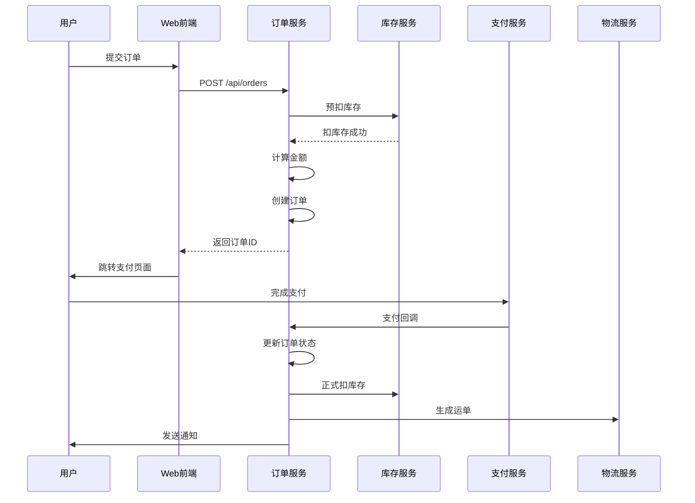

# 技术方案设计文档模板（TDD, Technical Design Document）

## 目录
1. 文档概述
2. 模块划分与职责
3. 接口定义
4. 数据模型设计
5. 数据流转逻辑
6. 安全设计
7. 非功能性需求落地
8. 测试策略

---

## 1. 文档概述

### 1.1 文档目的
说明本文档的目标读者（开发团队、测试团队、运维团队）和使用场景（编码指导、代码评审、测试用例设计）

### 1.2 文档范围
明确本次技术方案涵盖的功能模块和业务范围，说明与相关模块的边界

### 1.3 参考文档
- 系统架构设计文档（SAD）
- 相关的 SRS/PRD 文档
- 技术选型说明文档

---

## 2. 模块划分与职责

### 2.1 模块边界划分

基于高内聚低耦合原则，将系统划分为多个模块：

**模块划分原则**：
- 单一职责：每个模块只负责一个业务领域
- 高内聚：模块内部功能紧密相关
- 低耦合：模块之间依赖最小化
- 可扩展：预留扩展点，便于后续功能添加

### 2.2 模块职责说明

| 模块名称 | 职责描述 | 核心功能 | 输入/输出 |
|---------|---------|---------|----------|
| 用户模块 | 用户注册、登录、信息管理 | 注册、登录、修改密码、个人信息 | 用户信息、认证Token |
| 订单模块 | 订单创建、查询、状态流转 | 创建订单、查询订单、取消订单、订单列表 | 订单数据、状态更新 |
| 支付模块 | 支付对接、退款、对账 | 发起支付、支付回调、退款、对账 | 支付请求、支付结果 |
| 商品模块 | 商品信息管理、库存管理 | 商品列表、商品详情、库存扣减 | 商品数据、库存状态 |

### 2.3 模块调用链路

**同步调用场景**：
- 用户下单 → 订单服务创建订单 → 支付服务发起支付
- 用户登录 → 用户服务验证 → 生成认证Token

**异步调用场景**（消息队列）：
- 支付成功 → 发送消息 → 订单服务更新订单状态 → 通知服务推送通知
- 订单创建 → 发送消息 → 库存服务扣减库存 → 物流服务生成运单

**事件驱动场景**：
- 用户注册完成 → 发布用户注册事件 → 积分服务赠送积分 → 邮件服务发送欢迎邮件

### 2.4 模块依赖关系

```
用户模块 ← 订单模块 ← 支付模块
   ↓         ↓         ↓
权限模块   商品模块   通知模块
   ↓         ↓         ↓
日志模块   库存模块   短信模块
```

---

## 3. 接口定义

### 3.1 RESTful API 设计规范

**URL 设计规范**：
- 使用名词复数形式：`/api/users`, `/api/orders`
- 使用层级关系：`/api/users/{userId}/orders`
- 使用查询参数过滤：`/api/orders?status=paid&page=1&size=10`
- 使用 HTTP 方法表示操作：
  - GET: 获取资源
  - POST: 创建资源
  - PUT: 更新资源（全量）
  - PATCH: 更新资源（部分）
  - DELETE: 删除资源

**请求/响应格式**：
- 统一使用 JSON 格式
- 请求头：`Content-Type: application/json`
- 响应头：`Content-Type: application/json`

**统一响应格式**：

成功响应：
```json
{
  "code": 200,
  "message": "success",
  "data": {
    // 实际数据
  },
  "timestamp": 1699999999000
}
```

失败响应：
```json
{
  "code": 400,
  "message": "参数错误",
  "errors": [
    {
      "field": "email",
      "message": "邮箱格式不正确"
    }
  ],
  "timestamp": 1699999999000
}
```

### 3.2 具体接口定义

#### 3.2.1 用户登录接口

**接口信息**：
- URL: `POST /api/v1/users/login`
- 描述: 用户登录，返回认证Token

**请求参数**：
```json
{
  "email": "user@example.com",
  "password": "password123"
}
```

**响应参数**：
```json
{
  "code": 200,
  "message": "success",
  "data": {
    "userId": "user_123456",
    "email": "user@example.com",
    "nickname": "张三",
    "token": "eyJhbGciOiJIUzI1NiIsInR5cCI6IkpXVCJ9...",
    "expiresIn": 7200
  },
  "timestamp": 1699999999000
}
```

**错误码**：
- `400`: 参数错误（邮箱格式、密码长度）
- `401`: 用户名或密码错误
- `403`: 账号已被禁用
- `429`: 请求过于频繁（防刷）

#### 3.2.2 创建订单接口

**接口信息**：
- URL: `POST /api/v1/orders`
- 描述: 创建订单

**请求参数**：
```json
{
  "userId": "user_123456",
  "items": [
    {
      "productId": "prod_123",
      "quantity": 2,
      "price": 99.99
    },
    {
      "productId": "prod_456",
      "quantity": 1,
      "price": 199.99
    }
  ],
  "shippingAddress": {
    "name": "张三",
    "phone": "13800138000",
    "province": "北京市",
    "city": "北京市",
    "district": "朝阳区",
    "detail": "XX路XX号"
  }
}
```

**响应参数**：
```json
{
  "code": 200,
  "message": "success",
  "data": {
    "orderId": "order_20240101123456",
    "status": "pending_payment",
    "totalAmount": 399.97,
    "createdAt": "2024-01-01T12:34:56Z"
  },
  "timestamp": 1699999999000
}
```

**错误码**：
- `400`: 参数错误（商品不存在、库存不足、地址格式错误）
- `401`: 未登录
- `409`: 订单已存在（幂等性校验）

### 3.3 gRPC 接口定义（示例）

**.proto 文件**：
```protobuf
syntax = "proto3";

package user;

service UserService {
  rpc GetUser(GetUserRequest) returns (GetUserResponse);
  rpc CreateUser(CreateUserRequest) returns (CreateUserResponse);
}

message GetUserRequest {
  string user_id = 1;
}

message GetUserResponse {
  User user = 1;
}

message User {
  string user_id = 1;
  string email = 2;
  string nickname = 3;
  int64 created_at = 4;
}

message CreateUserRequest {
  string email = 1;
  string password = 2;
  string nickname = 3;
}

message CreateUserResponse {
  string user_id = 1;
}
```

### 3.4 WebSocket 接口定义（示例）

**连接地址**：
- `wss://api.example.com/v1/ws`

**认证方式**：
- 连接时在 URL 参数中携带 Token：`wss://api.example.com/v1/ws?token=xxx`

**消息格式**：
```json
{
  "type": "message",
  "data": {
    "from": "user_123",
    "to": "user_456",
    "content": "你好"
  },
  "timestamp": 1699999999000
}
```

**心跳机制**：
- 客户端每 30 秒发送一次心跳：`{"type": "ping"}`
- 服务端回复：`{"type": "pong"}`

---

## 4. 数据模型设计

### 4.1 实体关系图（ER 图）

**用户-订单-商品关系**：
```
┌─────────┐         ┌─────────┐         ┌─────────┐
│  用户   │ 1     N │  订单   │ N     N │  商品   │
│  User   │────────│  Order  │────────│ Product │
└─────────┘         └─────────┘         └─────────┘
    │                                         │
    │ 1                                     N │
    │─────────────────────────────────────────│
                           N
                    ┌─────────┐
                    │ 订单项  │
                    │OrderItem│
                    └─────────┘
```

### 4.2 数据库表设计

#### 4.2.1 用户表（users）

| 字段名 | 类型 | 长度 | 允许空 | 默认值 | 索引 | 说明 |
|--------|------|------|--------|--------|------|------|
| user_id | VARCHAR | 64 | NOT NULL | - | PRIMARY | 用户ID（UUID） |
| email | VARCHAR | 128 | NOT NULL | - | UNIQUE | 邮箱 |
| password | VARCHAR | 255 | NOT NULL | - | - | 密码哈希（bcrypt） |
| nickname | VARCHAR | 64 | NULL | - | - | 昵称 |
| avatar_url | VARCHAR | 512 | NULL | - | - | 头像URL |
| status | TINYINT | 1 | NOT NULL | 1 | INDEX | 状态（0禁用/1正常） |
| created_at | DATETIME | - | NOT NULL | NOW() | INDEX | 创建时间 |
| updated_at | DATETIME | - | NOT NULL | NOW() | - | 更新时间 |

**索引设计**：
- PRIMARY KEY: `user_id`
- UNIQUE INDEX: `email`（登录查询）
- INDEX: `status`（状态过滤）
- INDEX: `created_at`（时间范围查询）

#### 4.2.2 订单表（orders）

| 字段名 | 类型 | 长度 | 允许空 | 默认值 | 索引 | 说明 |
|--------|------|------|--------|--------|------|------|
| order_id | VARCHAR | 64 | NOT NULL | - | PRIMARY | 订单ID（UUID） |
| user_id | VARCHAR | 64 | NOT NULL | - | INDEX | 用户ID |
| status | VARCHAR | 32 | NOT NULL | - | INDEX | 订单状态 |
| total_amount | DECIMAL | 10,2 | NOT NULL | - | - | 订单总金额 |
| paid_amount | DECIMAL | 10,2 | NOT NULL | 0 | - | 已支付金额 |
| shipping_address | JSON | - | NULL | - | - | 收货地址（JSON格式） |
| created_at | DATETIME | - | NOT NULL | NOW() | INDEX | 创建时间 |
| updated_at | DATETIME | - | NOT NULL | NOW() | - | 更新时间 |

**索引设计**：
- PRIMARY KEY: `order_id`
- INDEX: `user_id`（用户订单查询）
- INDEX: `status`（状态过滤）
- INDEX: `created_at`（时间范围查询）
- COMPOSITE INDEX: `(user_id, created_at)`（用户订单列表查询）

#### 4.2.3 订单项表（order_items）

| 字段名 | 类型 | 长度 | 允许空 | 默认值 | 索引 | 说明 |
|--------|------|------|--------|--------|------|------|
| item_id | BIGINT | - | NOT NULL | AUTO_INCREMENT | PRIMARY | 订单项ID |
| order_id | VARCHAR | 64 | NOT NULL | - | INDEX | 订单ID |
| product_id | VARCHAR | 64 | NOT NULL | - | INDEX | 商品ID |
| product_name | VARCHAR | 255 | NOT NULL | - | - | 商品名称（快照） |
| product_price | DECIMAL | 10,2 | NOT NULL | - | - | 商品单价（快照） |
| quantity | INT | - | NOT NULL | - | - | 购买数量 |
| created_at | DATETIME | - | NOT NULL | NOW() | - | 创建时间 |

**索引设计**：
- PRIMARY KEY: `item_id`
- INDEX: `order_id`（订单项查询）
- INDEX: `product_id`（商品销售统计）

### 4.3 分层对象设计

#### 4.3.1 PO（持久化对象）
与数据库表一一对应，用于数据持久化操作。

**示例：UserPO**
```java
public class UserPO {
    private String userId;
    private String email;
    private String password;
    private String nickname;
    private String avatarUrl;
    private Integer status;
    private Date createdAt;
    private Date updatedAt;
}
```

#### 4.3.2 DTO（数据传输对象）
用于服务之间传输数据，屏蔽内部实现细节。

**示例：CreateOrderDTO**
```java
public class CreateOrderDTO {
    private String userId;
    private List<OrderItemDTO> items;
    private ShippingAddressDTO shippingAddress;
}
```

#### 4.3.3 VO（视图对象）
用于返回给前端的数据对象，仅包含前端需要的字段。

**示例：OrderVO**
```java
public class OrderVO {
    private String orderId;
    private String status;
    private String statusText; // 状态文本（如"待支付"）
    private BigDecimal totalAmount;
    private List<OrderItemVO> items;
    private String createdAt; // 格式化后的时间
}
```

### 4.4 数据关联关系

**一对一关系**：
- 用户 ↔ 用户扩展信息（UserProfile）
- 订单 ↔ 支付记录（Payment）

**一对多关系**：
- 用户 ↔ 订单（一个用户可以有多个订单）
- 订单 ↔ 订单项（一个订单可以有多个订单项）
- 商品 ↔ 订单项（一个商品可以在多个订单项中）

**多对多关系**：
- 商品 ↔ 标签（一个商品可以有多个标签，一个标签可以对应多个商品）
- 用户 ↔ 角色（一个用户可以有多个角色，一个角色可以对应多个用户）

---

## 5. 数据流转逻辑

### 5.1 核心业务流程

#### 5.1.1 用户下单流程

**流程图**：
```
1. 用户选择商品 → 调用商品服务获取商品信息
2. 用户填写收货地址 → 前端验证地址格式
3. 用户提交订单 → 调用订单服务创建订单
4. 订单服务验证库存 → 调用库存服务预扣库存
5. 订单服务计算金额 → 计算商品总价、运费、优惠
6. 订单服务创建订单 → 写入数据库，返回订单ID
7. 跳转支付页面 → 调用支付服务获取支付参数
8. 用户完成支付 → 第三方支付回调支付服务
9. 支付服务通知订单服务 → 更新订单状态为"已支付"
10. 订单服务通知库存服务 → 正式扣减库存
11. 订单服务通知物流服务 → 生成运单
12. 订单服务通知用户 → 发送支付成功通知
```

**时序图**（Mermaid 语法）：


### 5.2 异步处理场景

**消息队列异步处理**：
- **场景**：支付成功后需要更新订单状态、扣减库存、发送通知
- **同步处理问题**：耗时操作阻塞支付回调，可能导致第三方支付超时
- **异步处理方案**：
  1. 支付服务收到回调，快速返回成功
  2. 支付服务发送"支付成功"消息到消息队列
  3. 订单服务消费消息，更新订单状态
  4. 库存服务消费消息，扣减库存
  5. 通知服务消费消息，发送通知

**消息格式示例**：
```json
{
  "eventType": "payment.success",
  "eventId": "evt_20240101123456",
  "timestamp": 1699999999000,
  "data": {
    "paymentId": "pay_123",
    "orderId": "order_456",
    "amount": 399.97,
    "userId": "user_789"
  }
}
```

### 5.3 数据一致性保证

**分布式事务场景**：
- 订单创建和库存扣减需要保证原子性
- 使用 Saga 模式或 TCC 模式

**TCC（Try-Confirm-Cancel）模式**：
```
Try: 预扣库存（冻结库存，不实际扣减）
Confirm: 确认扣减（正式扣减库存）
Cancel: 取消扣减（释放冻结的库存）
```

**补偿机制**：
- 如果订单创建失败，自动取消预扣库存
- 定时任务扫描"预扣库存"超时的记录，自动释放库存

---

## 6. 安全设计

### 6.1 认证设计

**JWT（JSON Web Token）认证**：
- 用户登录成功后，服务端生成 JWT Token
- Token 包含用户 ID、过期时间等信息
- 客户端在请求头中携带 Token：`Authorization: Bearer <token>`
- 服务端验证 Token 签名和有效期

**Token 示例**：
```json
{
  "header": {
    "alg": "HS256",
    "typ": "JWT"
  },
  "payload": {
    "userId": "user_123456",
    "email": "user@example.com",
    "exp": 1700006400,
    "iat": 1699999999
  }
}
```

**Refresh Token 机制**：
- Access Token 有效期较短（如 2 小时）
- Refresh Token 有效期较长（如 30 天）
- Access Token 过期后，使用 Refresh Token 获取新的 Access Token
- Refresh Token 只能使用一次，使用后需要更新

### 6.2 授权设计

**RBAC（基于角色的访问控制）**：
- 用户 → 角色 → 权限
- 示例：
  - 管理员角色：拥有所有权限
  - 普通用户角色：拥有查看、创建、编辑自己的数据权限
  - 审核员角色：拥有审核权限

**权限判断逻辑**：
```java
public boolean hasPermission(String userId, String resource, String action) {
    // 1. 查询用户的角色
    List<Role> roles = getUserRoles(userId);
    // 2. 查询角色的权限
    List<Permission> permissions = getRolePermissions(roles);
    // 3. 判断是否有对应资源的操作权限
    return permissions.stream()
        .anyMatch(p -> p.getResource().equals(resource)
                   && p.getActions().contains(action));
}
```

### 6.3 数据加密

**传输加密**：
- 所有接口使用 HTTPS 协议
- TLS 版本：1.2 或 1.3
- 禁用弱加密算法（如 RC4、DES）

**存储加密**：
- 密码使用 bcrypt 或 Argon2 哈希
- 敏感字段（如身份证号、手机号）使用 AES 加密
- 加密密钥使用密钥管理系统（KMS）管理

**示例**：
```java
// 密码哈希（bcrypt）
String hashedPassword = BCrypt.hashpw(password, BCrypt.gensalt());

// 敏感字段加密（AES）
String encrypted = AES.encrypt(sensitiveData, secretKey);
String decrypted = AES.decrypt(encrypted, secretKey);
```

### 6.4 防攻击设计

**SQL 注入防护**：
- 使用参数化查询，禁止拼接 SQL 字符串

**示例**：
```java
// ❌ 错误：SQL 注入风险
String sql = "SELECT * FROM users WHERE email = '" + email + "'";

// ✅ 正确：参数化查询
String sql = "SELECT * FROM users WHERE email = ?";
PreparedStatement stmt = connection.prepareStatement(sql);
stmt.setString(1, email);
```

**XSS 防护**：
- 前端输入过滤：使用 XSS 过滤库（如 DOMPurify）
- 后端输出转义：使用模板引擎的自动转义功能

**CSRF 防护**：
- 使用 CSRF Token
- 验证 HTTP Referer 头

**防刷机制**：
- 限制同一 IP 的请求频率（如 1 分钟最多 10 次登录）
- 使用验证码（图形验证码、短信验证码）
- 风险识别：检测异常行为（如频繁尝试登录）

### 6.5 审计日志

**审计日志记录内容**：
- 操作人：用户 ID
- 操作时间：时间戳
- 操作类型：登录、创建、更新、删除
- 操作资源：资源 ID、资源类型
- 操作结果：成功/失败
- IP 地址：客户端 IP
- User Agent：客户端信息

**审计日志表设计**：
```sql
CREATE TABLE audit_logs (
    log_id BIGINT PRIMARY KEY AUTO_INCREMENT,
    user_id VARCHAR(64) NOT NULL,
    action VARCHAR(32) NOT NULL,
    resource_type VARCHAR(32),
    resource_id VARCHAR(64),
    result VARCHAR(16) NOT NULL,
    ip_address VARCHAR(64),
    user_agent VARCHAR(512),
    created_at DATETIME NOT NULL DEFAULT NOW(),
    INDEX idx_user_id (user_id),
    INDEX idx_created_at (created_at)
);
```

---

## 7. 非功能性需求落地

### 7.1 性能优化

**缓存策略**：
- 热点数据缓存：使用 Redis 缓存商品信息、用户信息
- 缓存过期策略：TTL（生存时间）设置合理（如 30 分钟）
- 缓存更新策略：主动更新（数据变更时更新缓存）+ 被动更新（缓存过期时从数据库加载）

**数据库优化**：
- 索引优化：为常用查询字段创建索引
- 读写分离：主库写、从库读，提高查询性能
- 分库分表：数据量大时按用户 ID 或时间分片

**异步处理**：
- 耗时操作异步处理：如发送邮件、短信、消息推送
- 使用消息队列解耦：提高系统吞吐量

### 7.2 可观测性

**日志规范**：
```json
{
  "level": "INFO",
  "timestamp": "2024-01-01T12:34:56Z",
  "service": "order-service",
  "traceId": "trace_123456",
  "userId": "user_789",
  "action": "create_order",
  "data": {
    "orderId": "order_456",
    "amount": 399.97
  },
  "duration": 125
}
```

**监控指标**：
- QPS（每秒查询数）：监控接口调用频率
- 响应时间：监控接口响应时间（P50/P95/P99）
- 错误率：监控接口失败率
- 系统资源：CPU、内存、磁盘、网络

**链路追踪**：
- 使用 Jaeger 或 Zipkin 进行分布式链路追踪
- 每个请求生成唯一的 traceId
- 跨服务调用时传递 traceId

### 7.3 稳定性保障

**限流策略**：
- 令牌桶算法：限制请求频率
- 滑动窗口：更精确的限流控制

**熔断降级**：
- 使用 Hystrix 或 Sentinel 实现熔断
- 当下游服务失败率超过阈值时，熔断该服务
- 提供降级方案：如返回缓存数据或默认值

**重试机制**：
- 幂等接口：支持重试，不会产生重复数据
- 指数退避：重试间隔逐渐增加（1s、2s、4s、8s）
- 最大重试次数：如最多重试 3 次

---

## 8. 测试策略

### 8.1 单元测试

**测试范围**：
- 核心业务逻辑：订单计算、库存扣减等
- 工具类：日期处理、加密解密等
- 数据访问层：数据库操作

**测试框架**：
- Java: JUnit 5 + Mockito
- Go: testing + testify
- Python: pytest + unittest.mock

**示例**：
```java
@Test
public void testCalculateOrderAmount() {
    OrderCalculator calculator = new OrderCalculator();
    List<OrderItem> items = Arrays.asList(
        new OrderItem("prod1", 99.99, 2),
        new OrderItem("prod2", 199.99, 1)
    );
    BigDecimal amount = calculator.calculateAmount(items);
    assertEquals(new BigDecimal("399.97"), amount);
}
```

### 8.2 集成测试

**测试范围**：
- 接口测试：验证 API 接口的正确性
- 数据库集成测试：验证数据库操作
- 第三方服务集成测试：如支付服务、物流服务

**测试框架**：
- Java: TestContainers + RestAssured
- Go: testing + httptest
- Python: pytest + requests

**示例**：
```java
@Test
public void testCreateOrder() {
    CreateOrderRequest request = new CreateOrderRequest();
    request.setUserId("user_123");
    request.setItems(/* 订单项 */);

    ResponseEntity<OrderResponse> response = restTemplate.postForEntity(
        "/api/orders", request, OrderResponse.class
    );

    assertEquals(200, response.getStatusCodeValue());
    assertNotNull(response.getBody().getOrderId());
}
```

### 8.3 端到端测试（E2E）

**测试范围**：
- 完整业务流程：用户下单、支付、发货
- 跨系统协作：订单服务、支付服务、物流服务

**测试框架**：
- Cypress / Playwright（Web 端）
- Appium（移动端）

### 8.4 性能测试

**测试场景**：
- 高并发下单：模拟 1000 并发用户下单
- 大数据查询：查询 100 万条订单数据

**测试工具**：
- JMeter
- Gatling
- Locust

**性能指标**：
- QPS：目标 > 10000
- 响应时间：P95 < 200ms
- 错误率：< 0.1%

---

## 附录

### A. 术语表
- TDD: Technical Design Document，技术方案设计文档
- PO: Persistent Object，持久化对象
- DTO: Data Transfer Object，数据传输对象
- VO: View Object，视图对象
- JWT: JSON Web Token，JSON Web 令牌
- RBAC: Role-Based Access Control，基于角色的访问控制
- TCC: Try-Confirm-Cancel，三阶段提交模式

### B. 接口清单
- 完整的 API 接口列表（含 URL、方法、参数说明）

### C. 数据字典
- 所有数据表、字段、枚举值的详细说明

---

**文档版本**: v1.0
**编写日期**: YYYY-MM-DD
**编写人**: [开发工程师姓名]
**审核人**: [技术负责人姓名]
