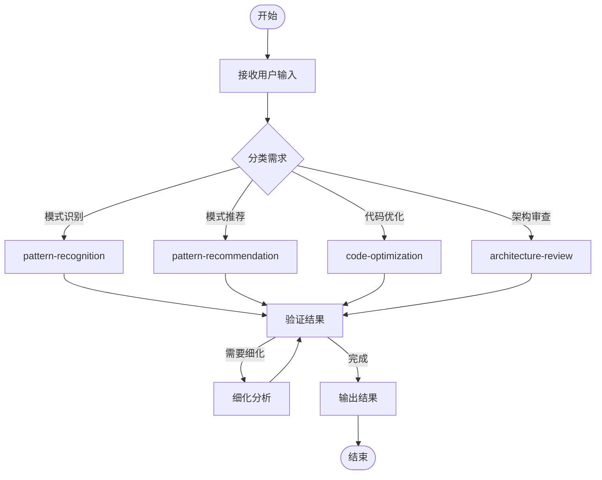
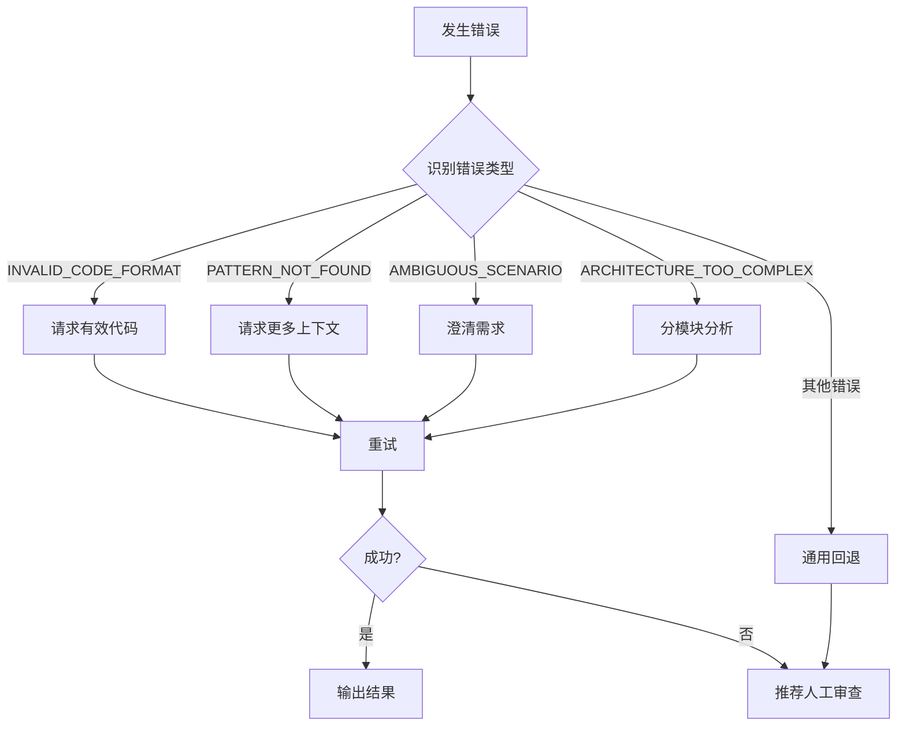

# 设计模式顾问工作流

**名称**: design-pattern-advisor-workflow  
**描述**: 设计模式顾问的标准工作流程，支持复杂场景的多步骤处理  
**版本**: 1.0.0  
**关联技能**: design-pattern-advisor

---

## 工作流概览



---

## 工作步骤

### Step 1: 接收用户输入

**操作**：
- 接收用户的自然语言描述或代码片段
- 识别用户意图（识别/推荐/优化/审查）
- 收集必要的上下文信息

**输入示例**：
```
"分析这个数据库连接池类的设计模式使用"
"我需要实现一个支持多种支付方式的系统"
"优化这段包含大量if-else的代码"
"审查这个微服务架构的设计"
```

**输出**：
- 分类后的需求类型
- 提取的关键信息

---

### Step 2: 分类需求

**操作**：
根据用户输入，将需求分类为以下四种类型之一：

| 需求类型 | 关键词 | 复合能力 |
|----------|--------|----------|
| 模式识别 | 分析、识别、使用了什么模式 | pattern-recognition |
| 模式推荐 | 推荐、选择、用什么模式 | pattern-recommendation |
| 代码优化 | 优化、重构、改进 | code-optimization |
| 架构审查 | 审查、评估、架构 | architecture-review |

**决策逻辑**：
```
IF 输入包含 "分析" OR "识别" OR "使用了什么"
    THEN 类型 = 模式识别
ELSE IF 输入包含 "推荐" OR "选择" OR "用什么"
    THEN 类型 = 模式推荐
ELSE IF 输入包含 "优化" OR "重构" OR "改进"
    THEN 类型 = 代码优化
ELSE IF 输入包含 "审查" OR "评估" OR "架构"
    THEN 类型 = 架构审查
ELSE
    请求用户澄清需求
```

---

### Step 3: 执行复合能力

根据分类结果，调用相应的复合能力：

#### 3.1 模式识别 (pattern-recognition)

**调用原子能力**：
1. analyze-pattern-usage
2. detect-pattern-misuse

**执行流程**：
```
analyze-pattern-usage
    ↓
IF 发现模式 THEN
    detect-pattern-misuse
        ↓
    生成识别报告
ELSE
    返回未识别到模式
```

**输出示例**：
```
识别到的设计模式：
✓ 单例模式 - 正确实现
✓ 工厂方法 - 部分正确
⚠ 潜在问题：单例持有可变状态
```

#### 3.2 模式推荐 (pattern-recommendation)

**调用原子能力**：
1. recommend-pattern
2. compare-patterns（如需要）

**执行流程**：
```
recommend-pattern
    ↓
IF 推荐数 > 1 THEN
    compare-patterns
        ↓
    生成对比分析
ELSE
    返回单一推荐
```

**输出示例**：
```
推荐方案：
1. 策略模式（高优先级）
2. 工厂方法（中优先级）

对比：策略模式 vs 状态模式
- 策略模式更适合当前场景
```

#### 3.3 代码优化 (code-optimization)

**调用原子能力**：
1. suggest-refactoring
2. generate-code-example

**执行流程**：
```
suggest-refactoring
    ↓
IF 有重构方案 THEN
    generate-code-example
        ↓
    生成完整示例
ELSE
    返回优化建议
```

**输出示例**：
```
重构建议：将条件判断重构为策略模式

步骤1：定义策略接口
步骤2：提取具体策略
步骤3：修改上下文类

重构收益：代码复杂度降低60%
```

#### 3.4 架构审查 (architecture-review)

**调用原子能力**：
1. evaluate-architecture
2. identify-design-smell

**执行流程**：
```
evaluate-architecture
    ↓
identify-design-smell
    ↓
生成架构评估报告
```

**输出示例**：
```
架构评估报告：
整体评分：82/100

优势：
- 服务职责划分清晰

风险：
- 服务间耦合过高

改进建议：
1. 引入外观模式
2. 添加熔断机制
```

---

### Step 4: 验证结果

**操作**：
- 检查分析结果是否完整
- 验证建议的合理性
- 评估置信度

**验证标准**：
- [ ] 结果包含明确的结论
- [ ] 建议具体可执行
- [ ] 置信度 > 0.8

**决策**：
```
IF 结果完整 AND 置信度足够 THEN
    进入输出步骤
ELSE IF 需要更多信息 THEN
    请求用户补充
ELSE
    进入细化分析
```

---

### Step 5: 细化分析（可选）

**触发条件**：
- 初步分析结果不够具体
- 需要更深入的代码审查
- 用户要求更详细的解释

**操作**：
- 缩小分析范围
- 增加分析深度
- 提供更多示例

**细化策略**：
1. **缩小范围**：聚焦特定模块或类
2. **增加深度**：从basic提升到detailed
3. **补充示例**：生成更多代码示例

---

### Step 6: 输出结果

**操作**：
- 格式化分析结果
- 生成结构化报告
- 提供可执行的建议

**输出格式**：
```markdown
## 分析结果

### 1. 识别/推荐/优化/审查 总结
[一句话总结]

### 2. 详细分析
[详细说明]

### 3. 建议方案
[具体建议]

### 4. 预期收益
[收益分析]

### 5. 注意事项
[风险提示]
```

---

## 错误处理流程



### 错误处理策略

| 错误类型 | 处理策略 | 回退操作 |
|----------|----------|----------|
| INVALID_CODE_FORMAT | 请求有效代码 | 提供代码格式示例 |
| PATTERN_NOT_FOUND | 请求更多上下文 | 建议手动描述意图 |
| AMBIGUOUS_SCENARIO | 澄清需求 | 提供场景模板 |
| ARCHITECTURE_TOO_COMPLEX | 分模块分析 | 建议提供架构图 |
| UNSUPPORTED_LANGUAGE | 说明支持范围 | 推荐主流语言 |
| INSUFFICIENT_CONTEXT | 请求补充信息 | 提供信息清单 |

---

## 使用示例

### 示例1：完整工作流程（模式识别）

**用户输入**：
```
分析这个数据库连接池类的设计模式使用
```

**工作流执行**：

1. **接收输入**
   - 识别到代码分析请求
   - 提取关键词："分析"、"设计模式"

2. **分类需求**
   - 类型 = 模式识别
   - 复合能力 = pattern-recognition

3. **执行复合能力**
   - 调用 analyze-pattern-usage
   - 发现单例模式、工厂方法
   - 调用 detect-pattern-misuse
   - 检测到单例持有可变状态

4. **验证结果**
   - 结果完整 ✓
   - 置信度 0.92 ✓

5. **输出结果**
   ```
   识别到的设计模式：
   ✓ 单例模式 - 正确实现
   ✓ 工厂方法 - 部分正确
   ⚠ 潜在问题：单例持有可变状态
   ```

### 示例2：需要细化的工作流程

**用户输入**：
```
优化这段代码
```

**工作流执行**：

1. **接收输入**
   - 识别到优化请求
   - 但未提供具体代码

2. **分类需求**
   - 类型 = 代码优化
   - 但缺少必要信息

3. **错误处理**
   - 错误类型 = INSUFFICIENT_CONTEXT
   - 回退操作 = 请求提供代码

4. **请求补充**
   ```
   请提供需要优化的代码片段，我将为您分析并提供重构建议。
   ```

5. **用户补充**
   - 用户提供代码

6. **重新执行**
   - 继续正常流程

---

## 最佳实践

### 工作流使用建议

1. **明确需求**
   - 在开始时清晰描述需求
   - 提供必要的上下文信息

2. **提供完整输入**
   - 包含相关代码片段
   - 说明业务背景和目标

3. **迭代优化**
   - 先获取初步分析
   - 根据需要请求细化

4. **验证建议**
   - 评估建议的合理性
   - 结合实际场景调整

### 性能优化

1. **缓存结果**
   - 相同输入直接返回缓存
   - 减少重复分析

2. **并行处理**
   - 独立原子能力并行执行
   - 提高响应速度

3. **增量分析**
   - 只分析变更部分
   - 避免全量处理

---

## 版本历史

### v1.0.0 (2026-03-01)

- 初始版本
- 定义标准工作流程
- 支持4种复合能力
- 包含完整的错误处理流程

---

**使用此工作流，系统化地应用设计模式顾问技能！**
