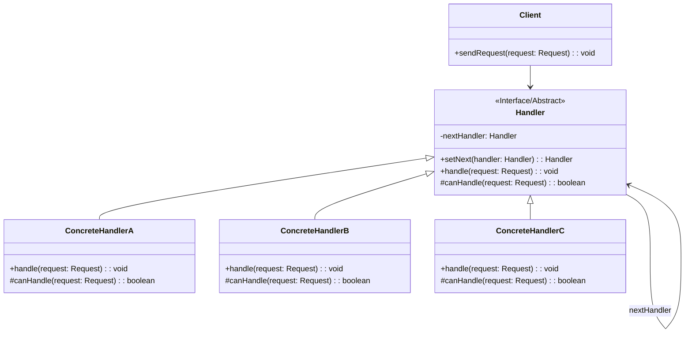

# 责任链模式 (Chain of Responsibility Pattern)

## 意图

使多个对象都有机会处理请求，从而避免请求的发送者和接收者之间的耦合关系。将这些对象连成一条链，并沿着这条链传递请求，直到有一个对象处理它为止。

## 结构

### UML类图

### 角色说明

| 角色 | 职责 |
|------|------|
| **Handler（抽象处理者）** | 定义处理请求的接口，通常包含设置下一个处理者的方法 `setNext()` 和处理请求的方法 `handle()`。可以定义一个默认的处理行为，用于将请求转发给下一个处理者 |
| **ConcreteHandler（具体处理者）** | 实现抽象处理者接口，负责处理它所负责的请求。如果无法处理该请求，则将请求转发给下一个处理者 |
| **Client（客户端）** | 创建处理链，并向链的第一个处理者提交请求。客户端不需要知道请求最终由哪个处理者处理 |

## 适用场景

- 有多个对象可以处理同一个请求，具体哪个对象处理由运行时决定
- 在不明确指定接收者的情况下，向多个对象中的一个提交请求
- 可动态指定一组对象处理请求
- 需要在不同时间动态添加、移除或重新排序处理者
- 处理者集合及其处理顺序在运行时需要改变
- 多个对象需要按顺序处理同一请求，形成处理管道
- 需要实现请求的分级处理机制（如审批流程）
- 希望避免将请求发送者与多个接收者硬编码耦合

## 优缺点

### 优点

1. **降低耦合度**：请求发送者不需要知道请求最终由哪个处理者处理，也不需要知道链的结构，只需将请求发送给第一个处理者即可
2. **增强了给对象指派职责的灵活性**：可以在运行时动态地改变链中的处理者顺序或增删处理者，无需修改现有代码
3. **符合单一职责原则**：每个处理者只负责处理自己职责范围内的请求，将请求的发送和处理解耦
4. **符合开闭原则**：可以方便地增加新的处理者类来扩展功能，而无需修改现有代码

### 缺点

1. **不能保证请求一定被接收**：如果链的末端没有处理者能够处理请求，或者链配置不当，请求可能无法被处理而"掉落到地上"
2. **系统性能将受到一定影响**：请求可能需要在链上传递多次才能找到合适的处理者，特别是在链较长时
3. **代码调试时不太方便**：由于请求的处理路径是动态的，追踪请求在链中的传递过程相对困难
4. **可能产生循环调用**：如果链的配置不当（如处理者A指向B，B又指回A），可能导致无限循环

## 实现要点

1. **定义处理器接口**：创建抽象处理者类，包含设置下一个处理者的方法和处理请求的抽象方法
2. **每个处理器知道下一个处理器**：在抽象处理者中维护一个指向下一个处理者的引用
3. **无法处理时传递给下一个处理器**：在 `handle()` 方法中，如果当前处理者无法处理请求，则调用 `nextHandler.handle(request)` 将请求转发
4. **链的构建**：客户端负责按正确顺序组装处理链，确保链的末端有一个默认处理者或进行空检查
5. **请求对象的封装**：将请求信息封装成对象，便于在链中传递和处理

## 与其他模式的关系

- **命令模式**：可以用命令对象发起请求，责任链模式中的请求可以封装为命令对象。命令模式将请求封装为对象，而责任链模式决定由哪个对象处理请求
- **装饰器模式**：两者都使用递归组合来组织对象，但目的不同。装饰器模式用于动态添加功能，责任链模式用于动态选择处理者
- **组合模式**：责任链模式常与组合模式结合使用，形成树形结构的处理链，请求可以在树中传递直到被处理
- **观察者模式**：责任链模式允许多个处理者依次尝试处理请求，而观察者模式允许多个观察者同时接收并处理通知

## 常见问题

### Q1: 如何处理链末端请求未被处理的情况？

**A**: 有几种常见的处理方式：
- 在链的末端添加一个默认处理者，负责处理所有未被前面处理者处理的请求
- 在抽象处理者的 `handle()` 方法中添加检查，如果 `nextHandler` 为空且当前处理者无法处理，则抛出异常或记录日志
- 让 `handle()` 方法返回布尔值或结果对象，客户端可以根据返回值判断请求是否被处理

### Q2: 责任链模式和装饰器模式有什么区别？

**A**: 虽然两者都使用链式结构，但有本质区别：
- **责任链模式**：链上的每个处理者决定是否处理请求，如果不处理则传递给下一个，只有一个处理者会实际处理请求
- **装饰器模式**：每个装饰器都会处理请求（添加功能），然后将请求传递给下一个，所有装饰器都会参与处理

### Q3: 如何避免链中的循环调用？

**A**: 可以采取以下措施：
- 在构建链时进行验证，确保不会产生循环引用
- 在请求对象中添加访问标记或计数器，当检测到循环时抛出异常
- 使用有向无环图（DAG）的结构来组织处理者关系

## 最佳实践

1. **保持处理者的单一职责**：每个处理者应该只负责一种类型或一个范围内的请求处理，避免创建"万能处理者"。这样可以提高代码的可维护性和可测试性

2. **提供链构建的辅助方法**：为客户端提供便捷的方法来构建处理链，例如使用建造者模式或工厂方法，而不是让客户端手动设置每个处理者的下一个处理者

3. **考虑使用异步处理**：对于耗时较长的处理操作，考虑将责任链与异步编程模型结合，避免阻塞主线程

4. **添加适当的日志和监控**：由于请求的处理路径是动态的，添加日志记录请求在链中的传递路径，便于调试和性能监控
