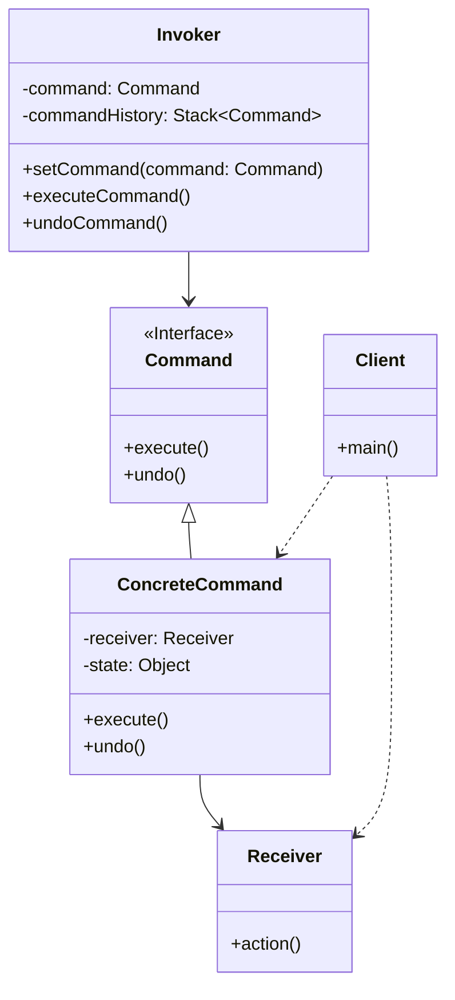

# 命令模式 (Command Pattern)

## 意图

将一个请求封装为一个对象，从而使你可用不同的请求对客户进行参数化；对请求排队或记录请求日志，以及支持可撤销的操作。

命令模式的核心思想是**解耦**——将发出请求的对象（调用者）与执行请求的对象（接收者）分离，使两者可以独立变化。

## 结构

### UML类图



### 角色说明

| 角色 | 职责描述 |
|------|----------|
| **Command（命令接口）** | 声明执行操作的接口，通常包含 `execute()` 和 `undo()` 方法 |
| **ConcreteCommand（具体命令）** | 实现命令接口，绑定一个接收者对象，调用接收者的相应操作来完成请求 |
| **Invoker（调用者）** | 负责调用命令对象执行请求，可以维护命令历史以支持撤销功能 |
| **Receiver（接收者）** | 知道如何实施与执行一个请求相关的操作，任何类都可能作为接收者 |
| **Client（客户端）** | 创建具体命令对象并设置其接收者，将命令对象交给调用者 |

## 适用场景

1. **请求解耦**：需要将请求调用者和请求接收者解耦，使调用者不需要知道接收者的具体实现
2. **请求排队**：需要在不同的时间指定请求、将请求排队和执行请求
3. **撤销恢复**：需要支持命令的撤销（Undo）和恢复（Redo）操作
4. **宏命令**：需要将一组操作组合在一起，形成宏命令（Composite Command）
5. **日志记录**：需要记录请求日志，以便在系统崩溃时能够重新执行这些请求
6. **事务系统**：需要实现事务功能，确保一组操作要么全部成功，要么全部回滚
7. **GUI操作**：图形界面中的菜单项、按钮等需要绑定可配置的操作

## 优缺点

### 优点

1. **单一职责原则**：将发起操作的对象与执行操作的对象解耦，每个类只负责单一职责
2. **开闭原则**：新的命令可以很容易地添加到系统中，无需修改现有代码
3. **支持撤销/重做**：通过维护命令历史，可以方便地实现撤销和恢复功能
4. **支持宏命令**：可以将多个命令组合成一个复合命令，实现批处理操作
5. **支持事务**：可以将多个命令组织成原子操作，实现事务性执行

### 缺点

1. **类数量膨胀**：每个具体命令都需要一个类，可能导致系统中类的数量过多
2. **实现复杂度增加**：为了实现撤销功能，需要额外维护状态和历史记录，增加了实现复杂度
3. **内存开销**：维护命令历史会消耗额外的内存资源，特别是在长时间运行的系统中

## 实现要点

1. **定义命令接口**：声明 `execute()` 和可选的 `undo()` 方法
2. **具体命令封装接收者**：在 `execute()` 方法中调用接收者的相应操作
3. **调用者持有命令对象**：调用者通过命令接口与具体命令交互
4. **支持撤销功能**：在命令中保存执行前的状态，以便 `undo()` 方法恢复
5. **命令历史管理**：使用栈结构管理命令历史，支持多级撤销

## 与其他模式的关系

### 组合模式（Composite Pattern）

命令模式可以与组合模式结合使用，将多个命令组合成一个**宏命令**（Composite Command）。宏命令本身也是一个命令，可以包含多个子命令，执行时依次调用所有子命令。

```
MacroCommand (Composite)
├── ConcreteCommand A
├── ConcreteCommand B
└── ConcreteCommand C
```

### 备忘录模式（Memento Pattern）

命令模式与备忘录模式经常一起使用来实现**撤销功能**。命令对象在执行前创建接收者的备忘录（Memento），保存当前状态；撤销时，使用备忘录将接收者恢复到之前的状态。

```
ConcreteCommand.execute():
    1. 创建 Memento = Receiver.createMemento()
    2. 保存 Memento 到历史栈
    3. 执行 Receiver.action()

ConcreteCommand.undo():
    1. 从历史栈取出 Memento
    2. Receiver.restoreMemento(Memento)
```

### 责任链模式（Chain of Responsibility）

可以用责任链来处理命令，将多个命令处理器链接在一起，每个处理器决定是否处理该命令或将命令传递给下一个处理器。

## 常见问题

### Q1: 如何实现多级撤销功能？

**A**: 使用栈（Stack）数据结构来维护命令历史：

```java
public class Invoker {
    private Stack<Command> history = new Stack<>();
    private Stack<Command> redoStack = new Stack<>();

    public void executeCommand(Command command) {
        command.execute();
        history.push(command);
        redoStack.clear(); // 新命令执行后清空重做栈
    }

    public void undo() {
        if (!history.isEmpty()) {
            Command command = history.pop();
            command.undo();
            redoStack.push(command);
        }
    }

    public void redo() {
        if (!redoStack.isEmpty()) {
            Command command = redoStack.pop();
            command.execute();
            history.push(command);
        }
    }
}
```

### Q2: 命令模式如何与备忘录模式组合实现复杂对象的撤销？

**A**: 当接收者对象状态复杂时，直接在命令中保存状态会变得困难。这时可以结合备忘录模式：

```java
// 接收者
public class Editor {
    private String content;
    private int cursorPosition;
    private List<String> selection;

    public Memento createMemento() {
        return new Memento(content, cursorPosition, selection);
    }

    public void restoreMemento(Memento memento) {
        this.content = memento.getContent();
        this.cursorPosition = memento.getCursorPosition();
        this.selection = memento.getSelection();
    }
}

// 具体命令
public class InsertTextCommand implements Command {
    private Editor editor;
    private String text;
    private Memento backup;

    public void execute() {
        backup = editor.createMemento();  // 保存状态
        editor.insert(text);
    }

    public void undo() {
        editor.restoreMemento(backup);    // 恢复状态
    }
}
```

### Q3: 如何处理不需要撤销的简单命令？

**A**: 可以为命令接口提供默认的 `undo()` 实现，或者使用抽象类：

```java
public interface Command {
    void execute();
    default void undo() {
        // 默认空实现，不需要撤销的命令无需重写
    }
}
```

## 最佳实践

### 1. 使用空对象模式处理无操作情况

当调用者在没有设置命令时被调用，使用空对象模式避免空指针异常：

```java
public class NoCommand implements Command {
    public void execute() {
        // 什么都不做
    }
    public void undo() {
        // 什么都不做
    }
}

// 调用者初始化时使用空命令
public class Invoker {
    private Command command = new NoCommand();  // 默认空命令
}
```

### 2. 延迟执行与命令队列

将命令放入队列中实现延迟执行，适用于异步处理、任务调度等场景：

```java
public class CommandQueue {
    private BlockingQueue<Command> queue = new LinkedBlockingQueue<>();

    public void addCommand(Command command) {
        queue.offer(command);
    }

    public void processCommands() {
        while (!queue.isEmpty()) {
            Command command = queue.poll();
            command.execute();
        }
    }
}
```

### 3. 命令的序列化与持久化

将命令序列化保存到磁盘，实现系统崩溃后的恢复：

```java
public class CommandLogger {
    public void logCommand(Command command) {
        String serialized = serialize(command);
        writeToLogFile(serialized);
    }

    public void replayCommands() {
        List<String> logs = readLogFile();
        for (String log : logs) {
            Command command = deserialize(log);
            command.execute();
        }
    }
}
```

### 4. 使用Lambda表达式简化（Java 8+）

对于简单的命令，可以使用Lambda表达式避免创建大量具体命令类：

```java
// 使用函数式接口
Invoker invoker = new Invoker();
invoker.setCommand(() -> receiver.action());
invoker.executeCommand();
```

## 相关设计原则

- **开闭原则**：对扩展开放，对修改关闭
- **单一职责原则**：一个类只负责一项职责
- **依赖倒置原则**：高层模块不应该依赖低层模块，两者都应该依赖抽象
