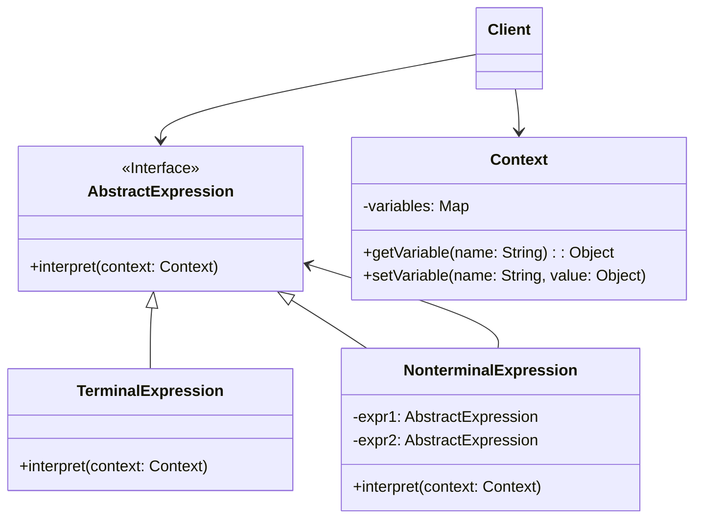

# 解释器模式 (Interpreter Pattern)

## 意图

给定一个语言，定义它的文法的一种表示，并定义一个解释器，这个解释器使用该表示来解释语言中的句子。

解释器模式为自定义领域特定语言（DSL）提供了一种系统化的实现方式，通过将文法规则映射为类层次结构，使得语言解释过程变得清晰且可扩展。

## 结构

### UML类图

### 角色说明

| 角色 | 职责描述 |
|------|----------|
| **AbstractExpression（抽象表达式）** | 声明一个抽象的 `interpret()` 操作，所有具体表达式类都实现该接口。这是抽象语法树中所有节点的共同基类。 |
| **TerminalExpression（终结符表达式）** | 实现与文法中的终结符相关的 `interpret()` 操作。终结符表达式通常表示语言中的原子元素，如变量、常量或基本符号。 |
| **NonterminalExpression（非终结符表达式）** | 实现与文法中的非终结符相关的 `interpret()` 操作。非终结符表达式通常包含对其他表达式的引用，用于表示复合规则（如加法、逻辑运算等）。 |
| **Context（上下文）** | 包含解释器所需的全局信息，如变量值、函数定义等。上下文在解释过程中被传递和共享。 |
| **Client（客户端）** | 构建抽象语法树（AST），并调用解释操作。客户端负责将输入文本解析为表达式对象的树形结构。 |

## 适用场景

- 当有一个语言需要解释执行，并且可将该语言中的句子表示为一个抽象语法树时
- 文法简单且相对稳定的场景，文法规则数量较少（通常几十条以内）
- 效率不是关键问题，对执行性能要求不高的场景
- 需要频繁扩展或修改文法规则的场景
- 实现领域特定语言（DSL）时，如配置文件解析、查询语言、规则引擎等
- 需要实现简单的脚本语言或表达式求值器时
- 数学表达式计算、正则表达式解析、SQL解析等场景

## 优缺点

### 优点

1. **易于改变和扩展文法**：通过继承机制可以方便地添加新的表达式类来扩展文法，符合开闭原则
2. **实现文法较为容易**：每个文法规则对应一个类，文法的层次结构清晰直观，易于理解和实现
3. **增加新的解释表达式较为方便**：新增表达式类型只需添加新的具体表达式类，无需修改现有代码
4. **便于实现语法树的可视化和调试**：由于表达式被表示为对象树，可以方便地进行遍历、打印和分析
5. **支持解释器的组合和复用**：复杂的表达式可以通过组合简单的表达式来构建，提高代码复用性

### 缺点

1. **对于复杂的文法比较难以维护**：当文法规则数量庞大时，类的数量会急剧增加，导致系统难以管理和维护
2. **执行效率较低**：解释器模式通常采用递归调用和对象树遍历，性能开销较大，不适合高性能要求的场景
3. **每条规则至少对应一个类**：文法规则较多时会产生大量的类文件，增加系统复杂度和内存占用
4. **错误处理机制复杂**：语法错误的定位和报告需要额外的机制支持，增加了实现难度
5. **缺乏编译优化**：相比编译型语言，解释执行难以进行优化，执行速度较慢

## 实现要点

1. **定义抽象表达式接口**：创建一个声明 `interpret()` 方法的抽象类或接口，作为所有表达式的基类
2. **终结符表达式实现基本解释**：为文法中的终结符（如变量、常量）创建具体类，实现基本的解释逻辑
3. **非终结符表达式组合子表达式**：为文法中的非终结符（如运算符、语句）创建具体类，通过组合其他表达式实现复合解释逻辑
4. **上下文存储解释所需信息**：设计上下文类存储变量、函数定义等全局信息，确保在解释过程中可被访问
5. **构建抽象语法树**：客户端或解析器负责将输入文本转换为表达式对象的树形结构
6. **递归解释执行**：通过递归调用各节点的 `interpret()` 方法完成整个表达式的求值

## 与其他模式的关系

- **组合模式**：抽象语法树通常用组合模式实现。解释器模式中的表达式树本质上是一种组合结构，终结符表达式对应叶子节点，非终结符表达式对应组合节点
- **访问者模式**：可以用访问者模式来维护抽象语法树，实现对表达式树的不同操作（如类型检查、代码生成、优化等）而无需修改表达式类
- **享元模式**：当终结符表达式需要大量创建时，可以使用享元模式共享相同的终结符对象，减少内存占用
- **策略模式**：解释器可以使用策略模式来选择不同的解释策略或优化算法

## 常见问题

### Q1: 解释器模式与编译器有什么区别？

解释器模式是一种设计模式，用于构建语言的解释器；而编译器是一个完整的工具链，通常包含词法分析、语法分析、语义分析、代码生成和优化等阶段。解释器模式通常只关注解释执行部分，且一般采用直接解释抽象语法树的方式，而编译器通常会将源代码转换为目标机器代码或字节码。解释器模式适合简单的领域特定语言，而编译器适合复杂的通用编程语言。

### Q2: 如何处理解释器模式中的语法错误？

在解释器模式中处理语法错误通常需要以下策略：
1. **解析阶段错误处理**：在构建抽象语法树时进行语法检查，发现错误时抛出异常并报告错误位置
2. **解释阶段错误处理**：在 `interpret()` 方法执行时捕获运行时错误，如变量未定义、类型不匹配等
3. **错误恢复机制**：实现错误恢复策略，如跳过错误语句继续执行，或提供详细的错误堆栈信息
4. **上下文信息传递**：在上下文中维护位置信息（行号、列号），便于错误定位和报告

### Q3: 解释器模式适用于大型复杂语言吗？

解释器模式通常不推荐用于大型复杂语言的实现。对于复杂语言，建议采用以下替代方案：
1. 使用成熟的解析器生成工具（如 ANTLR、Yacc/Bison）
2. 将语言编译为字节码，然后在虚拟机中执行
3. 使用现有的脚本语言引擎（如嵌入 Lua、JavaScript 等）

## 最佳实践

1. **保持文法简单**：解释器模式最适合文法规则数量较少的场景（通常建议不超过几十条规则）。如果文法过于复杂，应考虑使用专业的解析器生成工具或编译器框架。

2. **使用组合模式构建表达式树**：充分利用组合模式的特性来构建表达式层次结构，确保终结符和非终结符表达式具有一致的接口，便于递归处理和遍历。

3. **考虑使用享元模式优化**：当相同的终结符表达式会被频繁创建时（如常量、变量名），使用享元模式共享这些对象，可以显著减少内存占用和提高性能。

4. **分离解析与解释职责**：将构建抽象语法树的解析逻辑与解释执行的逻辑分离，遵循单一职责原则。可以考虑使用工厂模式或建造者模式来创建表达式对象。

5. **缓存解释结果**：对于重复执行的表达式，考虑在上下文中缓存解释结果，避免重复计算，提高执行效率。

6. **提供清晰的错误信息**：在解释过程中提供详细的错误信息，包括错误类型、位置信息和修复建议，便于用户调试和使用。

## 相关设计原则

- 单一职责原则
- 开闭原则
