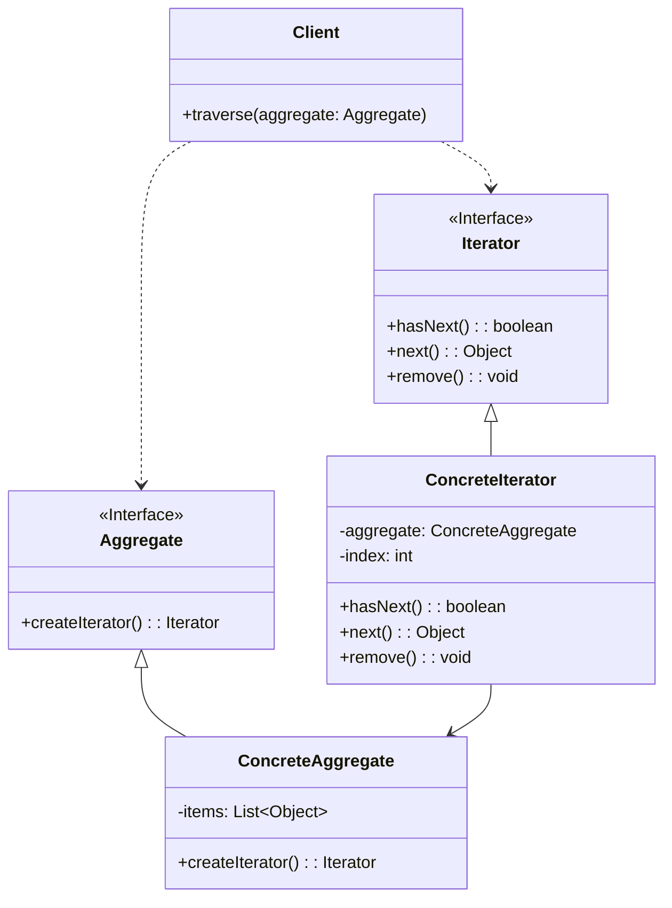

# 迭代器模式 (Iterator Pattern)

## 意图

提供一种方法顺序访问一个聚合对象中的各个元素，而又不需要暴露该对象的内部表示。

该模式将遍历逻辑从聚合对象中分离出来，使得客户端能够以统一的方式访问不同的聚合结构，同时保持聚合对象的封装性。迭代器模式定义了一个访问聚合元素的接口，而具体的遍历算法由迭代器实现，这使得相同的聚合结构可以支持多种遍历方式。

## 结构

### UML类图

### 角色说明

| 角色 | 职责 |
|------|------|
| **Iterator（迭代器）** | 定义访问和遍历元素的接口，声明 `hasNext()`、`next()` 等方法用于遍历聚合对象中的元素 |
| **ConcreteIterator（具体迭代器）** | 实现 Iterator 接口，维护遍历的当前位置，跟踪聚合对象中的当前元素，负责具体的遍历算法实现 |
| **Aggregate（聚合）** | 定义创建相应迭代器对象的接口，声明 `createIterator()` 工厂方法用于获取迭代器实例 |
| **ConcreteAggregate（具体聚合）** | 实现 Aggregate 接口，返回 ConcreteIterator 的实例，负责存储和管理聚合对象的数据 |
| **Client（客户端）** | 通过 Iterator 接口遍历聚合对象中的元素，无需了解聚合对象的内部结构 |

## 适用场景

- **隐藏聚合内部结构**：当需要访问聚合对象的内容而无需暴露其内部表示时，迭代器模式提供了一种统一的访问方式
- **支持多种遍历方式**：当聚合对象需要支持多种遍历算法（如正向遍历、反向遍历、按特定条件过滤遍历等）时
- **统一遍历接口**：为遍历不同的聚合结构（数组、链表、树、图等）提供一个统一的接口，使客户端代码与具体聚合结构解耦
- **支持并发遍历**：当需要在同一个聚合对象上同时进行多个遍历时，每个迭代器维护自己的遍历状态
- **简化聚合类**：将遍历逻辑从聚合类中分离出来，使聚合类专注于数据存储，符合单一职责原则

## 优缺点

### 优点

1. **单一职责原则**：将遍历逻辑从聚合对象中分离，聚合类只需关注数据存储，迭代器类负责遍历逻辑，使代码更加清晰和易于维护
2. **开闭原则**：可以引入新的聚合类和迭代器类而不修改现有代码，轻松实现新的遍历方式
3. **支持多种遍历方式**：同一个聚合对象可以有多个不同的迭代器实现，支持正向、反向、过滤等多种遍历策略
4. **并行遍历支持**：可以在同一个聚合对象上同时进行多个遍历，每个迭代器维护自己的遍历状态，互不干扰
5. **统一的访问接口**：为不同类型的聚合结构提供一致的遍历接口，客户端代码无需关心底层数据结构

### 缺点

1. **增加系统复杂性**：对于简单的聚合对象，引入迭代器模式会增加额外的类和接口，使系统变得更加复杂
2. **性能开销**：相比直接访问集合元素，使用迭代器会带来一定的性能开销，特别是在需要频繁创建迭代器对象的场景
3. **调试困难**：由于遍历逻辑分散在迭代器类中，当出现问题时，调试和跟踪代码执行流程可能变得更加困难

## 实现要点

1. **定义迭代器接口**：声明遍历所需的基本方法，通常包括 `hasNext()` 判断是否还有下一个元素、`next()` 获取下一个元素，可选 `remove()` 删除当前元素
2. **聚合对象提供创建迭代器的方法**：Aggregate 接口声明 `createIterator()` 工厂方法，ConcreteAggregate 实现该方法返回对应的 ConcreteIterator 实例
3. **迭代器维护遍历状态**：ConcreteIterator 需要维护当前遍历位置（如索引），确保能够正确追踪遍历进度
4. **考虑空迭代器**：对于空聚合对象，可以返回一个特殊的空迭代器实现，避免空指针检查
5. **线程安全考虑**：在多线程环境下，需要考虑迭代器的线程安全性，或使用 fail-fast 机制检测并发修改

## 与其他模式的关系

- **组合模式**：常与迭代器模式一起使用遍历树形结构。组合模式定义了树形结构的组织方式，而迭代器模式提供了遍历该结构的方法。可以使用迭代器实现组合结构的深度优先或广度优先遍历。

- **工厂方法模式**：聚合对象通常使用工厂方法模式来创建对应的迭代器对象。Aggregate 接口声明 `createIterator()` 方法，ConcreteAggregate 实现该方法返回 ConcreteIterator 实例，这本质上就是工厂方法模式的应用。

- **备忘录模式**：可以与迭代器模式结合使用，实现迭代器状态的保存和恢复。这在需要支持"撤销"遍历操作或实现复杂遍历历史记录时非常有用。

- **访问者模式**：迭代器模式用于遍历聚合结构，而访问者模式用于对聚合结构中的元素执行操作。两者可以结合使用，在遍历过程中对元素执行特定操作。

## 常见问题

### Q1: 迭代器模式与直接使用 for 循环遍历有什么区别？

**A:** 主要区别在于封装性和灵活性：
- **封装性**：迭代器模式隐藏了聚合对象的内部结构，客户端无需知道底层是数组、链表还是其他数据结构
- **灵活性**：迭代器模式支持多种遍历方式（正向、反向、过滤等），且可以在运行时切换
- **安全性**：迭代器可以在遍历过程中检测聚合对象的修改（fail-fast 机制），避免并发修改异常
- **统一接口**：为不同类型的聚合提供一致的遍历接口，使客户端代码更加通用

### Q2: 如何处理在遍历过程中修改聚合对象的情况？

**A:** 常见的处理策略包括：
- **Fail-Fast 机制**：迭代器在创建时记录聚合对象的修改次数，每次访问元素时检查修改次数是否变化，如果变化则抛出并发修改异常
- **快照迭代器**：创建迭代器时对聚合对象进行快照，迭代器遍历的是快照数据，不受原聚合对象修改的影响
- **延迟删除**：迭代器提供 `remove()` 方法，由迭代器安全地删除当前元素，而不是直接修改聚合对象
- **读写分离**：使用读写锁等机制确保遍历和修改操作的线程安全

## 最佳实践

1. **优先使用语言内置的迭代器**：现代编程语言（如 Java 的 `Iterator` 接口、C# 的 `IEnumerable`、Python 的迭代器协议）都提供了内置的迭代器支持，应优先使用这些标准实现，而不是自己从头实现

2. **实现 fail-fast 机制**：在 ConcreteIterator 中维护一个修改计数器，在创建迭代器时记录聚合对象的修改次数，每次访问元素时检查修改次数是否一致。如果不一致，抛出 `ConcurrentModificationException` 异常，避免不确定的行为

3. **考虑提供多种迭代器**：对于复杂的聚合结构，可以提供多种迭代器实现，如正向迭代器、反向迭代器、过滤迭代器等，以满足不同的遍历需求

4. **空对象模式处理空聚合**：对于空聚合对象，返回一个特殊的空迭代器实现（Null Iterator），其 `hasNext()` 始终返回 false，避免客户端进行空值检查

5. **保持迭代器的轻量级**：迭代器应该只维护遍历所需的最小状态（如当前索引），避免持有大量数据或引用，以减少内存开销
