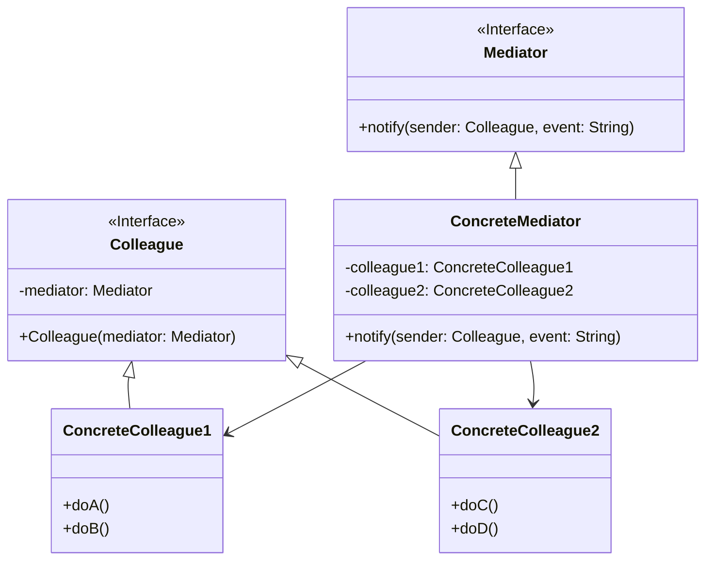

# 中介者模式 (Mediator Pattern)

## 意图

用一个中介对象来封装一系列的对象交互。中介者使各对象不需要显式地相互引用，从而使其耦合松散，而且可以独立地改变它们之间的交互。

## 结构

### UML类图

### 角色说明

| 角色 | 职责 |
|------|------|
| **Mediator（中介者接口）** | 定义与 Colleague 对象通信的接口，声明同事对象交互的方法 |
| **ConcreteMediator（具体中介者）** | 实现 Mediator 接口，协调各 Colleague 对象的交互关系；了解并维护其管理的同事对象 |
| **Colleague（同事类接口）** | 定义同事类的公共接口，每个同事类都知道它的中介者对象 |
| **ConcreteColleague（具体同事类）** | 实现 Colleague 接口，每个具体同事类只知道自己的行为，不了解其他同事类；通过中介者与其他同事通信 |

## 适用场景

- 一组对象以定义良好但复杂的方式进行通信，产生的相互依赖关系结构混乱且难以理解
- 一个对象引用其他很多对象并且直接与这些对象通信，导致难以复用该对象
- 想定制一个分布在多个类中的行为，而又不想生成太多的子类
- 系统中对象之间存在多对多的复杂交互关系
- 需要集中管理对象间的通信逻辑，避免分散在各个对象中
- 需要动态改变对象间的交互方式，而不需要修改对象本身

## 优缺点

### 优点

1. **降低耦合度**：将对象间的一对多关联转变为一对一的关联，使各个同事类解耦，可以独立变化和复用
2. **集中控制交互**：将对象间的交互行为集中封装在中介者中，便于理解和维护复杂的交互逻辑
3. **符合迪米特法则**：同事类只需要与中介者交互，不需要了解其他同事类的内部细节
4. **简化对象协议**：用中介者和同事类的一对多交互替代了同事类之间的多对多交互，简化了通信协议
5. **提高可扩展性**：新增同事类时，只需修改中介者，其他同事类无需改动

### 缺点

1. **中介者过于复杂**：随着同事类数量的增加，中介者会变得越来越庞大和复杂，可能演变成"上帝对象"
2. **单点故障风险**：中介者承担了过多的职责，一旦中介者出现问题，整个系统的通信都会受到影响
3. **性能瓶颈**：所有对象间的通信都经过中介者，在高并发场景下可能成为性能瓶颈

## 实现要点

1. **定义中介者接口**：声明同事对象交互的方法，通常包含 `notify()` 或 `send()` 等方法
2. **同事类持有中介者引用**：每个同事类都应该持有中介者的引用，通过中介者与其他同事通信
3. **中介者协调交互**：中介者需要了解所有同事类，负责协调它们之间的交互逻辑
4. **避免循环依赖**：注意防止同事类和中介者之间产生循环依赖
5. **考虑使用观察者模式**：中介者可以使用观察者模式来实现，当同事状态变化时通知中介者

## 与其他模式的关系

### 外观模式（Facade Pattern）

- **相似点**：两者都通过引入一个中间对象来简化复杂的交互
- **区别**：
  - 外观模式是单向的，客户端通过外观对象访问子系统，子系统不直接与客户端交互
  - 中介者模式是双向的，同事类之间通过中介者进行双向通信
  - 外观模式目的是简化接口，中介者模式目的是解耦对象间的通信

### 观察者模式（Observer Pattern）

- **关系**：中介者模式可以使用观察者模式来实现
- **区别**：
  - 观察者模式定义的是对象间一对多的依赖关系，一个主题通知多个观察者
  - 中介者模式封装的是多对多的交互关系，协调多个对象之间的复杂通信

## 常见问题

### Q1：中介者模式与外观模式有什么区别？

| 对比维度 | 中介者模式 | 外观模式 |
|---------|-----------|---------|
| **目的** | 封装对象间的交互，降低耦合 | 简化复杂子系统的接口 |
| **通信方向** | 双向通信，同事类之间互相通信 | 单向通信，客户端调用子系统 |
| **关注点** | 对象间的协作关系 | 接口的简化封装 |
| **子系统感知** | 子系统（同事类）知道中介者的存在 | 子系统通常不知道外观的存在 |

### Q2：如何避免中介者变成"上帝对象"？

- **职责分离**：将复杂的交互逻辑拆分到多个专门的中介者子类中
- **策略模式**：在中介者中使用策略模式来处理不同类型的交互
- **状态模式**：将状态相关的交互逻辑提取到状态类中
- **限制中介者职责**：中介者只负责协调通信，不涉及业务逻辑处理

### Q3：中介者模式适用于所有多对象交互的场景吗？

不是的。中介者模式适用于对象间交互复杂且经常变化的场景。如果对象间的交互关系简单且稳定，直接引用可能更清晰。过度使用中介者模式会导致不必要的复杂性。

## 最佳实践

1. **合理控制中介者规模**：当同事类数量过多时，考虑将中介者拆分为多个专门的中介者，或使用组合中介者模式

2. **结合观察者模式实现**：使用观察者模式实现中介者，让同事类作为被观察者，中介者作为观察者，这样可以更灵活地处理状态变化通知

3. **避免在中介者中处理业务逻辑**：中介者的职责应该是协调通信，而不是处理具体的业务逻辑。业务逻辑应该保留在各个同事类中

4. **考虑使用事件总线**：在大型系统中，可以考虑使用事件总线（Event Bus）或消息队列来替代传统的中介者模式，以获得更好的可扩展性和解耦效果

5. **文档化交互规则**：由于所有交互逻辑都集中在中介者中，务必做好文档化工作，记录各个同事类之间的交互规则和时序关系
