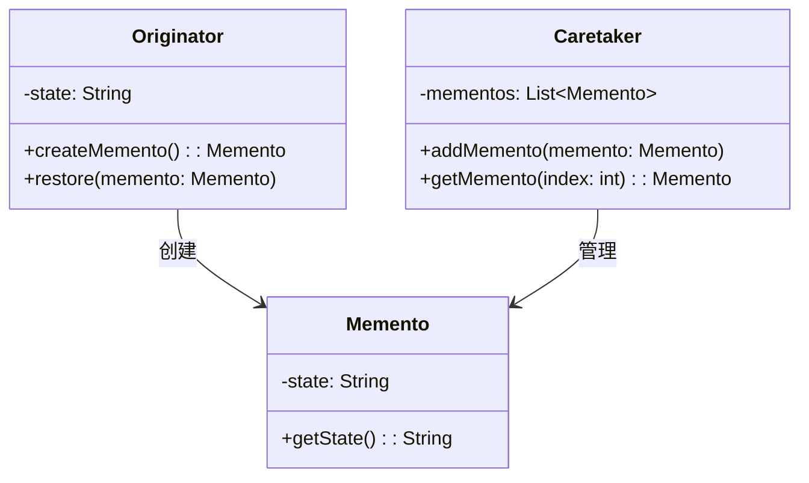

# 备忘录模式 (Memento Pattern)

## 意图

在不破坏封装性的前提下，捕获一个对象的内部状态，并在该对象之外保存这个状态。这样以后就可将该对象恢复到原先保存的状态。

## 结构

### UML类图



### 角色说明

- **原发器（Originator）**：需要保存状态的类。它创建一个备忘录对象来记录当前内部状态，并可以使用备忘录恢复到之前的状态。
- **备忘录（Memento）**：存储原发器的内部状态。备忘录可以保护原发器状态的封装性，防止原发器以外的对象访问备忘录中的状态信息。
- **负责人（Caretaker）**：负责保存备忘录，但不能对备忘录的内容进行操作或检查。负责人可以管理多个备忘录，支持历史记录和多次撤销。

## 适用场景

- 需要保存和恢复数据的相关状态场景，如文本编辑器的撤销功能
- 需要提供一个可回滚的操作，如游戏存档系统
- 需要监控的副本场景，如配置版本管理
- 数据库连接的事务管理，支持事务回滚
- 图形编辑器中的历史记录功能
- 软件安装程序的还原点创建
- 复杂对象状态的快照保存

## 优缺点

### 优点

1. **保持封装性**：在不破坏原发器封装性的前提下捕获和恢复状态，原发器的内部细节不会暴露给其他对象
2. **简化原发器**：将状态保存和恢复的职责分离到备忘录对象，简化了原发器的实现
3. **支持多次撤销**：通过负责人管理多个备忘录，可以实现多级撤销和重做功能
4. **状态快照**：可以创建对象在某一时刻的快照，便于后续恢复或比较

### 缺点

1. **资源消耗**：如果原发器的状态数据量很大，或者保存备忘录的频率很高，会消耗大量内存资源
2. **性能开销**：频繁创建备忘录和恢复状态可能影响系统性能，特别是在状态复杂的情况下
3. **维护成本**：需要额外维护备忘录的生命周期管理，包括备忘录的创建、存储和销毁

## 实现要点

1. **原发器创建备忘录**：原发器负责创建包含其当前状态的备忘录对象
2. **备忘录存储状态**：备忘录存储原发器的状态，通常只允许原发器访问这些状态
3. **负责人管理备忘录**：负责人负责保存备忘录，但不能操作备忘录内容，仅作为备忘录的存储容器
4. **窄接口与宽接口**：备忘录可以提供窄接口（仅原发器可访问）和宽接口（其他对象可访问）来控制访问权限
5. **增量存储优化**：对于大型对象，可以考虑只存储状态的变化（增量）来减少内存占用

## 与其他模式的关系

- **命令模式**：可以使用备忘录模式实现撤销功能。命令对象在执行操作前创建备忘录，撤销时使用备忘录恢复状态
- **迭代器模式**：备忘录模式可以与迭代器模式结合，用于遍历和保存聚合对象的历史状态
- **原型模式**：原型模式可以作为备忘录模式的替代方案，通过复制对象来保存状态，但会破坏封装性

## 常见问题

### 如何与命令模式组合实现撤销功能？

备忘录模式与命令模式结合是实现撤销功能的经典方案：

1. **命令对象持有备忘录**：每个命令对象在执行操作前，通过原发器创建备忘录并保存
2. **撤销时恢复状态**：执行撤销操作时，命令对象从负责人处获取备忘录，调用原发器的恢复方法
3. **支持多级撤销**：负责人维护一个备忘录栈，支持多次撤销和重做

```java
// 示例代码结构
class Command {
    private Originator originator;
    private Memento memento;
    
    public void execute() {
        memento = originator.createMemento(); // 保存状态
        // 执行业务操作
    }
    
    public void undo() {
        originator.restore(memento); // 恢复状态
    }
}
```

### 如何控制备忘录的访问权限？

备忘录模式中有两种接口设计方式：

1. **窄接口（Narrow Interface）**：仅暴露必要的操作给负责人，状态访问方法只对原发器可见
2. **宽接口（Wide Interface）**：暴露所有操作，但需要通过访问控制（如包私有、内部类）限制访问

推荐做法是将备忘录类作为原发器的内部类，或者使用友元类机制，确保只有原发器可以访问备忘录的内部状态。

## 最佳实践

1. **限制备忘录的生命周期**：避免无限累积备忘录导致内存溢出，可以设置最大历史记录数，或者使用LRU（最近最少使用）策略淘汰旧备忘录

2. **使用增量存储优化内存**：对于状态变化较小的场景，只存储状态的差异（增量）而非完整状态，可以显著减少内存占用

3. **备忘录的不可变性**：将备忘录设计为不可变对象，一旦创建就不能修改，这样可以安全地在多个负责人之间共享，也便于实现重做功能

4. **序列化支持**：对于需要持久化的场景，让备忘录实现序列化接口，可以将状态保存到磁盘，实现跨会话的状态恢复
