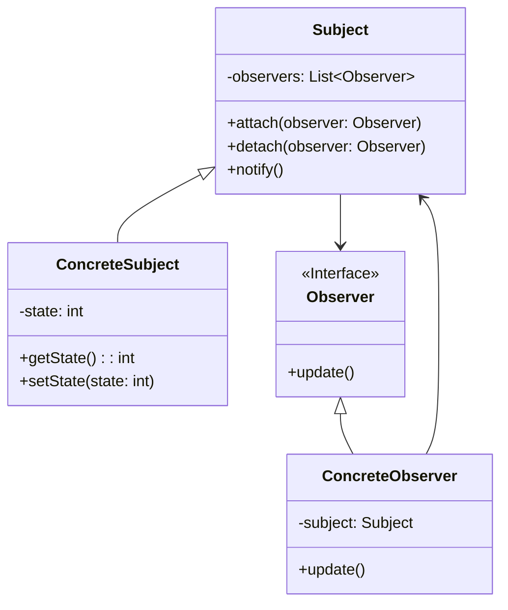

# 观察者模式 (Observer Pattern)

## 意图

定义对象间的一种一对多的依赖关系，当一个对象的状态发生改变时，所有依赖于它的对象都得到通知并被自动更新。

## 结构

### UML类图



### 角色说明

| 角色 | 职责描述 |
|------|----------|
| **Subject（主题/被观察者）** | 定义了注册、注销观察者以及通知所有观察者的接口。维护一个观察者列表，知道哪些观察者在观察自己。 |
| **ConcreteSubject（具体主题）** | 实现Subject接口，维护具体的状态数据。当状态发生变化时，调用notify()方法通知所有注册的观察者。 |
| **Observer（观察者）** | 定义了更新接口，用于接收主题状态变化的通知。通常包含一个update()方法。 |
| **ConcreteObserver（具体观察者）** | 实现Observer接口，维护一个指向具体主题对象的引用，存储需要与主题状态保持一致的状态，并实现update()方法来更新自身状态。 |

## 适用场景

- **事件处理系统**：当系统中存在事件源和多个事件监听器时，如GUI框架中的按钮点击事件处理
- **模型-视图分离**：在MVC架构中，当模型数据变化需要自动更新多个视图时
- **分布式事件广播**：需要向多个不相关的对象广播状态变化的场景，如消息队列、事件总线
- **实时数据监控**：股票行情、传感器数据等需要实时推送给多个订阅者的场景
- **配置中心**：配置项变更需要通知所有使用该配置的组件
- **日志系统**：日志记录器需要通知多个输出处理器（文件、控制台、网络等）

## 优缺点

### 优点

1. **松耦合设计**：观察者和被观察者之间是抽象耦合的，被观察者不需要知道观察者的具体实现，只知道它们实现了Observer接口，降低了对象间的依赖程度
2. **支持广播通信**：被观察者可以向所有注册的观察者发送通知，实现一对多的通信机制，简化了对象间的通信管理
3. **符合开闭原则**：可以在不修改被观察者代码的情况下增加新的观察者，系统具有良好的扩展性
4. **动态关系建立**：观察者和被观察者之间的关系可以在运行时动态建立和解除，提供了灵活的交互方式

### 缺点

1. **通知性能开销**：如果一个被观察者对象有大量的直接和间接观察者，将所有的观察者都通知到会花费较多时间和资源，可能影响系统性能
2. **循环依赖风险**：如果在观察者和观察目标之间有循环依赖的话，观察目标会触发它们之间进行循环调用，可能导致系统崩溃或栈溢出
3. **观察者状态不一致**：如果观察者的更新顺序有依赖关系，或者某些观察者更新失败，可能导致观察者之间的状态不一致
4. **内存泄漏隐患**：如果观察者没有正确注销，而主题对象又长期存活，可能导致观察者对象无法被垃圾回收，造成内存泄漏

## 实现要点

1. **主题维护观察者列表**：Subject需要维护一个观察者集合，提供注册（attach/attach）和注销（detach/remove）方法
2. **观察者订阅/取消订阅主题**：观察者通过调用主题的注册方法订阅通知，在不需要时及时注销以避免内存泄漏
3. **主题状态变化时通知所有观察者**：当主题状态发生变化时，遍历观察者列表并调用每个观察者的update()方法
4. **考虑线程安全**：在多线程环境下，观察者的注册、注销和通知操作需要同步处理，避免并发问题
5. **确定通知时机**：可以选择在状态改变后立即通知，或者提供显式的通知方法让调用者控制通知时机

## 与其他模式的关系

- **中介者模式**：中介者模式封装了对象间的复杂通信，而观察者模式定义了对象间的一对多依赖。中介者模式通常用于协调多个对象之间的交互，而观察者模式用于状态变更的通知。两者可以结合使用，中介者可以作为观察者模式中的主题，协调多个同事对象之间的通信。

- **发布-订阅模式**：发布-订阅模式是观察者模式的变体，它引入了一个事件通道（消息代理）作为中间层，发布者和订阅者不直接通信，而是通过事件通道进行解耦。观察者模式中观察者和主题是直接关联的，而发布-订阅模式中发布者和订阅者完全解耦。

- **单例模式**：主题对象在某些场景下可以是单例，确保全局只有一个状态管理中心，所有观察者都向这个单一实例注册。

## 常见问题

### Q1: 推模式（Push）与拉模式（Pull）有什么区别？

**推模式（Push Model）**：
- 主题在通知观察者时，将变化的数据作为参数传递给观察者的update()方法
- 优点：观察者可以直接获取所需数据，无需再次查询
- 缺点：如果数据量较大，或者不同观察者需要不同的数据，会造成资源浪费

```java
// 推模式示例
public void notifyObservers(Object data) {
    for (Observer observer : observers) {
        observer.update(data);  // 直接传递数据
    }
}
```

**拉模式（Pull Model）**：
- 主题仅通知观察者状态已改变，观察者需要主动调用主题的方法来获取具体数据
- 优点：观察者按需获取数据，灵活性高，主题不需要知道观察者需要什么数据
- 缺点：观察者需要额外调用获取数据的方法，增加了通信开销

```java
// 拉模式示例
public void notifyObservers() {
    for (Observer observer : observers) {
        observer.update();  // 仅通知变化
    }
}

// 观察者在update()中主动拉取数据
public void update() {
    Object data = subject.getData();  // 主动获取数据
    // 处理数据
}
```

**选择建议**：
- 数据量小且所有观察者需要相同数据时，使用推模式
- 数据量大或观察者需求各不相同时，使用拉模式
- 现代框架（如Java的PropertyChangeSupport）通常采用混合模式

### Q2: 如何避免观察者模式中的内存泄漏问题？

内存泄漏通常发生在观察者没有正确注销，而主题对象长期存活的情况下。解决方案包括：

1. **及时注销观察者**：在观察者不再需要接收通知时，显式调用主题的detach/remove方法
2. **使用弱引用**：在主题中使用弱引用（WeakReference）持有观察者，允许垃圾回收器在观察者没有其他引用时回收它
3. **生命周期管理**：在Android等环境中，结合生命周期感知组件（如LifecycleObserver）自动管理注册和注销
4. **使用事件总线框架**：如RxJava、EventBus等，它们通常内置了生命周期管理和自动注销机制

### Q3: 如何处理观察者更新失败的情况？

当某个观察者的update()方法抛出异常时，可能影响其他观察者的更新。处理策略包括：

1. **异常隔离**：为每个观察者的更新操作添加try-catch块，确保一个观察者的失败不影响其他观察者
2. **异步通知**：使用异步方式通知观察者，避免阻塞主题的执行流程
3. **重试机制**：对于重要的观察者，可以实现重试逻辑
4. **错误回调**：提供错误处理回调接口，让调用者决定如何处理更新失败的情况

## 最佳实践

1. **合理设计通知粒度**：避免过于频繁的状态变化通知，可以采用防抖（Debounce）或节流（Throttle）机制，或者提供批量更新接口，减少不必要的通知开销

2. **明确观察者执行顺序**：如果观察者的执行顺序很重要，考虑使用有序的观察者列表（如LinkedHashSet），或者使用优先级队列来管理观察者，确保关键观察者先执行

3. **避免在update()中修改主题状态**：观察者的update()方法中不应该修改主题的状态，否则可能触发级联通知，导致难以调试的问题。如果需要修改，应该使用标志位或队列延迟处理

4. **使用现代响应式编程库**：在实际项目中，优先考虑使用成熟的响应式编程库（如RxJava、Project Reactor、Kotlin Flow等），它们提供了更强大、更灵活的观察者模式实现，包括背压处理、线程调度、组合操作等功能

5. **文档化通知契约**：明确定义主题的通知时机、数据格式、线程模型等契约，确保观察者实现者能够正确使用接口，避免因误解导致的bug
