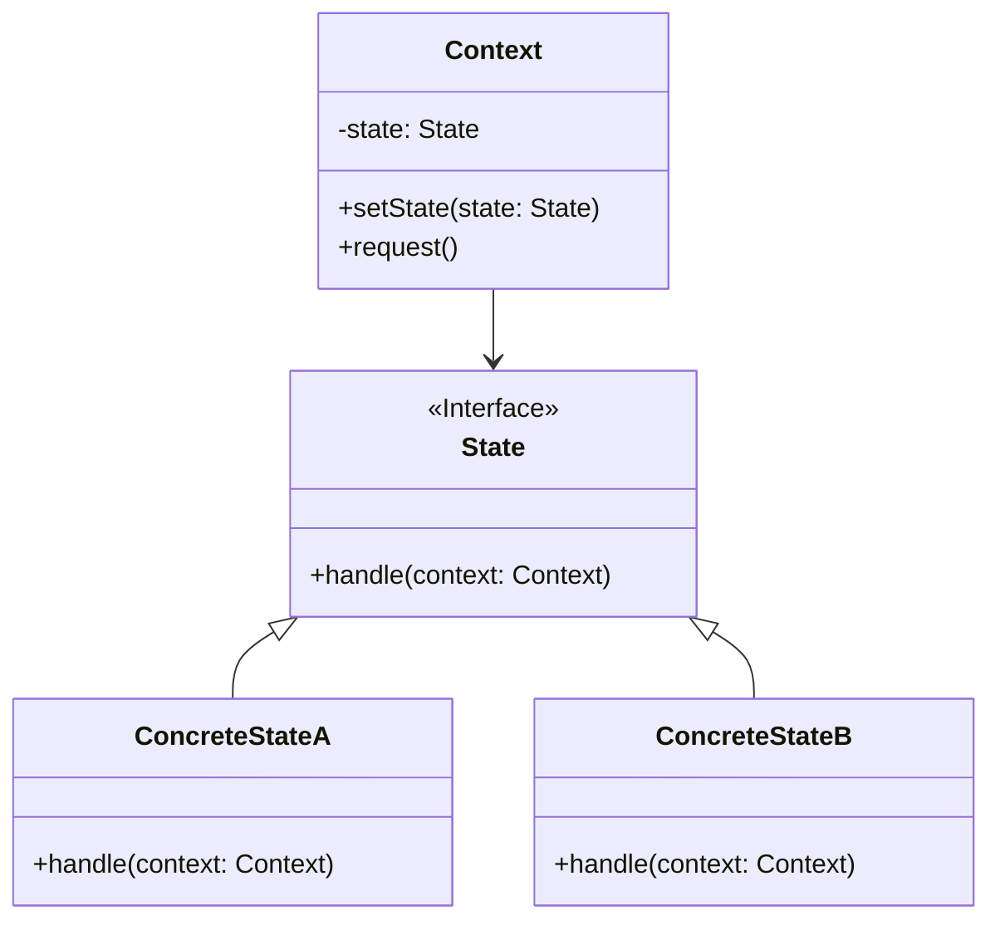

# 状态模式 (State Pattern)

## 意图

允许对象在其内部状态改变时改变它的行为。对象看起来似乎修改了它的类。

状态模式将状态封装成独立的类，并将行为委托给当前状态对象，从而使对象的行为随着内部状态的改变而改变。

## 结构

### UML类图

### 角色说明

| 角色 | 职责 |
|------|------|
| **State（状态接口）** | 定义所有具体状态的公共接口，封装与Context的一个特定状态相关的行为 |
| **ConcreteState（具体状态）** | 实现State接口，每个具体状态类实现Context在该状态下的行为，并负责状态转换 |
| **Context（上下文）** | 维护一个ConcreteState子类的实例，这个实例定义当前的状态，并将与状态相关的操作委托给当前状态对象处理 |

## 适用场景

- 一个对象的行为取决于它的状态，并且它必须在运行时刻根据状态改变它的行为
- 一个操作中含有庞大的多分支结构（如if-else或switch-case），并且这些分支决定于对象的状态
- 代码中包含大量与对象状态有关的条件语句，导致代码难以维护和扩展
- 需要避免使用大量的条件判断语句来处理状态转换逻辑
- 状态转换规则复杂且多变，需要独立管理和维护
- 需要将状态转换逻辑集中管理，而不是分散在各个条件分支中

## 优缺点

### 优点

1. **单一职责原则**：将与特定状态相关的行为局部化到一个状态中，并且将不同状态的行为分割开来，使代码结构更清晰
2. **开闭原则**：通过定义新的状态类很容易地增加新的状态和转换，无需修改现有代码
3. **消除条件分支**：避免使用庞大的条件语句，将不同状态的行为分散到不同的状态类中，提高代码可读性
4. **状态转换显式化**：状态转换逻辑被封装在状态类中，使状态转换更加明确和易于理解
5. **状态可复用**：多个Context对象可以共享同一个状态实例（通常使用单例模式实现）

### 缺点

1. **类数量增加**：引入状态模式会增加系统中类的数量，对于简单的状态逻辑可能显得过于复杂
2. **实现复杂度**：状态模式的结构与实现都较为复杂，需要仔细设计状态接口和转换逻辑
3. **开闭原则限制**：如果新增状态需要修改其他状态的转换逻辑，可能会违反开闭原则
4. **调试困难**：由于状态转换分散在各个状态类中，调试和跟踪状态变化可能变得困难

## 实现要点

1. **定义状态接口**：创建一个State接口，声明所有具体状态类需要实现的方法
2. **实现具体状态**：为每个具体状态创建类，实现State接口中定义的行为
3. **维护上下文**：Context类维护一个当前状态的引用，并提供设置状态的方法
4. **委托行为**：Context将请求委托给当前状态对象处理，而不是自己实现状态相关的行为
5. **状态转换**：状态转换可以由Context控制，也可以由具体状态类控制（推荐后者）
6. **状态实例管理**：考虑状态对象的生命周期管理，可以使用单例模式或工厂模式

## 与其他模式的关系

- **策略模式**：状态模式与策略模式结构相似，但意图不同。策略模式由客户端选择策略，状态模式的状态转换由状态自身或上下文决定。状态模式可以看作是策略模式的"有状态的孪生兄弟"。
- **单例模式**：状态对象通常实现为单例，因为状态类通常不包含成员变量，可以被多个Context实例共享。
- **享元模式**：当多个Context需要共享相同的状态对象时，可以使用享元模式来管理状态对象池。

## 常见问题

### Q1: 状态模式和策略模式有什么区别？

虽然状态模式和策略模式在结构上非常相似（都使用组合和委托），但它们有以下关键区别：

| 维度 | 状态模式 | 策略模式 |
|------|----------|----------|
| **关注点** | 状态及其转换 | 算法的选择和替换 |
| **状态感知** | 状态通常知道其他状态的存在，可以触发状态转换 | 策略通常不知道其他策略的存在 |
| **客户端角色** | 客户端通常不直接改变状态 | 客户端主动选择并切换策略 |
| **状态变化** | 状态变化是对象内部行为的一部分 | 策略变化是客户端的决策 |
| **使用场景** | 对象行为随内部状态变化 | 需要在不同算法间切换 |

### Q2: 状态转换应该由Context还是ConcreteState控制？

两种方法都可以，但各有优劣：

- **由Context控制**：集中管理所有状态转换逻辑，易于查看完整的状态转换图，但Context需要了解所有具体状态
- **由ConcreteState控制**：将状态转换逻辑分散到各个状态类中，符合单一职责原则，但难以看到完整的状态转换图

**推荐做法**：由ConcreteState控制状态转换，这样可以将状态转换逻辑与特定状态的行为封装在一起。

### Q3: 如何处理状态中的共享数据？

有几种处理方式：

1. **通过Context传递**：将所有共享数据存储在Context中，状态通过Context访问数据
2. **状态对象持有数据**：如果数据是状态特定的，可以存储在状态对象中
3. **参数传递**：在方法调用时传递必要的数据

推荐第一种方式，因为它保持了状态对象的无状态性，便于状态对象被多个Context共享。

## 最佳实践

1. **保持状态对象的无状态性**：状态对象不应该包含实例变量，这样可以安全地将状态实现为单例，被多个Context共享。所有与状态相关的数据应该存储在Context中。

2. **明确状态转换规则**：在文档或代码注释中清晰地描述状态转换规则，可以使用状态转换表或状态图来辅助理解。如果状态转换逻辑复杂，考虑使用状态机框架。

3. **避免状态类膨胀**：如果状态数量过多，考虑将相似的状态合并，或者使用分层状态模式（Hierarchical State Pattern）来管理复杂的状态层次结构。

4. **合理选择状态控制者**：对于简单的状态机，可以由Context控制状态转换；对于复杂的状态机，建议由具体状态类控制转换，以保持良好的封装性。

5. **考虑使用状态机库**：对于复杂的状态管理需求，可以考虑使用现有的状态机库（如Spring Statemachine、Stateless4j等），而不是手动实现状态模式。
