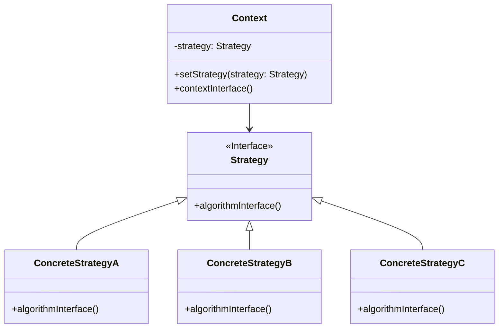

# 策略模式 (Strategy Pattern)

## 意图

定义一系列的算法，把它们一个个封装起来，并且使它们可相互替换。策略模式让算法的变化独立于使用算法的客户。

## 结构

### UML类图

### 角色说明

**Strategy（策略接口）**
定义所有支持的算法的公共接口。Context 使用这个接口来调用具体策略定义的算法。

**ConcreteStrategy（具体策略）**
实现 Strategy 接口，封装了具体的算法或行为。每个具体策略类提供一种特定的算法实现。

**Context（上下文）**
维护一个对 Strategy 对象的引用，定义一个接口让 Strategy 可以访问它的数据。Context 将具体的算法执行委托给 Strategy 对象。

## 适用场景

- **多种算法变体**：当一个系统中有许多类，它们之间的区别仅在于它们的行为时
- **动态算法选择**：一个系统需要动态地在几种算法中选择一种
- **消除条件语句**：如果一个对象有很多的行为，不使用恰当的模式，这些行为就只好使用多重的条件选择语句来实现
- **算法独立性**：需要隔离算法的实现细节与使用算法的代码
- **运行时行为变更**：需要在运行时根据不同情况改变对象的行为
- **数据处理方式多样**：针对不同类型数据需要采用不同处理方式，如排序、压缩、加密等

## 优缺点

### 优点

1. **算法可以自由切换**：由于策略类都实现相同的接口，客户端可以在运行时动态切换策略，无需修改原有代码
2. **避免使用多重条件判断**：消除了复杂的 if-else 或 switch-case 语句，使代码更加清晰易读
3. **扩展性良好**：新增算法时只需添加新的策略类，符合开闭原则，无需修改现有代码
4. **算法复用性高**：策略类可以在不同上下文中重复使用，提高了代码的复用性
5. **单一职责原则**：将算法的实现从使用算法的类中分离出来，每个类只负责单一职责

### 缺点

1. **策略类数量增多**：每增加一个算法就需要增加一个策略类，可能导致类的数量爆炸
2. **所有策略类都需要对外暴露**：客户端必须知道所有的策略类，并自行决定使用哪一个策略
3. **增加系统复杂度**：引入策略模式会增加类的数量和系统的复杂度，对于简单场景可能过度设计
4. **策略切换开销**：频繁切换策略可能带来一定的性能开销，特别是策略对象创建成本较高时

## 实现要点

1. **定义策略接口**：创建一个公共接口，声明算法执行的方法
2. **实现具体策略**：为每种算法创建具体的策略类，实现策略接口
3. **构建上下文类**：维护策略对象的引用，提供设置策略的方法，将算法调用委托给策略对象
4. **考虑策略工厂**：结合工厂模式来创建和管理策略对象，减少客户端对具体策略类的依赖
5. **数据传递方式**：确定上下文如何向策略传递数据（通过参数传递或让策略持有上下文引用）

## 与其他模式的关系

### 与状态模式的关系

策略模式和状态模式在结构上非常相似，都使用组合和委托来改变对象的行为。主要区别在于：
- **策略模式**：客户端主动选择策略，策略之间通常是平等的，没有状态转换的概念
- **状态模式**：状态转换由状态机自动管理，状态之间存在流转关系，当前状态决定下一个状态

### 与工厂模式的关系

策略模式通常与工厂模式结合使用：
- 使用简单工厂或工厂方法模式来创建具体的策略对象
- 这样可以进一步解耦客户端与具体策略类的依赖，客户端只需知道策略接口和工厂

### 与模板方法模式的关系

- **策略模式**：使用组合，将算法封装在独立的策略类中，可以在运行时切换
- **模板方法模式**：使用继承，在父类中定义算法骨架，子类重写特定步骤，编译时确定行为

## 常见问题

### Q1: 策略模式与状态模式有什么区别？

虽然两者在UML类图上几乎相同，但它们的设计意图和使用场景有本质区别：

| 维度 | 策略模式 | 状态模式 |
|------|----------|----------|
| 意图 | 封装不同的算法，让它们可以相互替换 | 封装对象的不同状态，管理状态转换 |
| 控制权 | 客户端主动选择策略 | 状态机自动控制状态流转 |
| 关系 | 策略之间是平等的，无依赖关系 | 状态之间存在转换关系 |
| 使用场景 | 需要在不同算法间切换 | 对象行为随状态改变而改变 |

### Q2: 如何避免客户端了解所有的具体策略类？

可以通过以下方式降低客户端对具体策略类的依赖：
1. **使用工厂模式**：通过工厂类根据条件创建相应的策略对象
2. **使用依赖注入框架**：由框架负责策略的创建和注入
3. **配置文件**：将策略类名配置在配置文件中，通过反射动态加载
4. **注册表模式**：维护一个策略注册表，客户端通过标识符获取策略

### Q3: 策略模式会导致类爆炸吗？如何优化？

是的，每个算法都需要一个策略类，可能导致类数量过多。优化方案：
1. **使用匿名类或Lambda**：在支持函数式编程的语言中，可以用函数代替策略类
2. **策略共享**：如果策略是无状态的，可以使用享元模式共享策略实例
3. **合并相似策略**：将相似的算法合并为一个策略类，通过参数区分行为

## 最佳实践

1. **优先使用组合而非继承**：策略模式的核心是使用组合来封装变化，避免通过继承来扩展行为，这符合"组合优于继承"的设计原则。

2. **保持策略接口的纯粹性**：策略接口应该只定义算法相关的方法，避免将上下文相关的数据访问方法放入策略接口，保持策略类的独立性和可复用性。

3. **考虑策略的创建成本**：如果策略对象的创建成本较高，可以考虑使用享元模式缓存策略实例，或者使用单例模式管理策略对象。

4. **结合依赖注入使用**：在现代框架中，利用依赖注入容器来管理策略对象的创建和注入，可以进一步降低组件间的耦合度。

5. **文档化策略选择逻辑**：当有多种策略可选时，应该清晰文档化每种策略的适用场景和选择依据，帮助其他开发者正确选择策略。

## 相关设计原则

- **开闭原则**：对扩展开放，对修改关闭
- **依赖倒转原则**：依赖于抽象，不依赖于具体
- **单一职责原则**：一个类只负责一个职责
- **组合优于继承**：优先使用组合来实现代码复用
