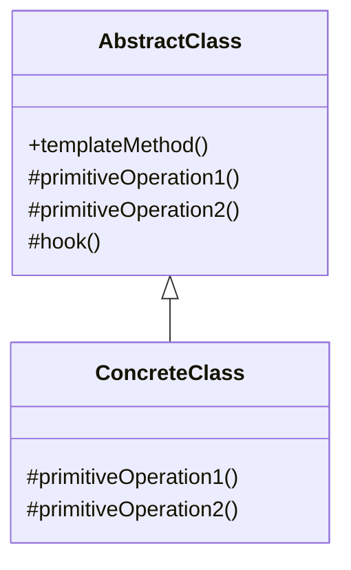

# 模板方法模式 (Template Method Pattern)

## 意图

定义一个操作中的算法的骨架，而将一些步骤延迟到子类中。模板方法使得子类可以不改变一个算法的结构即可重定义该算法的某些特定步骤。

## 结构

### UML类图



### 角色说明

**AbstractClass（抽象类）**
- 定义了一个或多个抽象操作（primitiveOperation），由子类实现
- 定义并实现了一个模板方法（templateMethod），该方法是一个具体方法，给出了一个顶级逻辑的骨架
- 可以定义钩子方法（hook），提供默认实现或空实现，子类可选择性覆盖

**ConcreteClass（具体类）**
- 实现抽象类中定义的抽象操作，完成算法中与特定子类相关的步骤
- 可选择性覆盖钩子方法，以影响模板方法的执行流程

## 适用场景

- 一次性实现一个算法的不变部分，并将可变的行为留给子类来实现
- 各子类中公共的行为应被提取出来并集中到一个公共父类中以避免代码重复
- 需要控制子类扩展，只允许在特定点进行扩展
- 当多个类具有相似的行为模式，只有部分步骤不同时
- 需要复用代码，将公共代码放在父类中，将变化部分放在子类中
- 需要实现一个算法的框架，但允许子类在不改变结构的情况下定制某些步骤

## 优缺点

### 优点

1. **封装不变部分，扩展可变部分**：将算法的骨架封装在父类中，将可变部分留给子类实现，符合开闭原则
2. **提取公共代码，便于维护**：将公共代码集中在父类中，避免代码重复，修改时只需修改一处
3. **行为由父类控制，子类实现**：父类控制算法的整体流程，子类只负责实现具体步骤，便于统一管理
4. **通过钩子方法实现灵活扩展**：钩子方法允许子类在不改变算法结构的情况下影响算法行为

### 缺点

1. **类数量增加**：每一个不同的实现都需要一个子类来实现，可能导致类的个数增加
2. **继承的局限性**：由于使用继承，子类与父类耦合度高，父类的改变可能影响所有子类
3. **父类中的抽象方法由子类实现，子类执行的结果会影响父类的结果**：如果子类实现不当，可能导致算法执行异常

## 实现要点

1. **抽象类定义模板方法和基本方法**：模板方法定义算法骨架，基本方法由子类实现
2. **模板方法定义算法骨架**：模板方法通常是final的，防止子类修改算法结构
3. **具体子类实现基本方法**：子类只需关注特定步骤的实现
4. **合理使用钩子方法**：钩子方法提供默认实现，子类可选择性覆盖以改变算法行为
5. **区分抽象方法和钩子方法**：抽象方法必须实现，钩子方法可选择性覆盖

## 与其他模式的关系

- **工厂方法模式**：工厂方法经常被模板方法调用，模板方法可以定义创建对象的算法骨架，具体创建由工厂方法完成
- **策略模式**：模板方法使用继承改变算法，策略模式使用委托改变算法；模板方法改变算法的部分步骤，策略模式改变整个算法

## 常见问题

### 什么是钩子方法（Hook Method）？

钩子方法是抽象类中声明并定义默认实现（或空实现）的方法，子类可以选择性覆盖。钩子方法允许子类在算法的特定点插入自定义行为，而不改变算法的整体结构。

```java
public abstract class AbstractClass {
    public final void templateMethod() {
        primitiveOperation1();
        if (hook()) {
            primitiveOperation2();
        }
    }
    
    protected abstract void primitiveOperation1();
    protected abstract void primitiveOperation2();
    
    // 钩子方法，默认返回true
    protected boolean hook() {
        return true;
    }
}
```

### 模板方法模式与策略模式有什么区别？

| 特性 | 模板方法模式 | 策略模式 |
|------|-------------|----------|
| 实现方式 | 继承 | 组合/委托 |
| 改变范围 | 算法的部分步骤 | 整个算法 |
| 耦合度 | 较高（继承耦合） | 较低（接口耦合） |
| 适用场景 | 算法骨架固定，部分步骤变化 | 需要动态切换不同算法 |

## 最佳实践

### 遵循好莱坞原则（Hollywood Principle）

"别调用我们，我们会调用你"（Don't call us, we'll call you）。在模板方法模式中，父类控制算法的整体流程，在适当的时候调用子类实现的方法。子类不需要主动调用父类的方法，而是等待父类来调用自己。

```java
// 好莱坞原则的体现
public abstract class DataParser {
    // 模板方法控制流程
    public final void parse() {
        openFile();      // 父类实现
        readData();      // 子类实现 - 父类调用子类
        processData();   // 子类实现 - 父类调用子类
        closeFile();     // 父类实现
    }
    
    protected abstract void readData();
    protected abstract void processData();
}
```

### 使用final关键字保护模板方法

为了防止子类意外或恶意修改算法结构，应该将模板方法声明为final。

```java
public abstract class Game {
    // 模板方法声明为final，防止子类修改
    public final void play() {
        initialize();
        startPlay();
        endPlay();
    }
    
    protected abstract void initialize();
    protected abstract void startPlay();
    protected abstract void endPlay();
}
```

### 合理使用钩子方法提供扩展点

在设计模板方法时，应该识别算法中可能变化的点，并提供相应的钩子方法。钩子方法应该：
- 有明确的命名，通常以"do"开头或包含"Hook"字样
- 提供合理的默认实现
- 文档说明其用途和调用时机

```java
protected boolean shouldProcessData() {
    return true; // 默认处理数据
}
```
