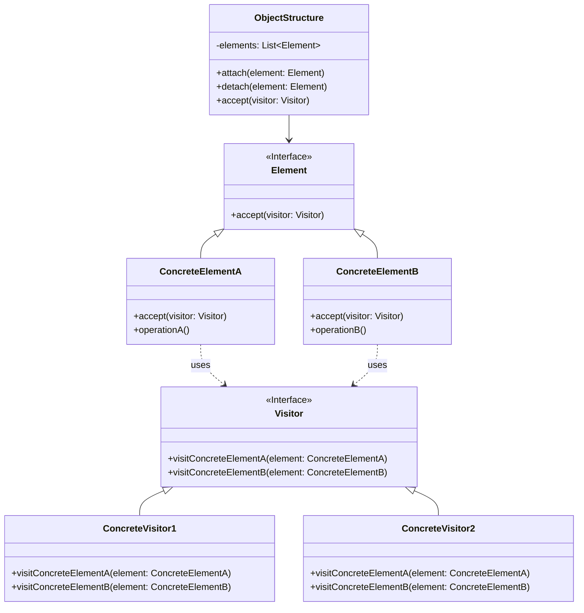

# 访问者模式 (Visitor Pattern)

## 意图

表示一个作用于某对象结构中的各元素的操作。它使你可以在不改变各元素的类的前提下定义作用于这些元素的新操作。

访问者模式将数据结构与作用于结构上的操作解耦，使得操作集合可以独立于数据结构变化。通过这种方式，可以在不改变元素类的前提下，为元素添加新的操作行为。

## 结构

### UML类图



### 角色说明

**Visitor（访问者）**
- 抽象接口，声明访问各种具体元素的visit方法
- 为每个ConcreteElement类声明一个visit操作
- 方法签名中明确指定被访问元素的类型

**ConcreteVisitor（具体访问者）**
- 实现Visitor接口声明的操作
- 每个操作实现算法的一部分，对应特定的元素类
- 存储遍历过程中累积的状态
- 可以访问所遍历元素的具体状态

**Element（元素）**
- 抽象接口，声明accept方法接受访问者
- accept方法通常以Visitor作为参数

**ConcreteElement（具体元素）**
- 实现Element接口的accept方法
- 在accept方法中调用访问者的visit方法，并将自身作为参数传递
- 提供具体业务操作方法

**ObjectStructure（对象结构）**
- 维护元素的集合（如列表、树等）
- 提供遍历元素的方法
- 可以提供一个高层接口以允许访问者访问其元素

## 适用场景

- **对象结构稳定，操作频繁变化**：对象结构中对象对应的类很少改变，但经常需要在此对象结构上定义新的操作
- **多种不相关操作**：需要对一个对象结构中的对象进行很多不同的并且不相关的操作，避免这些操作"污染"元素类
- **复杂对象结构**：对象结构包含许多具有不同接口的类，需要对这些类执行依赖于具体类的操作
- **编译器设计**：抽象语法树（AST）的遍历和代码生成、类型检查等操作
- **报表生成**：对复杂数据结构生成不同格式的报表（HTML、PDF、Excel等）
- **数据序列化**：将对象结构序列化为不同格式（XML、JSON、YAML等）
- **UI组件操作**：对UI组件树执行渲染、事件处理、验证等操作

## 优缺点

### 优点

1. **符合单一职责原则**：将相关的行为封装到访问者中，元素类只负责数据存储，访问者负责操作逻辑，每个类的职责更加清晰

2. **优秀的扩展性**：添加新的操作只需增加新的具体访问者类，无需修改现有元素类，符合开闭原则

3. **灵活的操作组合**：可以将多个相关的操作集中在一个访问者中，或将不相关的操作分散到不同的访问者中

4. **访问异构对象**：能够访问具有不同接口的异构对象，并在访问者中统一处理

5. **状态累积**：访问者可以在遍历过程中累积状态，便于实现复杂的遍历算法

### 缺点

1. **违反迪米特法则**：具体元素必须向访问者暴露其内部状态，增加了类之间的耦合

2. **元素变更困难**：添加新的ConcreteElement类需要修改所有Visitor接口及其实现类，违反了开闭原则

3. **违反依赖倒置原则**：访问者模式依赖于具体元素类而非抽象，ConcreteVisitor依赖于ConcreteElement

4. **破坏封装性**：为了允许访问者访问元素的状态，元素可能需要公开其内部实现细节

5. **理解难度较高**：双分派机制增加了代码的复杂性，对于不熟悉该模式的开发者来说理解成本较高

## 实现要点

1. **定义访问者接口**：为每个具体元素类定义对应的visit方法，方法参数类型为具体元素类

2. **实现accept方法**：元素类提供accept方法，接收Visitor参数，并在内部调用visitor.visit(this)实现回调

3. **实现双分派**：通过accept方法和visit方法的组合实现双分派，运行时根据元素类型和访问者类型确定具体调用的方法

4. **维护对象结构**：ObjectStructure负责维护元素集合，提供遍历方法，可以批量接受访问者

5. **状态管理**：访问者可以在遍历过程中维护状态，用于跨元素的计算或数据收集

## 与其他模式的关系

### 组合模式（Composite Pattern）

访问者模式常与组合模式一起使用。组合模式定义对象结构的层次结构，而访问者模式用于对这些对象执行操作。在遍历树形结构时，访问者可以递归地访问组合对象和叶子对象。

### 迭代器模式（Iterator Pattern）

迭代器模式和访问者模式都可以用于遍历对象结构。迭代器模式提供顺序访问元素的方式，而访问者模式在遍历的同时执行操作。两者可以结合使用，迭代器负责遍历，访问者负责操作。

### 解释器模式（Interpreter Pattern）

解释器模式使用访问者模式来遍历抽象语法树（AST）并执行解释操作。访问者可以分离语法分析树的不同操作（如类型检查、代码优化、代码生成等）。

## 常见问题

### 什么是双分派（Double Dispatch）？

双分派是访问者模式的核心机制。在单分派（如Java、C++、C#等语言的方法重载）中，具体调用的方法只由对象的运行时类型决定。而在双分派中，方法调用的选择基于两个对象的运行时类型：

1. **第一次分派**：调用元素的accept方法，根据元素的类型确定具体调用哪个accept实现
2. **第二次分派**：在accept方法中调用visitor.visit(this)，根据访问者的类型确定调用哪个visit实现

通过双分派，访问者模式实现了根据元素类型和访问者类型两个维度来确定最终执行的操作。

```java
// 双分派示例
element.accept(visitor);  // 第一次分派：根据element类型
// 在accept内部：
visitor.visit(this);      // 第二次分派：根据visitor类型
```

### 如何添加新的元素类型？

添加新的ConcreteElement类需要：
1. 在Visitor接口中添加新的visit方法
2. 在所有ConcreteVisitor类中实现新的visit方法
3. 实现新元素类的accept方法

这是访问者模式的主要缺点，因为它违反了开闭原则。因此，访问者模式适用于元素类相对稳定的场景。

### 访问者模式与策略模式有什么区别？

虽然两者都涉及封装算法，但有本质区别：
- **策略模式**：针对单一对象定义算法族，运行时切换算法，是单分派
- **访问者模式**：针对对象结构中的多种元素定义操作，利用双分派根据元素类型执行不同操作

### 如何避免循环依赖？

访问者模式容易导致元素类和访问者类之间的循环依赖。解决方案：
- 使用接口或抽象类隔离具体实现
- 考虑使用反射机制（虽然会牺牲类型安全）
- 在支持多方法分派的语言（如CLOS、Groovy）中，可以直接使用语言特性替代访问者模式

## 最佳实践

### 1. 评估适用性

在使用访问者模式前，仔细评估以下因素：
- 对象结构是否稳定？如果元素类经常变化，访问者模式会带来大量维护工作
- 是否需要对元素执行多种不同的操作？如果操作很少或单一，可能不值得引入复杂性
- 是否需要跨元素累积状态？访问者模式在这方面有优势

### 2. 合理组织访问者层次

- 使用抽象访问者类而非接口，为visit方法提供默认空实现，减少ConcreteVisitor的样板代码
- 根据功能相关性将操作分组到不同的访问者中，避免"上帝访问者"
- 考虑使用访问者组合，将多个访问者的功能组合使用

```java
public abstract class AbstractVisitor implements Visitor {
    @Override
    public void visitConcreteElementA(ConcreteElementA element) {
        // 默认空实现
    }
    
    @Override
    public void visitConcreteElementB(ConcreteElementB element) {
        // 默认空实现
    }
}
```

### 3. 结合现代语言特性

在支持模式匹配的现代语言（如Java 17+、Scala、Kotlin）中，可以考虑使用模式匹配替代传统的访问者模式，简化代码结构：

```java
// Java 17+ 模式匹配示例
String result = switch (element) {
    case ConcreteElementA a -> processA(a);
    case ConcreteElementB b -> processB(b);
    default -> throw new IllegalStateException();
};
```

### 4. 文档化约束和契约

- 明确文档化访问者模式的使用约定，特别是accept和visit方法的调用契约
- 说明哪些类是稳定的，哪些操作是预期的扩展点
- 提供示例代码展示如何添加新的访问者和元素（如果适用）

### 5. 考虑替代方案

在某些场景下，以下方案可能比访问者模式更合适：
- **反射**：在性能不敏感的场景下，可以使用反射避免类型依赖
- **事件驱动架构**：使用事件机制解耦操作和数据结构
- **函数式编程**：使用高阶函数和模式匹配替代访问者模式
