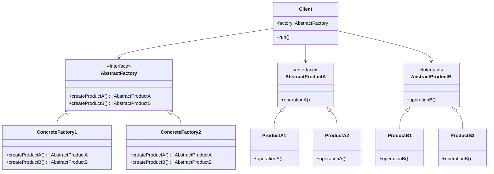

# 抽象工厂模式 (Abstract Factory Pattern)

## 意图

提供一个创建一系列相关或相互依赖对象的接口，而无需指定它们具体的类。

## 结构

### UML类图

### 角色说明

| 角色 | 职责 |
|------|------|
| **AbstractFactory** | 抽象工厂，声明创建抽象产品对象的接口，包含创建每种产品的方法 |
| **ConcreteFactory** | 具体工厂，实现创建具体产品对象的方法，每个具体工厂对应一个产品族 |
| **AbstractProduct** | 抽象产品，为一类产品对象声明接口，定义产品的通用行为 |
| **ConcreteProduct** | 具体产品，定义具体工厂生产的具体产品对象，实现抽象产品接口 |
| **Client** | 客户端，仅使用由AbstractFactory和AbstractProduct类声明的接口 |

## 适用场景

- 系统需要独立于产品的创建、组合和表示时
- 系统需要由多个产品系列中的一个来配置时
- 需要强调一系列相关的产品对象的设计以便进行联合使用时
- 提供一个产品类库，只想显示它们的接口而不是实现时
- 当产品族中的多个对象被设计成一起工作，且需要确保这一点时
- 当需要创建跨平台UI组件库，如Windows风格和Mac风格控件时
- 当需要支持多种数据库访问，且不同数据库的Connection、Command、DataReader需要配套使用时

## 优缺点

### 优点

1. **保证产品族的一致性**：确保同一产品族中的对象是兼容的，避免混用不同产品族的对象
2. **客户端与具体类解耦**：客户端通过抽象接口使用产品，无需知道具体的产品类名
3. **符合开闭原则**：新增产品族时，只需添加新的具体工厂类，无需修改现有代码
4. **便于切换产品族**：只需更换具体工厂实例，即可切换整个产品族
5. **封装性良好**：产品的创建逻辑集中在工厂中，客户端无需关心创建细节

### 缺点

1. **难以支持新种类的产品**：新增产品类型时，需要修改AbstractFactory及其所有子类
2. **产品族扩展困难**：当产品族需要增加新产品时，所有具体工厂都需要修改
3. **增加系统复杂度**：引入了更多的类和接口，增加了系统的抽象层次和理解难度
4. **代码量较大**：需要为每个产品族和产品类型定义对应的类和接口

## 实现要点

1. **定义抽象产品接口**：为每种产品类型定义一个抽象接口或抽象类
2. **定义抽象工厂接口**：声明创建所有抽象产品的方法
3. **实现具体产品类**：每个具体产品实现对应的抽象产品接口
4. **实现具体工厂类**：每个具体工厂负责创建一个完整的产品族
5. **客户端通过抽象接口使用**：客户端只依赖抽象工厂和抽象产品接口

## 与其他模式的关系

- **工厂方法模式**：抽象工厂通常使用工厂方法模式来实现，每个产品创建方法都是一个工厂方法；工厂方法模式是抽象工厂模式的一个特例，只创建单一产品
- **单例模式**：具体工厂通常实现为单例模式，确保整个应用中只有一个工厂实例
- **原型模式**：抽象工厂可以使用原型模式来创建产品，通过复制现有对象而非新建
- **建造者模式**：当产品族中的产品构造过程复杂时，可以结合建造者模式来创建复杂产品

## 常见问题

### Q1: 抽象工厂模式和工厂方法模式有什么区别？

**A**: 主要区别在于创建的产品数量和目的：
- **工厂方法模式**：关注创建**单一产品**，将实例化延迟到子类，一个工厂方法创建一个产品
- **抽象工厂模式**：关注创建**产品族**（一系列相关产品），提供一个创建一系列相关对象的接口

抽象工厂模式可以看作是多个工厂方法模式的组合，用于创建一组相关的产品。

### Q2: 何时应该选择抽象工厂模式而不是简单工厂？

**A**: 选择抽象工厂模式的场景包括：
- 当系统需要多个相关的产品对象，且这些产品需要配套使用时
- 当需要支持多个产品族，且可能在运行时切换产品族时
- 当需要确保同一产品族中的产品兼容性时
- 当希望将产品的创建和使用完全分离时

简单工厂适用于产品类型较少、不需要产品族概念的场景。

### Q3: 如何处理抽象工厂中新增产品类型的问题？

**A**: 新增产品类型确实会破坏抽象工厂的接口，解决方案包括：
- 在设计阶段充分考虑产品类型的扩展性
- 使用抽象工厂变体，如将工厂接口设计为更通用的`createProduct(type)`方法
- 考虑使用建造者模式或原型模式作为替代方案
- 如果产品类型变化频繁，可能需要重新评估是否适合使用抽象工厂模式

## 最佳实践

1. **优先考虑接口而非抽象类**：在支持接口的语言中，优先使用接口定义AbstractFactory和AbstractProduct，这样可以更灵活地实现多重继承

2. **具体工厂实现为单例**：通常一个具体工厂实例就足以创建整个产品族，将具体工厂实现为单例模式可以避免重复创建工厂对象

3. **使用依赖注入**：通过依赖注入将具体工厂传递给客户端，而不是让客户端直接创建工厂实例，这样可以进一步提高灵活性和可测试性

4. **配置文件驱动**：将具体工厂的类名配置在配置文件中，通过反射动态创建工厂实例，实现真正的运行时产品族切换

5. **产品族标识清晰**：为每个产品族定义清晰的标识（如枚举或常量），便于在代码中明确区分不同的产品族

## 相关设计原则

- **开闭原则**：对扩展开放（新增产品族），对修改关闭（无需修改现有代码）
- **依赖倒转原则**：依赖抽象（AbstractFactory、AbstractProduct），而非具体类
