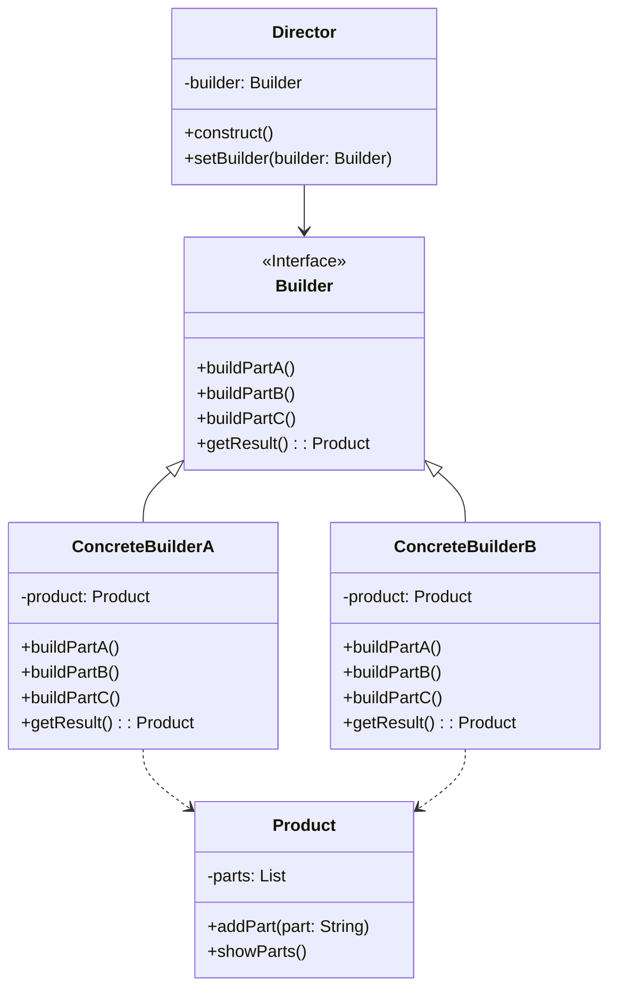

# 建造者模式 (Builder Pattern)

## 意图

将一个复杂对象的构建与它的表示分离，使得同样的构建过程可以创建不同的表示。

建造者模式的核心思想是将一个复杂对象的构造过程分解为多个步骤，每个步骤由一个独立的建造者来完成。这样，客户端无需关心对象内部的具体构造细节，只需要通过指挥者（Director）来协调建造过程，最终获得所需的产品对象。这种模式特别适用于那些具有复杂内部结构、需要多个步骤才能创建完成的对象。

## 结构

### UML类图



### 角色说明

**Director（指挥者）**
- 负责调用建造者接口来构建产品对象
- 定义了构建产品的步骤顺序和执行流程
- 不直接参与具体的产品构建，而是通过建造者接口来间接操作
- 可以复用相同的构建流程来创建不同的产品表示

**Builder（抽象建造者）**
- 定义了创建产品各个部件的抽象接口
- 声明了构建产品各个部分的方法（如 buildPartA、buildPartB 等）
- 声明了获取最终产品的方法（getResult）
- 为具体建造者提供了统一的接口规范

**ConcreteBuilder（具体建造者）**
- 实现了抽象建造者接口中定义的所有方法
- 负责具体的产品部件构建逻辑
- 维护一个产品的引用，并在构建过程中逐步组装产品
- 提供获取最终构建完成的产品的方法

**Product（产品）**
- 表示被构建的复杂对象
- 包含多个组成部件
- 通常包含显示产品内容的接口方法

## 适用场景

1. **复杂对象的创建**
   - 当创建的对象具有复杂的内部结构，包含多个组成部分时
   - 当对象的属性之间存在依赖关系或约束条件时

2. **需要分步骤构建**
   - 当对象的构建过程必须按照特定顺序执行时
   - 当构建过程需要多个步骤，且步骤之间可能有条件判断时

3. **多种表示的需求**
   - 当需要创建同一类对象的不同表示形式时
   - 当产品的内部表示需要独立于其构造过程时

4. **配置化构建**
   - 当需要通过配置来决定构建的具体内容时
   - 当需要支持运行时动态改变产品的构建过程时

5. **不可变对象的创建**
   - 当需要创建不可变对象，但构造参数较多时
   - 当需要避免构造函数参数过多的"伸缩构造函数"问题时

## 优缺点

### 优点

1. **分离构建与表示**
   - 将复杂对象的构建代码与表示代码分离，使得客户端无需了解产品内部的具体实现细节
   - 相同的构建过程可以创建不同的产品表示，提高了代码的灵活性

2. **更好的可扩展性**
   - 新增具体建造者无需修改原有代码，符合开闭原则
   - 可以方便地添加新的产品表示形式，而不会影响现有代码

3. **细粒度的构建控制**
   - 可以精确控制产品的构建过程，按步骤构建对象
   - 支持在构建过程中添加条件判断和循环逻辑

4. **代码复用**
   - 指挥者可以复用相同的构建流程来创建不同的产品
   - 具体建造者之间可以共享通用的构建逻辑

5. **支持不可变对象**
   - 非常适合创建具有大量属性的不可变对象
   - 避免了构造函数参数过多的问题

### 缺点

1. **类数量增加**
   - 需要定义多个类（Director、Builder、ConcreteBuilder、Product），增加了系统的复杂度
   - 如果产品内部变化复杂，可能需要定义很多具体建造者类

2. **构建过程固定**
   - 如果产品的内部结构发生变化，可能需要修改所有的建造者类
   - 对于简单对象的创建，使用建造者模式可能会显得过于复杂

3. **性能开销**
   - 相比直接创建对象，建造者模式涉及更多的方法调用，有一定的性能开销
   - 需要额外的内存来维护建造者对象

## 实现要点

1. **定义清晰的构建步骤**
   - 将产品的构建过程分解为清晰的步骤
   - 每个步骤负责构建产品的一个特定部分

2. **设计灵活的指挥者**
   - 指挥者应该能够使用不同的建造者
   - 构建流程应该可配置，支持不同的构建顺序

3. **处理可选部件**
   - 对于可选的部件，可以在建造者中提供默认实现
   - 支持链式调用（Fluent Interface）来简化客户端代码

4. **产品获取的时机**
   - 确保在所有必要部件都构建完成后才能获取产品
   - 可以考虑添加验证逻辑来检查产品的完整性

## 与其他模式的关系

### 工厂模式（Factory Pattern）

- **区别**：工厂模式关注于创建单个对象，通常是一步完成的；而建造者模式关注于复杂对象的逐步构建，将构建过程分解为多个步骤。
- **联系**：两者都是创建型模式，都用于封装对象的创建逻辑。在某些场景下，建造者模式可以使用工厂模式来创建各个部件。
- **选择建议**：当创建的对象较为简单时使用工厂模式；当对象复杂且需要分步骤构建时使用建造者模式。

### 组合模式（Composite Pattern）

- **区别**：组合模式用于表示对象的"部分-整体"层次结构；建造者模式用于构建复杂对象。
- **联系**：建造者模式常与组合模式结合使用，用于构建复杂的树形结构对象。建造者负责逐步构建组合对象的各个部分。
- **应用场景**：当需要构建复杂的文档对象模型（DOM）、组织架构树等层次结构时，可以结合使用这两种模式。

### 原型模式（Prototype Pattern）

- **区别**：原型模式通过复制现有对象来创建新对象；建造者模式通过逐步构建来创建对象。
- **联系**：在某些场景下，建造者可以使用原型模式来创建产品的各个部件，特别是当部件的创建成本较高时。
- **互补性**：原型模式适合创建相似对象，建造者模式适合创建具有复杂构建过程的对象。

## 常见问题

### Q1: 建造者模式和工厂模式有什么区别？什么时候应该使用建造者模式？

**解答：**

主要区别如下：

| 特性 | 工厂模式 | 建造者模式 |
|------|----------|------------|
| 关注点 | 创建单个对象 | 复杂对象的逐步构建 |
| 构建步骤 | 一步完成 | 多步骤完成 |
| 对象复杂度 | 简单或中等 | 复杂 |
| 客户端控制 | 较少 | 较多 |

**使用建造者模式的场景：**
- 对象有多个属性，且部分属性是可选的
- 对象的构建过程必须按照特定顺序执行
- 需要创建同一类对象的不同表示形式
- 需要避免构造函数参数过多的问题

**示例对比：**
```java
// 工厂模式 - 一步创建
Product p = ProductFactory.createProduct(type);

// 建造者模式 - 多步构建
Product p = new ProductBuilder()
    .setPartA(valueA)
    .setPartB(valueB)
    .setPartC(valueC)
    .build();
```

### Q2: 如何实现一个支持链式调用的建造者模式？

**解答：**

实现链式调用（Fluent Interface）的关键是让每个构建方法都返回建造者对象本身（`return this`）。

**Java 示例：**

```java
public class Computer {
    private String cpu;
    private String ram;
    private String storage;
    
    private Computer(Builder builder) {
        this.cpu = builder.cpu;
        this.ram = builder.ram;
        this.storage = builder.storage;
    }
    
    public static class Builder {
        private String cpu;
        private String ram;
        private String storage;
        
        public Builder cpu(String cpu) {
            this.cpu = cpu;
            return this;  // 返回this支持链式调用
        }
        
        public Builder ram(String ram) {
            this.ram = ram;
            return this;
        }
        
        public Builder storage(String storage) {
            this.storage = storage;
            return this;
        }
        
        public Computer build() {
            return new Computer(this);
        }
    }
}

// 使用
Computer computer = new Computer.Builder()
    .cpu("Intel i9")
    .ram("32GB")
    .storage("1TB SSD")
    .build();
```

**TypeScript 示例：**

```typescript
class Computer {
    constructor(
        public cpu: string,
        public ram: string,
        public storage: string
    ) {}
    
    static builder(): ComputerBuilder {
        return new ComputerBuilder();
    }
}

class ComputerBuilder {
    private cpu?: string;
    private ram?: string;
    private storage?: string;
    
    setCpu(cpu: string): this {
        this.cpu = cpu;
        return this;
    }
    
    setRam(ram: string): this {
        this.ram = ram;
        return this;
    }
    
    setStorage(storage: string): this {
        this.storage = storage;
        return this;
    }
    
    build(): Computer {
        if (!this.cpu || !this.ram) {
            throw new Error("CPU and RAM are required");
        }
        return new Computer(this.cpu, this.ram, this.storage || "256GB SSD");
    }
}

// 使用
const computer = Computer.builder()
    .setCpu("Intel i9")
    .setRam("32GB")
    .setStorage("1TB SSD")
    .build();
```

## 最佳实践

### 1. 使用静态内部类实现建造者

在 Java 中，推荐使用静态内部类的方式实现建造者模式。这种方式可以访问外部类的私有构造函数，同时保持代码的封装性。

```java
public class User {
    private final String firstName;
    private final String lastName;
    private final int age;
    private final String phone;
    
    private User(Builder builder) {
        this.firstName = builder.firstName;
        this.lastName = builder.lastName;
        this.age = builder.age;
        this.phone = builder.phone;
    }
    
    public static class Builder {
        private final String firstName;  // 必需参数
        private final String lastName;   // 必需参数
        private int age = 0;             // 可选参数，默认值
        private String phone = "";       // 可选参数，默认值
        
        public Builder(String firstName, String lastName) {
            this.firstName = firstName;
            this.lastName = lastName;
        }
        
        public Builder age(int age) {
            this.age = age;
            return this;
        }
        
        public Builder phone(String phone) {
            this.phone = phone;
            return this;
        }
        
        public User build() {
            return new User(this);
        }
    }
}
```

### 2. 在建造者中添加参数验证

在 `build()` 方法中添加参数验证逻辑，确保创建的对象始终处于有效状态。

```java
public class EmailMessage {
    private final String from;
    private final String to;
    private final String subject;
    private final String body;
    
    private EmailMessage(Builder builder) {
        this.from = builder.from;
        this.to = builder.to;
        this.subject = builder.subject;
        this.body = builder.body;
    }
    
    public static class Builder {
        private String from;
        private String to;
        private String subject;
        private String body;
        
        // ... setter methods ...
        
        public EmailMessage build() {
            // 参数验证
            if (from == null || from.isEmpty()) {
                throw new IllegalStateException("From address is required");
            }
            if (to == null || to.isEmpty()) {
                throw new IllegalStateException("To address is required");
            }
            if (subject == null || subject.isEmpty()) {
                throw new IllegalStateException("Subject is required");
            }
            
            return new EmailMessage(this);
        }
    }
}
```

### 3. 区分必需参数和可选参数

在建造者模式中，应该明确区分必需参数和可选参数。必需参数通过建造者构造函数传入，可选参数通过 setter 方法设置。

```java
// 必需参数通过构造函数传入
Pizza pizza = new Pizza.Builder("large", "thin")
    .cheese(true)      // 可选
    .pepperoni(true)   // 可选
    .mushrooms(false)  // 可选
    .build();
```

### 4. 使用 Lombok 简化建造者实现

如果使用 Java 并且项目中包含 Lombok，可以使用 `@Builder` 注解自动生成建造者代码。

```java
import lombok.Builder;
import lombok.Data;

@Data
@Builder
public class User {
    private String firstName;
    private String lastName;
    private int age;
    private String email;
}

// 使用
User user = User.builder()
    .firstName("John")
    .lastName("Doe")
    .age(30)
    .email("john@example.com")
    .build();
```

### 5. 考虑使用 Step Builder 模式处理复杂构建流程

当构建过程有严格的顺序要求时，可以考虑使用 Step Builder 模式，通过接口强制要求按照特定顺序调用构建方法。

```java
// 定义步骤接口
public interface FirstNameStep {
    LastNameStep firstName(String firstName);
}

public interface LastNameStep {
    BuildStep lastName(String lastName);
}

public interface BuildStep {
    BuildStep age(int age);
    BuildStep email(String email);
    User build();
}

// 实现
public class UserBuilder implements FirstNameStep, LastNameStep, BuildStep {
    // 实现...
}
```
