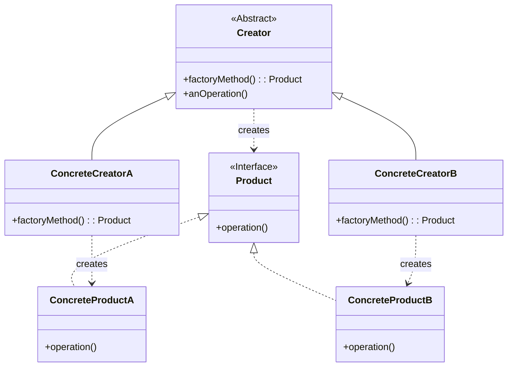

# 工厂方法模式 (Factory Method Pattern)

## 意图

定义一个创建对象的接口，让子类决定实例化哪个类。工厂方法模式使一个类的实例化延迟到其子类。

## 结构

### UML类图

### 角色说明

| 角色 | 职责 | 说明 |
|------|------|------|
| **Creator**（抽象创建者） | 声明工厂方法，返回Product类型的对象 | 可以定义工厂方法的默认实现，或声明为抽象方法让子类实现 |
| **ConcreteCreator**（具体创建者） | 重写工厂方法，返回ConcreteProduct的实例 | 每个具体创建者对应一个具体产品，决定实例化哪个具体产品类 |
| **Product**（抽象产品） | 定义产品的接口 | 声明产品对象的通用操作接口，是工厂方法创建对象的父类型 |
| **ConcreteProduct**（具体产品） | 实现Product接口 | 具体产品类由具体创建者创建，包含具体的业务逻辑 |

## 适用场景

- **解耦创建与使用**：当客户端不需要知道它所创建的对象的具体类时
- **扩展产品类型**：当系统需要支持多种产品类型，且未来可能增加新产品时
- **框架设计**：在框架设计中，让框架定义接口，由具体应用提供实现
- **多平台支持**：当需要为不同平台或环境创建不同的产品实现时
- **复杂对象创建**：当对象的创建过程复杂，需要集中管理创建逻辑时
- **依赖注入**：作为依赖注入容器的基础，实现对象的动态创建

## 优缺点

### 优点

1. **符合开闭原则**：增加新产品时无需修改原有系统，只需添加新的具体产品类和对应的具体创建者类
2. **符合单一职责原则**：将产品创建逻辑从业务逻辑中分离，每个类只负责一个职责
3. **降低耦合度**：客户端只依赖抽象产品接口，不依赖具体实现，便于替换和扩展
4. **提高可扩展性**：通过继承和多态，可以轻松扩展新的产品类型而无需修改现有代码
5. **便于单元测试**：可以方便地使用Mock对象替换真实产品，提高代码的可测试性

### 缺点

1. **类数量增加**：每增加一个产品类，就需要增加一个具体创建者类，增加了系统的复杂度
2. **代码复杂度提升**：引入了额外的抽象层，对于简单场景可能显得过于复杂
3. **产品创建逻辑分散**：具体产品的创建逻辑分散在各个具体创建者中，不利于集中管理

## 实现要点

1. **定义产品接口/抽象类**：明确产品的通用行为和属性
2. **定义创建者抽象类**：声明工厂方法，可以包含使用产品的业务逻辑
3. **实现具体产品类**：每个具体产品实现产品接口
4. **实现具体创建者类**：每个具体创建者重写工厂方法，返回对应的具体产品实例
5. **考虑工厂方法的参数化**：可以使用参数化的工厂方法来创建不同类型的产品，简化类结构

## 与其他模式的关系

- **抽象工厂模式**：工厂方法是抽象工厂的一个特例。抽象工厂使用多个工厂方法来创建一组相关产品，而工厂方法只创建一个产品
- **模板方法模式**：工厂方法经常被模板方法调用。创建者类中的`anOperation()`方法可以定义为模板方法，其中调用工厂方法`factoryMethod()`来获取产品
- **原型模式**：两者都用于创建对象，但工厂方法使用继承，原型模式使用委托；当产品类层次复杂时，原型模式可能更简单
- **单例模式**：具体创建者通常可以实现为单例，确保系统中只有一个创建者实例

## 常见问题

### Q1: 工厂方法模式和简单工厂模式有什么区别？

**A**: 简单工厂模式使用一个单独的工厂类，通过条件判断或参数来创建不同的产品，不符合开闭原则，增加新产品需要修改工厂类。工厂方法模式将创建逻辑分散到各个子类中，每个具体创建者负责创建一种具体产品，增加新产品时只需添加新的具体创建者类，无需修改原有代码，更符合开闭原则。

### Q2: 什么时候应该使用工厂方法模式而不是直接实例化？

**A**: 当满足以下情况时应该使用工厂方法模式：
- 无法预知需要创建的对象的确切类型
- 希望将创建逻辑与使用逻辑分离
- 需要支持多种产品变体，且可能在未来扩展
- 希望通过子类来定制创建的对象
- 需要统一管理对象的创建过程（如缓存、池化等）

### Q3: 工厂方法中的创建者是否必须声明为抽象类？

**A**: 不一定。创建者可以是一个具体类，提供一个默认的工厂方法实现，返回默认的具体产品。这样客户端可以直接使用创建者类，也可以通过继承来定制创建行为。这种设计提供了更大的灵活性。

## 最佳实践

1. **保持产品接口的简洁性**：产品接口应该只包含客户端真正需要的方法，避免过度设计。如果产品之间差异很大，考虑使用抽象类而不是接口。

2. **优先考虑组合而非继承**：如果创建逻辑复杂，可以考虑将创建逻辑委托给专门的创建策略对象，而不是在每个具体创建者中重复实现。

3. **使用参数化工厂方法简化结构**：当产品类型较多且创建逻辑相似时，可以使用参数化的工厂方法，通过参数决定创建哪种产品，减少类的数量。

4. **结合依赖注入使用**：在现代框架中，工厂方法模式常与依赖注入结合使用，通过配置文件或注解来指定具体创建者，实现更灵活的对象创建。

5. **文档化产品创建规则**：为每个具体创建者添加清晰的文档，说明它创建哪种产品以及适用的场景，便于其他开发者理解和使用。
