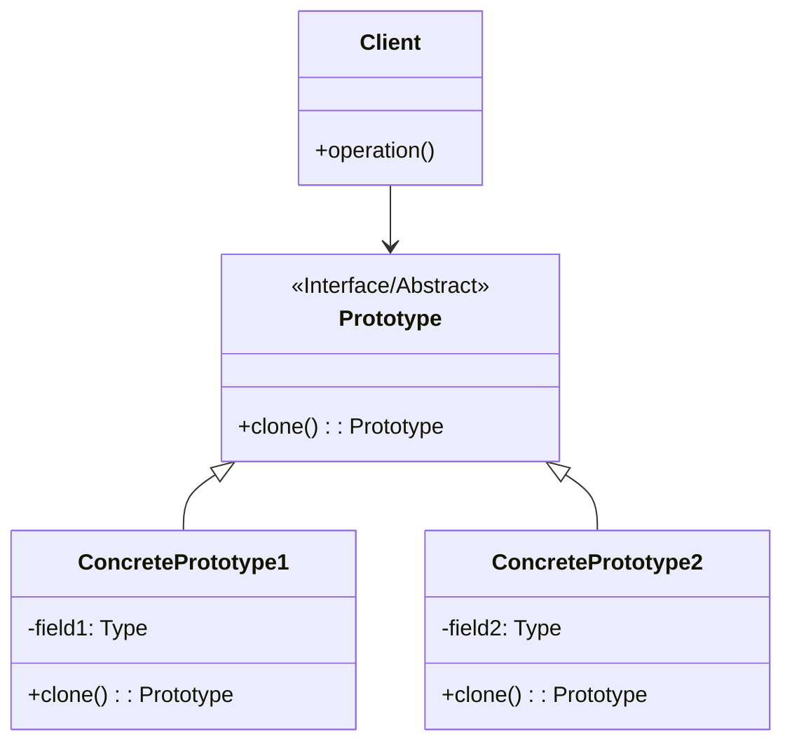

# 原型模式 (Prototype Pattern)

## 意图

原型模式是一种创建型设计模式，**通过复制现有对象来创建新对象**，而无需依赖它们的具体类。该模式允许通过复制已有实例来生成新对象，避免了使用标准的对象创建方式（如构造函数），特别适用于对象创建成本较高或需要保持对象状态的场合。

## 结构

### UML类图

### 角色说明

| 角色 | 职责 |
|------|------|
| **Prototype（原型）** | 声明一个克隆自身的接口，可以是抽象类或接口，定义统一的`clone`方法 |
| **ConcretePrototype（具体原型）** | 实现原型接口，负责实现克隆自身的方法。每个具体原型类都提供自己的克隆实现 |
| **Client（客户端）** | 通过请求原型对象调用克隆方法来创建新的对象实例，客户端可以创建任何继承自原型的对象 |

## 适用场景

- **对象创建成本高**：当创建新对象需要消耗大量资源（如数据库查询、复杂计算、网络请求）时
- **运行时动态指定对象类型**：当需要在运行时决定创建哪种对象，而不是在编译时确定
- **避免与产品类层次结构耦合**：当需要避免创建者与具体产品类紧密耦合时
- **对象状态需要保存**：当新对象需要与现有对象保持相同或部分相同的状态时
- **类实例只有少量不同组合**：当系统需要的产品类具有相似的属性，只有少量差异时
- **框架或工具库开发**：当需要提供一个可扩展的对象创建机制，允许用户通过配置而非编码来创建对象

## 优缺点

### 优点

1. **性能优化**：通过复制现有对象而非重新创建，显著减少对象初始化的时间开销，特别是在对象创建过程涉及复杂计算或资源密集型操作时
2. **简化对象创建**：避免了复杂的构造函数链和初始化逻辑，客户端无需了解对象创建的具体细节
3. **动态增加产品类**：可以在运行时动态添加新的具体原型类，无需修改现有代码，符合开闭原则
4. **保留对象状态**：克隆操作可以保留原对象的完整状态，便于实现撤销、历史记录等功能
5. **减少子类化**：不需要为每个具体产品类创建对应的工厂类，简化了系统结构

### 缺点

1. **克隆方法实现复杂**：每个具体原型类都需要实现克隆方法，对于包含复杂引用关系的对象，实现起来较为困难
2. **深拷贝与浅拷贝问题**：需要仔细处理对象内部的引用类型成员，错误的拷贝方式可能导致意外的副作用或数据共享问题
3. **循环引用处理困难**：当对象之间存在循环引用时，克隆实现会变得非常复杂
4. **违背开闭原则（部分场景）**：当需要改变克隆行为时，可能需要修改现有类的代码

## 实现要点

1. **定义克隆接口**：创建一个抽象类或接口，声明`clone`方法作为统一的克隆契约
2. **实现克隆方法**：每个具体原型类实现自己的克隆逻辑，确保正确复制所有字段
3. **区分深拷贝与浅拷贝**：
   - **浅拷贝**：复制对象本身及其值类型字段，引用类型字段只复制引用
   - **深拷贝**：递归复制对象及其所有引用类型的成员，创建完全独立的新对象
4. **处理特殊字段**：对于文件句柄、数据库连接等资源，需要在克隆时重新初始化或共享
5. **考虑克隆的性能影响**：对于大型对象，深拷贝可能带来性能开销，需要权衡使用

## 与其他模式的关系

### 与工厂方法模式的关系

- **相似性**：两者都是创建型模式，用于创建对象
- **区别**：
  - 工厂方法模式依赖于继承，通过子类化来创建对象
  - 原型模式依赖于组合，通过复制现有对象来创建新对象
- **协作**：原型模式可以作为工厂方法模式的一种实现方式，工厂方法返回克隆的对象而非新建对象

### 与备忘录模式的关系

- **相似性**：两者都涉及对象状态的保存
- **区别**：
  - 备忘录模式关注对象状态的保存和恢复，用于实现撤销功能
  - 原型模式关注通过复制创建新对象
- **协作**：备忘录模式可以使用原型模式来保存和恢复对象状态，通过克隆来创建状态快照

### 与抽象工厂模式的关系

- **协作**：抽象工厂可以存储一组原型，通过克隆这些原型来创建产品对象，形成原型工厂

## 常见问题

### Q1: 深拷贝与浅拷贝有什么区别？如何选择？

**浅拷贝**只复制对象的基本数据类型字段和引用类型字段的引用地址，不复制引用指向的实际对象。这意味着原对象和克隆对象会共享引用类型的数据。

**深拷贝**不仅复制对象本身，还递归复制所有引用类型的成员对象，创建一个完全独立的新对象。

**选择建议**：
- 当对象只包含值类型字段或不可变对象时，使用浅拷贝即可
- 当对象包含可变引用类型字段，且需要保证克隆对象的独立性时，必须使用深拷贝
- 深拷贝实现方式包括：递归克隆、序列化/反序列化、使用专门的拷贝库

### Q2: 如何处理包含循环引用的对象克隆？

循环引用（A引用B，B引用A）会导致简单的递归深拷贝陷入无限循环。

**解决方案**：
- **标记法**：使用哈希表记录已克隆的对象，遇到已克隆对象时直接返回引用
- **延迟初始化**：先创建对象外壳，再填充引用字段
- **序列化方式**：使用支持循环引用检测的序列化机制（如JSON.stringify的replacer函数）

### Q3: 原型模式是否适用于所有对象创建场景？

不适用。以下情况不建议使用原型模式：
- 对象创建简单且开销小，使用构造函数更直观
- 类层次结构稳定，不需要动态添加产品类
- 对象之间存在复杂的依赖关系，难以正确实现克隆
- 需要严格控制对象的创建过程，克隆可能导致状态不一致

## 最佳实践

1. **优先使用组合而非继承实现原型**：通过定义清晰的克隆接口，让具体类实现克隆逻辑，而不是依赖语言内置的克隆机制，这样可以提供更好的控制和灵活性

2. **为复杂对象提供配置化的克隆选项**：对于包含大量字段的复杂对象，可以在克隆方法中提供参数或选项对象，允许客户端选择性地复制某些字段或应用特定的转换规则

3. **文档化克隆语义**：明确说明克隆方法是深拷贝还是浅拷贝，以及特殊字段的处理方式，避免使用者产生误解

4. **考虑使用序列化实现深拷贝**：对于复杂的对象图，使用序列化/反序列化机制实现深拷贝通常比手动编写克隆逻辑更可靠且易于维护

5. **在原型注册表中管理原型对象**：对于包含多种原型类型的系统，使用原型注册表（Prototype Registry）集中管理原型实例，客户端通过标识符获取原型并克隆，实现更灵活的对象创建机制
