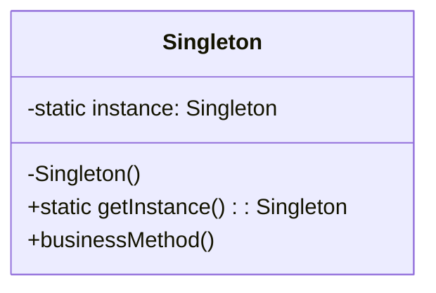

# 单例模式 (Singleton Pattern)

## 意图

确保一个类只有一个实例，并提供一个全局访问点。

单例模式属于创建型模式，它提供了一种创建对象的最佳方式。该模式涉及到一个单一的类，该类负责创建自己的对象，同时确保只有单个对象被创建。这个类提供了一种访问其唯一对象的方式，可以直接访问，不需要实例化该类的对象。

## 结构

### UML类图



### 角色说明

| 角色 | 职责 | 说明 |
|------|------|------|
| **Singleton（单例类）** | 负责创建并维护唯一实例 | 包含私有静态实例变量、私有构造函数和公共静态获取方法 |
| **instance（实例变量）** | 存储类的唯一实例 | 静态私有变量，在类加载时或首次访问时创建 |
| **getInstance()（获取方法）** | 提供全局访问点 | 静态公共方法，返回唯一实例，必要时创建实例 |
| **构造函数** | 阻止外部实例化 | 私有访问修饰符，防止通过 new 关键字创建实例 |

## 适用场景

1. **全局配置管理**
   - 应用程序的配置信息（如数据库连接配置、系统参数等）通常只需要一个实例来统一管理

2. **资源池管理**
   - 数据库连接池、线程池等资源池类，需要严格控制资源数量，避免重复创建

3. **硬件访问控制**
   - 打印机、文件系统等硬件设备的访问控制类，确保只有一个访问入口

4. **缓存管理**
   - 全局缓存对象（如应用级缓存、会话缓存），需要在整个应用生命周期内保持一致

5. **日志记录器**
   - 日志记录器通常只需要一个实例来统一管理日志输出，避免文件句柄冲突

6. **应用程序状态管理**
   - 需要全局唯一的状态管理器，确保应用状态的一致性

## 优缺点

### 优点

1. **唯一实例控制**
   - 严格控制客户对唯一实例的访问，确保系统中只存在一个实例，避免资源浪费

2. **节约系统资源**
   - 避免重复创建对象，减少内存占用和系统开销，特别适用于需要频繁创建和销毁的对象

3. **全局访问点**
   - 提供了一个全局访问点，使得任何代码都可以方便地获取该实例，简化了对象共享

4. **延迟初始化**
   - 支持延迟加载（Lazy Loading），实例在首次使用时才创建，提高系统启动性能

### 缺点

1. **违反单一职责原则**
   - 单例类既要负责业务逻辑，又要负责实例创建和管理，职责过重

2. **扩展困难**
   - 由于构造函数私有，没有抽象层，难以通过继承等方式进行扩展

3. **隐藏依赖关系**
   - 单例模式通过全局访问点暴露实例，使得代码之间的依赖关系不够明显，增加了代码耦合度

4. **并发问题**
   - 在多线程环境下需要额外处理同步问题，否则可能导致创建多个实例

5. **测试困难**
   - 单例模式使得单元测试变得困难，因为无法轻易替换为测试替身（Mock）

## 实现要点

1. **构造函数私有化**
   - 将构造函数设为私有，防止外部通过 new 关键字直接创建实例

2. **静态实例变量**
   - 在类内部定义静态私有变量来保存唯一实例

3. **公共获取方法**
   - 提供一个公共的静态方法作为全局访问点，用于获取唯一实例

4. **线程安全处理**
   - 在多线程环境下，需要考虑并发安全问题，确保只创建一个实例

5. **防止反射攻击**
   - 在构造函数中添加判断逻辑，防止通过反射机制创建多个实例

6. **防止序列化破坏**
   - 如果类实现了序列化接口，需要重写反序列化方法以确保单例特性

## 与其他模式的关系

### 工厂模式 (Factory Pattern)

- **关系**：工厂类经常使用单例模式来实现
- **说明**：工厂方法或抽象工厂中的具体工厂类通常只需要一个实例，因此常使用单例模式来实现。这样可以避免工厂类的重复创建，同时提供一个全局访问点来获取工厂实例。

### 外观模式 (Facade Pattern)

- **关系**：外观对象通常是单例
- **说明**：外观模式为子系统提供一个统一的接口，而外观对象通常只需要一个实例来协调子系统的交互。使用单例模式实现外观类可以简化客户端代码，确保整个应用使用同一个外观接口。

### 享元模式 (Flyweight Pattern)

- **关系**：都涉及对象共享，但目的不同
- **说明**：享元模式通过共享技术有效地支持大量细粒度对象，而单例模式确保只有一个实例。享元模式关注于减少内存使用，单例模式关注于控制实例数量。

## 常见问题

### Q1: 单例模式是否线程安全？

**A:** 单例模式的线程安全性取决于具体实现方式：

- **饿汉式（Eager Initialization）**：线程安全，实例在类加载时创建
- **懒汉式（Lazy Initialization）**：非线程安全，需要额外加锁机制
- **双重检查锁定（Double-Checked Locking）**：线程安全，通过双重检查减少锁开销
- **静态内部类（Static Inner Class）**：线程安全，利用类加载机制保证线程安全

在多线程环境下，推荐使用饿汉式或静态内部类实现方式，以避免复杂的同步问题。

### Q2: 如何防止单例模式被反射或序列化破坏？

**A:** 

**防止反射攻击：**
在私有构造函数中添加实例存在性检查：

```
private Singleton() {
    if (instance != null) {
        throw new RuntimeException("实例已存在，禁止通过反射创建");
    }
}
```

**防止序列化破坏：**
重写反序列化方法，确保反序列化时返回唯一实例：

```
protected Object readResolve() {
    return getInstance();
}
```

### Q3: 单例模式与全局变量有什么区别？

**A:** 

| 特性 | 单例模式 | 全局变量 |
|------|----------|----------|
| **创建时机** | 可以延迟初始化 | 程序启动时创建 |
| **访问控制** | 可以添加访问控制逻辑 | 无访问控制 |
| **实例数量** | 严格保证只有一个实例 | 无法保证唯一性 |
| **接口封装** | 可以定义接口，支持多态 | 无法实现接口 |
| **生命周期** | 可以精确控制 | 随程序生命周期 |

单例模式相比全局变量提供了更好的封装性和可控性。

## 最佳实践

### 1. 优先考虑依赖注入而非单例

在现代软件开发中，推荐使用依赖注入（Dependency Injection）框架来管理对象生命周期，而不是直接使用单例模式。依赖注入可以：

- 降低代码耦合度
- 提高代码可测试性
- 更灵活地控制对象生命周期
- 避免单例模式带来的隐藏依赖问题

如果必须使用单例，考虑通过依赖注入容器来管理单例实例。

### 2. 明确单例的生命周期管理

在使用单例模式时，需要明确单例对象的生命周期：

- **创建时机**：确定是应用启动时创建（饿汉式）还是首次使用时创建（懒汉式）
- **销毁时机**：确定单例对象何时释放资源，避免内存泄漏
- **状态重置**：考虑在特定场景下是否需要重置单例状态

对于需要管理资源（如数据库连接、文件句柄）的单例，务必实现资源释放机制。

### 3. 避免滥用单例模式

单例模式应该谨慎使用，避免以下滥用场景：

- **简单数据共享**：如果只是需要共享数据，考虑使用常量或配置对象
- **工具类**：工具类方法通常是静态的，不需要单例
- **短期对象**：生命周期短的对象不适合使用单例

在使用单例前，先问自己：是否真的需要全局唯一实例？是否有更合适的替代方案？

### 4. 文档化单例的使用

由于单例模式会引入全局状态，应该在代码文档中明确标注：

- 哪些类是单例
- 单例的线程安全性
- 单例的生命周期
- 使用单例的注意事项

这有助于团队成员理解代码设计，避免误用。
