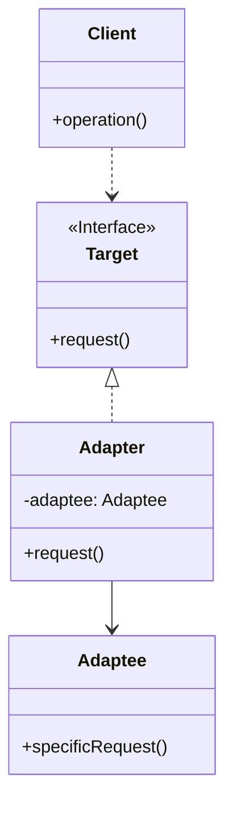

# 适配器模式 (Adapter Pattern)

## 意图

将一个类的接口转换成客户希望的另一个接口。适配器模式使得原本由于接口不兼容而不能一起工作的那些类可以协同工作。

## 结构

### UML类图

### 角色说明

| 角色 | 职责 |
|------|------|
| **Target（目标接口）** | 定义客户所需的特定领域接口，是客户期望的接口形式 |
| **Adapter（适配器）** | 实现目标接口，内部持有被适配者的引用，将目标接口的调用转换为对被适配者的调用 |
| **Adaptee（被适配者）** | 已存在的类或接口，其接口需要被适配以满足客户的需求 |
| **Client（客户）** | 通过目标接口与适配器交互，无需了解被适配者的具体实现 |

## 适用场景

- 需要使用现有的类，但其接口与系统要求的接口不一致
- 希望创建一个可复用的类，用于与多个不相关的类协同工作
- 需要统一多个类的接口，使其对外呈现一致的调用方式
- 集成第三方库或遗留系统时，接口与当前系统不兼容
- 在不修改原有代码的前提下，使不兼容的接口能够协同工作

## 优缺点

### 优点

1. **提高复用性**：允许复用现有的类，即使它们的接口与系统不兼容，无需修改原有代码
2. **增强灵活性**：通过引入适配器，可以在运行时动态地更换被适配的对象
3. **解耦客户端与被适配者**：客户端只需依赖目标接口，无需了解被适配者的具体实现细节
4. **符合开闭原则**：可以在不修改现有代码的情况下引入新的适配器，扩展系统功能

### 缺点

1. **增加系统复杂度**：引入额外的适配器类会增加代码量和理解难度
2. **性能开销**：适配器层会增加一次方法调用的间接性，可能带来轻微的性能损耗
3. **过度使用导致混乱**：在系统中大量使用适配器可能使架构变得混乱，难以维护

## 实现要点

1. **对象适配器**：通过组合方式实现（推荐），适配器持有被适配者的引用
2. **类适配器**：通过继承方式实现，适配器继承被适配者
3. **双向适配器**：可以同时适配两个接口，使两个不兼容的接口能够相互调用

## 与其他模式的关系

- **桥接模式**：桥接模式侧重于将抽象与实现分离，使两者可以独立变化；适配器模式侧重于解决接口不兼容问题
- **装饰模式**：装饰模式在不改变接口的前提下增强对象功能；适配器模式改变接口以适应客户需求
- **代理模式**：代理模式为对象提供访问控制，不改变接口；适配器模式改变接口以适配不同需求
- **外观模式**：外观模式为子系统提供简化的统一接口；适配器模式改变单个类的接口形式

## 常见问题

### Q1: 对象适配器与类适配器有什么区别？

| 特性 | 对象适配器 | 类适配器 |
|------|------------|----------|
| 实现方式 | 组合（持有被适配者引用） | 继承（继承被适配者） |
| 灵活性 | 高，可以适配被适配者的子类 | 低，只能适配特定的被适配者 |
| 被适配者修改 | 不影响适配器 | 可能影响适配器 |
| 适用场景 | 大多数情况推荐使用 | 需要重写被适配者行为时使用 |

**建议**：优先使用对象适配器，因为它更灵活且符合组合优于继承的原则。

### Q2: 适配器模式和代理模式有什么区别？

适配器模式和代理模式都作为中间层，但目的不同：
- **适配器模式**：解决接口不兼容问题，改变接口形式
- **代理模式**：控制对对象的访问，保持接口不变

### Q3: 什么时候应该使用适配器模式而不是重构代码？

- 当无法修改被适配者的源代码时（如第三方库、遗留系统）
- 当修改成本过高，且适配器能满足需求时
- 当需要保持被适配者的独立性，避免耦合时

## 最佳实践

1. **优先使用对象适配器**：对象适配器通过组合实现，比类适配器更灵活，可以适配被适配者的所有子类，且避免了继承带来的紧耦合问题

2. **保持适配器的单一职责**：一个适配器只负责适配一种接口转换，避免将多个适配逻辑混杂在一个适配器中，导致代码难以维护

3. **考虑使用默认适配器**：当目标接口方法较多时，可以提供一个抽象类实现目标接口的所有方法（空实现），具体适配器只需继承该抽象类并重写需要的方法

4. **文档化适配逻辑**：在适配器中清晰注释接口转换的规则和映射关系，便于后续维护者理解适配逻辑
