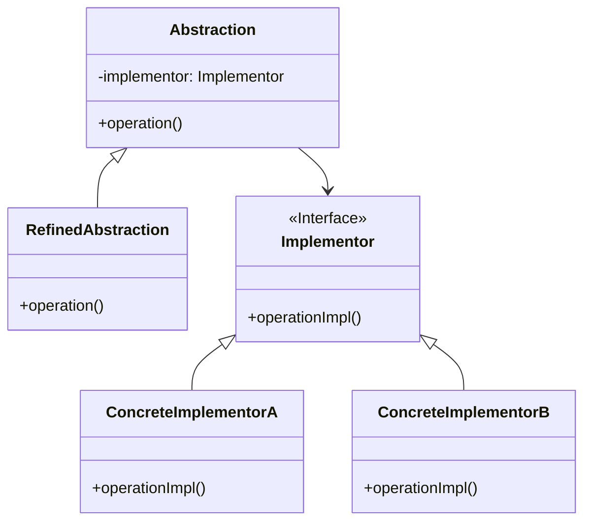

# 桥接模式 (Bridge Pattern)

## 意图

将抽象部分与实现部分分离，使它们都可以独立地变化。

桥接模式通过提供抽象化和实现化之间的桥接结构，来实现二者的解耦。这种模式涉及到一个作为桥接的接口，使得实体类的功能独立于接口实现类。这两种类型的类可被结构化改变而互不影响。

## 结构

### UML类图

### 角色说明

| 角色 | 职责描述 |
|------|----------|
| **Abstraction（抽象类）** | 定义抽象类的接口，维护一个指向Implementor类型对象的引用。它的接口通常与Implementor的接口不同，Abstraction将Client的请求转发给它的Implementor对象。 |
| **RefinedAbstraction（扩充抽象类）** | 扩充由Abstraction定义的接口，通常是具体的业务抽象类，实现特定的业务方法。 |
| **Implementor（实现类接口）** | 定义实现类的接口，这个接口不一定要与Abstraction的接口完全一致。实际上这两个接口可以完全不同。一般而言，Implementor接口仅提供基本操作，而Abstraction则定义了基于这些基本操作的较高层次的操作。 |
| **ConcreteImplementor（具体实现类）** | 实现Implementor接口并定义它的具体实现。 |

## 适用场景

1. **多维度变化**：当一个类存在两个独立变化的维度，且这两个维度都需要进行扩展时，使用桥接模式可以避免类的爆炸式增长。

2. **避免继承层次过深**：当一个系统不希望使用继承或因为多层次继承导致系统类的个数急剧增加时，桥接模式通过组合代替继承来简化系统结构。

3. **需要运行时切换实现**：当一个系统需要在构件的抽象化角色和具体化角色之间增加更多的灵活性，希望在运行时动态切换实现时。

4. **跨平台开发**：当需要开发跨平台的应用程序，且平台的实现细节需要与业务逻辑分离时。

5. **图形界面系统**：在GUI系统中，将窗口的抽象（如对话框、按钮）与具体的平台实现（如Windows、Linux、Mac）分离。

6. **数据库访问层**：当需要支持多种数据库，且访问逻辑需要与具体的数据库实现分离时。

## 优缺点

### 优点

1. **分离抽象和实现**：桥接模式分离了抽象部分和实现部分，从而极大地提高了系统的灵活性。抽象和实现可以独立地扩展，不会互相影响。

2. **提高可扩展性**：在两个变化维度中任意扩展一个维度，都不需要修改原有系统，符合开闭原则。可以独立地对Abstraction和Implementor层次结构进行扩充。

3. **实现细节对客户透明**：客户不需要知道实现细节，只需要与抽象层交互。这简化了客户端代码，并降低了耦合度。

4. **符合合成复用原则**：桥接模式使用组合关系代替继承关系，避免了继承带来的强耦合问题，使系统更加灵活。

5. **支持动态切换实现**：可以在运行时动态地更换具体的实现类，提供了更大的灵活性。

### 缺点

1. **增加系统复杂度**：桥接模式增加了系统的理解与设计难度。需要正确地识别出系统中两个独立变化的维度，这对设计者的分析能力要求较高。

2. **需要正确识别维度**：如果抽象和实现的划分不当，可能会导致系统设计混乱。错误地识别独立维度可能导致模式应用不当。

3. **增加开发成本**：由于需要定义更多的类和接口，初期开发成本会有所增加，需要更多的代码来实现相同的功能。

## 实现要点

1. **识别并分离抽象和实现两个维度**：仔细分析系统需求，找出两个独立变化的维度，一个作为抽象部分，一个作为实现部分。

2. **使用组合关系连接抽象和实现**：在抽象类中维护一个指向实现类接口的引用，通过该引用调用实现类的方法。

3. **两个维度可以独立变化**：确保抽象部分和实现部分可以独立扩展，新增抽象或实现都不需要修改对方。

4. **定义清晰的接口边界**：抽象接口和实现接口应该有清晰的职责划分，避免接口膨胀。

5. **考虑默认实现**：可以为实现类提供默认实现，简化具体实现类的开发。

## 与其他模式的关系

### 桥接模式 vs 适配器模式

- **目的不同**：桥接模式是预先设计，用于将抽象部分与实现部分分离；适配器模式是事后补救，用于协调两个不兼容的接口。
- **应用场景不同**：桥接模式用于设计阶段，处理多维度变化；适配器模式用于集成阶段，处理已有接口的不兼容问题。
- **结构相似性**：两者都使用组合关系，但桥接模式强调分离维度，适配器模式强调接口转换。

### 桥接模式 vs 策略模式

- **关系**：桥接模式中的实现部分可以使用策略模式来实现。Implementor接口可以看作是一组策略的抽象。
- **关注点不同**：策略模式关注算法的替换，桥接模式关注维度的分离。
- **使用方式**：策略模式通常由客户端选择策略，桥接模式通常在抽象层内部维护实现引用。

### 桥接模式 vs 抽象工厂模式

- **协同使用**：抽象工厂模式可以用来创建桥接模式中的具体实现对象，将对象的创建与使用分离。
- **关注点不同**：抽象工厂关注对象创建，桥接模式关注结构分离。

## 常见问题

### Q1: 如何正确识别桥接模式中的两个独立维度？

**A:** 识别独立维度需要分析业务需求中哪些特性是经常变化的，且这些变化之间没有强依赖关系。常见的方法包括：

- 分析业务概念：找出业务领域中本质上不同的概念，如"形状"和"颜色"、"图形"和"渲染方式"。
- 考虑扩展方向：思考系统未来可能的扩展方向，如果两个特性可以独立扩展，则可能是两个维度。
- 避免过度设计：不是所有多维度场景都需要桥接模式，只有当维度变化频繁且复杂时才考虑使用。

### Q2: 桥接模式会增加代码复杂度，什么时候不应该使用？

**A:** 以下情况不建议使用桥接模式：

- 系统只有两个简单的类，没有多维度变化的需求。
- 抽象和实现的耦合度本来就很高，分离后反而增加复杂度。
- 团队成员对设计模式理解不深，强行使用可能导致维护困难。
- 性能要求极高的场景，因为桥接模式引入了额外的间接层。

### Q3: 桥接模式和继承相比，性能上有什么差异？

**A:** 桥接模式通过组合而非继承来实现功能，会引入额外的间接调用开销。但在现代JVM和编译器优化下，这种开销通常可以忽略不计。如果性能是首要考虑因素，且维度变化不频繁，可以考虑使用继承方案。

## 最佳实践

1. **优先使用组合而非继承**：当面临多维度变化时，首先考虑桥接模式而不是多层继承。继承会导致类爆炸，而组合提供更灵活的解决方案。

2. **明确定义接口边界**：抽象接口和实现接口应该有清晰的职责划分。抽象接口面向业务，实现接口面向技术细节，两者不要互相渗透。

3. **使用依赖注入**：通过依赖注入的方式将具体实现注入到抽象类中，可以提高系统的灵活性和可测试性。

4. **结合工厂模式使用**：使用工厂模式创建具体的实现类，将对象的创建逻辑与桥接结构分离，使系统更加灵活。

5. **考虑默认实现**：为Implementor接口提供默认实现或抽象类，减少具体实现类的重复代码，遵循DRY原则。

6. **文档化维度设计**：在使用桥接模式时，务必在文档中清晰说明为什么选择这些维度，以及未来可能的扩展方向，帮助团队成员理解设计意图。

## 相关设计原则

- **合成复用原则**：优先使用对象组合，而不是类继承。
- **开闭原则**：对扩展开放，对修改关闭。
- **单一职责原则**：抽象和实现各自承担单一的职责。
