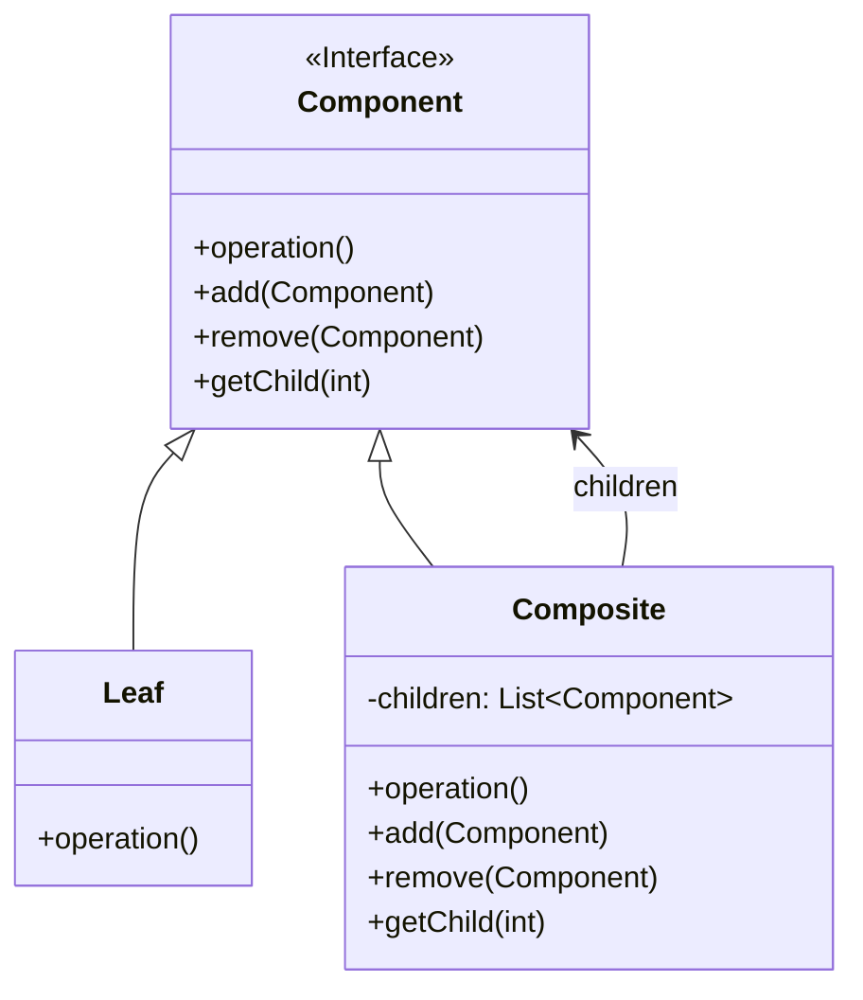

# 组合模式 (Composite Pattern)

## 意图

将对象组合成树形结构以表示"部分-整体"的层次结构，使用户对单个对象和组合对象的使用具有一致性。

## 结构

### UML类图

### 角色说明

- **Component（组件）**：定义了组合中所有对象的通用接口，包括叶子节点和组合节点。它声明了管理子组件的操作（如 add、remove、getChild）以及业务操作（如 operation）。
- **Leaf（叶子节点）**：表示组合中的叶子对象，没有子节点。它实现了 Component 接口中定义的业务操作，对于管理子组件的操作通常提供空实现或抛出异常。
- **Composite（组合节点）**：表示具有子组件的组合对象。它实现了 Component 接口，并维护一个子组件列表。在业务操作中，通常会递归调用子组件的相应操作。

## 适用场景

- 当需要表示对象的"部分-整体"层次结构时，如文件系统（文件和文件夹）、组织架构（员工和部门）、UI 组件树等
- 当希望用户能够统一地使用组合结构中的所有对象，忽略单个对象和组合对象之间的差异时
- 当需要处理树形结构数据，并且希望对叶子节点和分支节点进行一致操作时
- 当需要递归地遍历或操作树形结构中的所有节点时

## 优缺点

### 优点

1. **统一接口**：客户端可以一致地使用单个对象和组合对象，简化了客户端代码，无需区分处理叶子节点和组合节点
2. **易于扩展**：可以很容易地添加新的组件类型（新的 Leaf 或 Composite），符合开闭原则，无需修改现有代码
3. **灵活的层次结构**：可以构建复杂的树形结构，节点可以自由增加和删除，支持任意深度的层次嵌套
4. **递归组合**：天然支持递归操作，可以方便地对整个树形结构进行统一处理，如遍历、计算总价格、统计数量等

### 缺点

1. **设计复杂性**：在层次结构太深时，设计和调试会变得复杂，难以理解和维护
2. **类型限制困难**：由于所有组件都实现了相同的接口，不容易在编译期限制组合中的构件类型，只能在运行期进行检查
3. **过度抽象**：对于简单的场景，引入组合模式可能会造成过度设计，增加不必要的抽象层次

## 实现要点

1. **定义组件接口**：声明所有组件的通用操作，包括业务操作和管理子组件的操作
2. **实现叶子节点**：叶子节点实现业务操作，对于管理子组件的操作可以提供空实现或抛出异常
3. **实现组合节点**：组合节点维护子组件列表，在业务操作中递归调用子组件的相应操作
4. **选择实现方式**：根据需求选择透明方式（在 Component 中声明所有操作）或安全方式（只在 Composite 中声明管理操作）

## 与其他模式的关系

- **装饰模式**：都可以用来添加功能，组合模式强调结构（树形层次），装饰模式强调功能（动态添加职责）。两者可以结合使用，装饰器可以装饰组合树中的组件
- **迭代器模式**：常与组合模式一起使用来遍历树形结构。可以使用迭代器模式实现组合树的前序、后序或层次遍历
- **访问者模式**：可以对组合结构中的元素进行操作，将操作逻辑从组件类中分离出来，便于添加新的操作而不修改组件类
- **享元模式**：可以在组合树中共享叶子节点，以节省内存，特别是在有大量相似叶子节点的情况下

## 常见问题

### 1. 透明方式与安全方式的区别是什么？

**透明方式**：在 Component 接口中声明所有用来管理子对象的方法，包括 add、remove 和 getChild。这样做的好处是所有组件类都具有相同的接口，客户端可以完全一致地对待所有对象。缺点是叶子节点也需要实现管理子对象的方法，虽然这些方法对叶子节点没有意义，通常提供空实现或抛出异常。

**安全方式**：只在 Composite 类中声明管理子对象的方法，Component 和 Leaf 中不声明这些方法。这样做的好处是叶子节点不需要实现无意义的方法，更加安全。缺点是客户端需要区分叶子节点和组合节点，无法完全一致地对待所有对象，增加了客户端代码的复杂性。

### 2. 如何在组合模式中实现深度遍历？

可以使用递归方式实现深度遍历。在 Composite 的 operation 方法中，首先执行自身的业务逻辑，然后遍历所有子组件并递归调用它们的 operation 方法。如果需要控制遍历顺序（前序、后序），可以调整自身业务逻辑和递归调用的顺序。另外，也可以结合迭代器模式或访问者模式来实现更灵活的遍历策略。

### 3. 如何限制组合中的构件类型？

由于组合模式使用统一的 Component 接口，在编译期限制构件类型比较困难。可以采用以下方法：
- 在运行时进行类型检查，在 add 方法中检查传入组件的类型
- 使用泛型或模板来约束类型
- 在 Component 中添加类型标识，在运行时进行验证
- 创建特定领域的组合模式变体，只接受特定类型的组件

## 最佳实践

1. **合理选择透明方式或安全方式**：如果客户端需要完全一致地对待所有组件，选择透明方式；如果类型安全更重要，选择安全方式。在大多数 GUI 框架中，透明方式更为常见。

2. **在 Composite 中缓存计算结果**：如果组合树中的操作涉及复杂的计算（如计算总大小、总价格），可以考虑在 Composite 中缓存计算结果，并在子组件发生变化时使缓存失效，以提高性能。

3. **实现组件的深拷贝和序列化**：在需要复制或持久化组合树时，确保正确实现深拷贝和序列化机制，递归处理所有子组件，避免浅拷贝导致的问题。

4. **提供便捷的方法创建组合树**：可以提供一个 Builder 类或工厂方法来简化组合树的创建过程，使客户端代码更加简洁易读。

5. **考虑使用迭代器模式遍历组合树**：当需要以不同方式遍历组合树时（前序、后序、层次遍历），可以实现相应的迭代器，将遍历逻辑与组件类分离。
