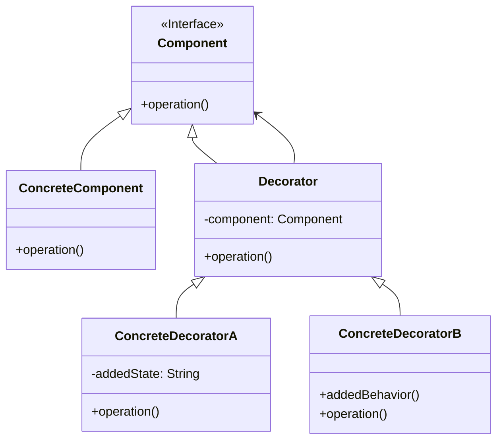

# 装饰模式 (Decorator Pattern)

## 意图

动态地给一个对象添加一些额外的职责。就增加功能来说，装饰模式比生成子类更为灵活。

装饰模式提供了一种比继承更灵活的方式来扩展对象的功能。它允许在不改变原有对象结构的情况下，通过包装（wrapping）的方式动态地为对象添加新的行为。这种模式创建了一个装饰类，用来包装原有的类，并在保持类方法签名完整性的前提下，提供额外的功能。

## 结构

### UML类图



### 角色说明

| 角色 | 职责 | 说明 |
|------|------|------|
| **Component** | 组件接口 | 定义一个对象接口，可以给这些对象动态地添加职责。它是所有具体组件和装饰器的共同父类或接口。 |
| **ConcreteComponent** | 具体组件 | 定义一个具体的对象，也可以给这个对象添加一些职责。这是被装饰的原始对象。 |
| **Decorator** | 装饰器 | 持有一个Component对象的引用，并定义一个与Component接口一致的接口。它是所有具体装饰器的基类。 |
| **ConcreteDecorator** | 具体装饰器 | 负责向组件添加新的职责。每个具体装饰器都可以添加特定的功能。 |

## 适用场景

- **动态扩展功能**：需要在不影响其他对象的情况下，以动态、透明的方式给单个对象添加职责
- **功能可撤销**：需要处理那些可以动态添加和撤销的职责
- **避免类爆炸**：当使用继承会导致产生大量子类时，使用装饰模式可以减少类的数量
- **组合多种功能**：需要通过不同的装饰类组合来产生多种功能组合时
- **运行时增强**：需要在运行时动态决定对象的功能增强方式
- **I/O流处理**：Java I/O流、.NET Stream等流式处理场景
- **UI组件增强**：GUI框架中组件的边框、滚动条、阴影等效果的动态添加
- **中间件管道**：Web框架中的中间件管道处理（如ASP.NET Core、Express.js）

## 优缺点

### 优点

1. **比继承更灵活**：可以在运行时动态地添加或删除职责，而继承是静态的，在编译时就确定了
2. **符合开闭原则**：可以在不修改原有代码的情况下扩展对象的功能，对扩展开放，对修改关闭
3. **单一职责原则**：可以将复杂的功能分解到不同的装饰器类中，每个装饰器只负责一项职责
4. **功能组合灵活**：通过使用不同的装饰类及这些装饰类的排列组合，可以创造出很多不同行为的组合
5. **透明性**：装饰器和被装饰对象具有相同的接口，客户端可以一致地对待它们

### 缺点

1. **产生大量小对象**：装饰模式会产生很多小的装饰器对象，增加系统的复杂性
2. **调试困难**：多层装饰后，排错和调试变得更加困难，需要跟踪多层包装
3. **配置复杂**：需要逐层配置装饰器，如果装饰层次过多，配置会变得复杂
4. **性能开销**：每一层装饰都会引入额外的间接层，可能带来轻微的性能开销

## 实现要点

1. **定义组件接口**：确保Component接口能够覆盖ConcreteComponent和Decorator的所有公共操作
2. **保持接口一致性**：Decorator必须实现与Component完全一致的接口，确保透明性
3. **委托调用**：Decorator的operation方法应该首先调用component的operation方法，然后再添加自己的功能
4. **支持多层装饰**：设计时要考虑装饰器可以被其他装饰器装饰的情况
5. **可选的抽象装饰器类**：可以提供一个抽象装饰器类来管理Component引用，简化具体装饰器的实现

## 与其他模式的关系

### 装饰模式 vs 代理模式

| 维度 | 装饰模式 | 代理模式 |
|------|----------|----------|
| **目的** | 增强功能，添加额外职责 | 控制访问，管理对象的生命周期 |
| **时机** | 运行时动态添加 | 通常是编译时或初始化时确定 |
| **接口** | 可以扩展接口（虽然通常保持一致） | 必须保持接口完全一致 |
| **关注点** | 功能的扩展和组合 | 访问的控制和保护 |

### 装饰模式 vs 适配器模式

| 维度 | 装饰模式 | 适配器模式 |
|------|----------|------------|
| **目的** | 改变对象的职责/功能 | 改变对象的接口 |
| **接口变化** | 保持接口不变 | 转换接口为另一个接口 |
| **使用场景** | 需要增强功能时 | 需要兼容不同接口时 |

### 装饰模式 vs 策略模式

- **装饰模式**：通过包装对象来动态添加职责，装饰器和被装饰对象属于同一类型层次结构
- **策略模式**：通过组合不同的算法来改变对象的行为，策略对象和被操作对象通常是不同的类型

## 常见问题

### Q1: 装饰模式和代理模式有什么区别？

**答：** 虽然两者都使用组合和委托，但它们的设计意图不同：

- **装饰模式**的主要目的是**增强功能**，动态地给对象添加额外的职责。装饰器通常会修改或增强被装饰对象的行为。

- **代理模式**的主要目的是**控制访问**，代理对象管理对被代理对象的访问，可能出于安全、延迟加载、远程访问等原因。代理通常不会修改被代理对象的行为，只是控制访问时机和方式。

**示例对比：**
- 装饰模式：给一个咖啡添加牛奶、糖等配料，每次添加都会改变咖啡的味道（功能增强）
- 代理模式：一个图片代理控制对真实图片的加载，在图片加载完成前显示占位符（访问控制）

### Q2: 如何避免装饰器层次过多导致的复杂性？

**答：** 可以采取以下策略：

1. **限制装饰层数**：设定合理的最大装饰层数，避免无限嵌套
2. **使用建造者模式**：当需要组合多个装饰器时，使用建造者模式来简化构建过程
3. **提供预设组合**：对于常用的装饰组合，提供预配置的工厂方法
4. **文档化装饰链**：在代码注释中清晰记录装饰器的组合顺序和预期行为
5. **考虑替代方案**：如果装饰层数经常超过3-4层，可能需要重新考虑设计，或许使用策略模式或其他模式更合适

### Q3: 装饰模式是否违反了里氏替换原则？

**答：** 装饰模式**不违反**里氏替换原则。实际上，装饰模式是里氏替换原则的典型应用：

- 装饰器（Decorator）和被装饰对象（ConcreteComponent）都实现了相同的Component接口
- 客户端代码可以将装饰器当作Component类型来使用
- 装饰器可以透明地替换被装饰对象，程序行为保持一致（只是功能被增强了）

关键在于装饰器必须严格实现Component接口的所有方法，确保替换的透明性。

## 最佳实践

### 1. 保持装饰器的透明性

确保装饰器实现与被装饰对象完全相同的接口，这样客户端代码不需要知道对象是否被装饰。避免在装饰器中公开被装饰对象特有的方法。

```java
// 好的做法：装饰器只暴露Component接口的方法
public class CoffeeDecorator implements Coffee {
    protected Coffee decoratedCoffee;
    
    public CoffeeDecorator(Coffee coffee) {
        this.decoratedCoffee = coffee;
    }
    
    @Override
    public double getCost() {
        return decoratedCoffee.getCost();
    }
    
    @Override
    public String getDescription() {
        return decoratedCoffee.getDescription();
    }
}
```

### 2. 使用抽象装饰器简化实现

当需要创建多个具体装饰器时，先创建一个抽象装饰器类来管理Component引用和基本委托逻辑，具体装饰器只需关注自己的增强功能。

```java
// 抽象装饰器处理通用逻辑
public abstract class CoffeeDecorator implements Coffee {
    protected Coffee decoratedCoffee;
    
    public CoffeeDecorator(Coffee coffee) {
        this.decoratedCoffee = coffee;
    }
    
    @Override
    public double getCost() {
        return decoratedCoffee.getCost();
    }
    
    @Override
    public String getDescription() {
        return decoratedCoffee.getDescription();
    }
}

// 具体装饰器只需实现特定功能
public class MilkDecorator extends CoffeeDecorator {
    public MilkDecorator(Coffee coffee) {
        super(coffee);
    }
    
    @Override
    public double getCost() {
        return super.getCost() + 0.5; // 添加牛奶的价格
    }
    
    @Override
    public String getDescription() {
        return super.getDescription() + ", Milk";
    }
}
```

### 3. 合理设计装饰顺序

装饰器的应用顺序可能会影响最终结果，应该在文档中明确说明装饰器的预期使用顺序，或者设计装饰器使其顺序无关。

```java
// 明确装饰顺序的影响
// 顺序1：先加牛奶，再加糖
Coffee coffee1 = new SugarDecorator(new MilkDecorator(new SimpleCoffee()));
// 结果：SimpleCoffee, Milk, Sugar

// 顺序2：先加糖，再加牛奶
Coffee coffee2 = new MilkDecorator(new SugarDecorator(new SimpleCoffee()));
// 结果：SimpleCoffee, Sugar, Milk

// 如果顺序不影响最终效果（如只是累加价格），则设计良好
// 如果顺序影响效果（如先加密再压缩 vs 先压缩再加密），需要文档说明
```

### 4. 考虑使用工厂方法创建装饰对象

对于复杂的装饰组合，使用工厂方法或建造者模式来简化客户端代码，避免客户端直接处理多层装饰的复杂性。

```java
// 使用工厂方法简化装饰对象的创建
public class CoffeeFactory {
    public static Coffee createCappuccino() {
        return new FoamDecorator(
            new MilkDecorator(
                new Espresso()
            )
        );
    }
    
    public static Coffee createLatte() {
        return new MilkDecorator(
            new MilkDecorator(
                new Espresso()
            )
        );
    }
}
```

## 相关设计原则

- **开闭原则**：对扩展开放，对修改关闭
- **合成复用原则**：优先使用对象组合，而不是类继承
- **单一职责原则**：每个装饰器只负责一项职责
