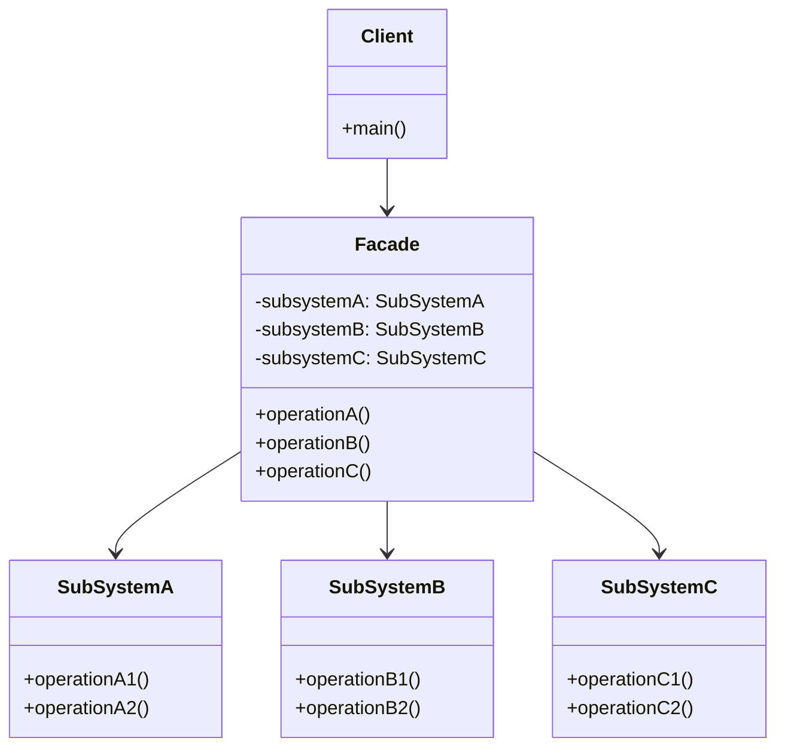

# 外观模式 (Facade Pattern)

## 意图

为子系统中的一组接口提供一个一致的界面，定义一个高层接口使子系统更易于使用。

外观模式通过创建一个统一的接口来隐藏系统的复杂性，客户端只需要与外观对象交互，而不需要了解子系统内部的复杂结构和相互依赖关系。这种模式促进了子系统的独立性和可维护性，同时降低了客户端与子系统之间的耦合度。

## 结构

### UML类图

### 角色说明

| 角色 | 职责 |
|------|------|
| **Facade（外观）** | 知道哪些子系统类负责处理请求，将客户端请求委派给适当的子系统对象。它是客户端访问子系统的统一入口点。 |
| **SubSystem（子系统）** | 实现子系统的功能，处理由Facade对象指派的任务。子系统不知道Facade的存在，它们直接处理来自Facade的请求。 |
| **Client（客户端）** | 通过调用Facade提供的接口来与子系统交互，无需直接访问子系统内部的复杂组件。 |

## 适用场景

- **简化复杂系统接口**：当需要为一个复杂子系统提供一个简单接口时，外观模式可以隐藏系统的复杂性，只暴露必要的功能。

- **解耦客户端与子系统**：当客户端程序与多个子系统类存在紧耦合时，使用外观模式可以降低耦合度，使系统更易于修改和扩展。

- **分层架构设计**：当需要构建层次结构的子系统时，外观模式可以为每个层次定义入口点，简化层与层之间的通信。

- **遗留系统封装**：当需要与遗留系统或第三方库集成时，外观模式可以封装这些系统的复杂性，提供统一的现代接口。

- **减少依赖扩散**：当子系统的变化会影响到大量客户端代码时，使用外观模式可以隔离变化，减少影响范围。

## 优缺点

### 优点

1. **简化接口**：为复杂子系统提供一个简单的统一接口，降低了学习和使用成本。

2. **解耦客户端与子系统**：客户端与子系统之间的耦合度降低，子系统的修改不会直接影响客户端代码。

3. **提高可维护性**：将子系统的复杂性封装在外观类中，使得系统更易于维护和更新。

4. **促进分层架构**：有助于构建清晰的分层架构，每层只通过外观与其他层交互。

5. **增强安全性**：通过外观控制对子系统的访问，可以隐藏敏感或危险的内部操作。

### 缺点

1. **不符合开闭原则**：如果子系统发生重大变化，可能需要修改外观类的实现，而不是通过扩展来解决。

2. **可能成为上帝对象**：如果外观类承担了过多的职责，可能演变为一个庞大的上帝类，难以维护。

3. **隐藏过多细节**：过度封装可能导致某些必要的底层功能无法被访问，限制了高级用户的灵活性。

## 实现要点

1. **了解子系统的功能**：深入理解各个子系统的职责和交互方式，才能设计出合理的外观接口。

2. **设计简化的统一接口**：外观接口应该只暴露客户端需要的功能，隐藏不必要的复杂性。

3. **处理子系统间的交互**：外观类负责协调多个子系统之间的调用顺序和依赖关系。

4. **保持子系统的独立性**：子系统不应该知道外观的存在，保持子系统的独立性和可重用性。

5. **考虑是否需要多个外观**：对于复杂的子系统，可以设计多个外观类，每个负责不同的功能领域。

## 与其他模式的关系

- **单例模式**：外观对象通常是单例，因为一般只需要一个统一的外观接口来访问子系统。

- **抽象工厂模式**：可以用来创建子系统对象，外观模式可以使用抽象工厂来获取子系统实例，进一步解耦。

- **中介者模式**：外观模式简化接口，中介者模式处理对象间通信。外观模式是单向的（客户端到子系统），而中介者是双向的。

- **适配器模式**：适配器模式改变接口以符合客户端期望，外观模式简化接口以隐藏复杂性。两者可以结合使用。

- **装饰器模式**：装饰器模式在不改变接口的情况下增强功能，可以与外观模式结合，为简化后的接口添加额外功能。

## 常见问题

### Q1: 外观模式与适配器模式有什么区别？

**A:** 虽然两者都涉及接口转换，但目的不同：
- **外观模式**的目的是简化接口，将复杂子系统的多个接口统一为一个简单的接口，隐藏内部复杂性。
- **适配器模式**的目的是转换接口，使不兼容的接口能够协同工作，通常涉及接口的转换或包装。

外观模式关注"简化"，适配器模式关注"转换"。

### Q2: 外观模式是否限制了子系统功能的完整使用？

**A:** 外观模式确实只暴露了子系统的部分功能，但这不一定是限制：
- 外观模式提供的是"常用操作"的快捷方式，简化了80%的使用场景。
- 对于需要访问底层功能的场景，客户端仍然可以直接使用子系统类。
- 可以设计多个外观类，针对不同使用场景提供不同级别的抽象。
- 也可以在外观类中提供获取子系统实例的方法，供高级用户使用。

### Q3: 如何避免外观类变成上帝类？

**A:** 可以采取以下策略：
- **职责分离**：将不同领域的外观功能拆分到不同的外观类中。
- **外观组合**：对于复杂系统，可以使用多个外观类，高层外观使用低层外观。
- **接口最小化**：只暴露真正需要的方法，避免将所有子系统方法都暴露出来。
- **定期重构**：当外观类变得过大时，及时识别并提取新的外观类。

## 最佳实践

1. **外观接口应该是粗粒度的**：外观方法应该封装完整的业务流程，而不是简单地代理单个子系统方法。例如，`placeOrder()`方法应该包含库存检查、支付处理、物流安排等一系列操作，而不是分别暴露这些步骤。

2. **保持子系统的独立性**：子系统不应该依赖外观类，这样可以确保子系统可以被其他客户端直接使用，也可以被不同的外观类组合使用。子系统的独立性是外观模式能够成功应用的关键。

3. **考虑提供可选的直接访问**：对于需要更细粒度控制的高级用户，可以在外观类中提供获取子系统实例的方法，或者允许客户端选择使用外观或直接访问子系统。

4. **文档化外观的使用场景**：清晰地文档化外观类解决了什么问题、封装了哪些子系统、适用于什么场景，帮助团队成员正确理解和使用外观模式。

5. **结合依赖注入使用**：通过依赖注入框架管理外观类和子系统类的生命周期，可以提高系统的可测试性和灵活性，便于在测试时使用模拟对象替换真实的子系统。
