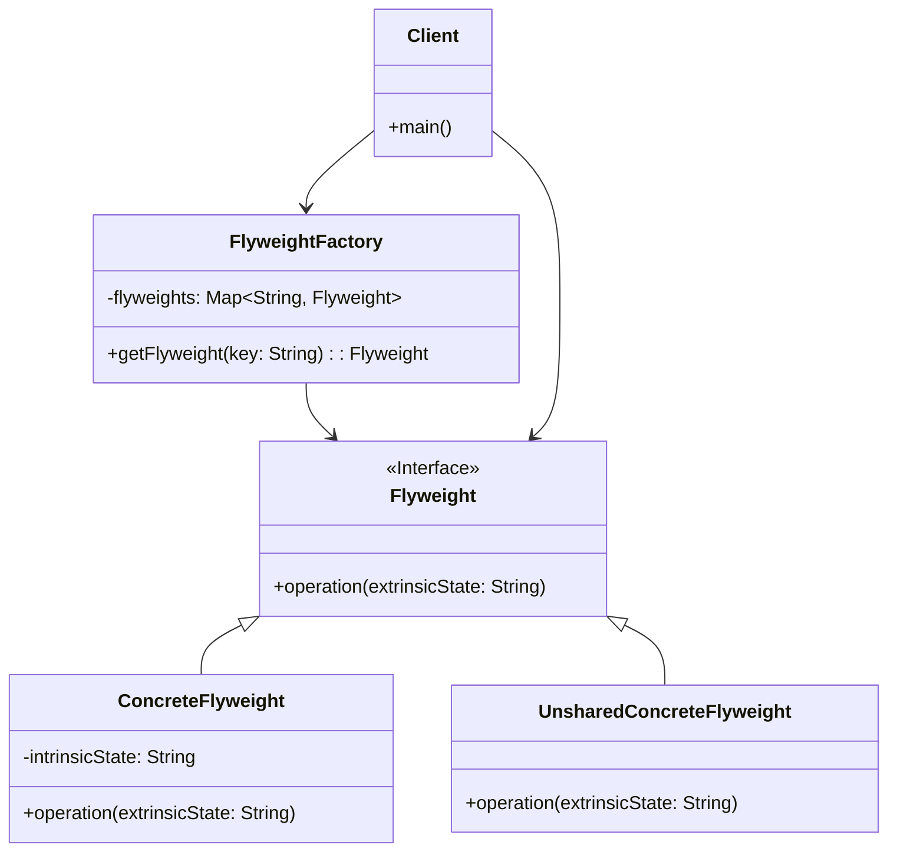

# 享元模式 (Flyweight Pattern)

## 意图

运用共享技术有效地支持大量细粒度的对象。

享元模式通过共享已经存在的对象来减少内存占用和提高性能，特别适用于需要创建大量相似对象的场景。它将对象的状态划分为内部状态（Intrinsic State）和外部状态（Extrinsic State），其中内部状态可以共享，而外部状态由客户端在运行时传入。

## 结构

### UML类图

### 角色说明

| 角色 | 职责描述 |
|------|----------|
| **Flyweight（抽象享元）** | 定义享元对象的接口，声明接收外部状态的方法。所有具体享元类必须实现此接口。 |
| **ConcreteFlyweight（具体享元）** | 实现 Flyweight 接口，存储内部状态（intrinsic state）。内部状态必须是独立于具体场景的、可共享的。 |
| **UnsharedConcreteFlyweight（非共享具体享元）** | 并非所有 Flyweight 子类都需要被共享。当需要不可共享的对象时，可以使用此角色。它通常将具体享元作为子节点。 |
| **FlyweightFactory（享元工厂）** | 负责创建和管理享元对象。当客户端请求享元时，工厂检查是否已存在符合条件的享元对象，如果存在则返回已有对象，否则创建新对象并存储。 |
| **Client（客户端）** | 维护对享元的引用，计算或存储享元的外部状态。 |

## 适用场景

- **大量相似对象**：系统中存在大量相似对象，造成内存开销过大
- **对象状态可分离**：对象的大部分状态可以转变为外部状态，从而能够被多个对象共享
- **缓存需求**：需要缓存对象以提高系统性能的场景
- **资源受限环境**：在内存或计算资源受限的环境中优化资源使用
- **文本编辑器**：处理大量字符对象，每个字符的字体、颜色等样式可以共享
- **游戏开发**：游戏中的粒子系统、地形渲染、树木植被等大量重复元素
- **图形界面**：GUI 中的图标、按钮样式等可复用组件

## 优缺点

### 优点

1. **大幅减少内存占用**：通过共享对象，显著减少系统中对象实例的数量，降低内存消耗
2. **提高性能**：减少对象创建和垃圾回收的开销，提升系统运行效率
3. **集中管理对象**：通过享元工厂集中管理共享对象，便于统一控制和优化
4. **优化缓存机制**：天然的缓存实现方式，适合需要频繁创建销毁对象的场景

### 缺点

1. **增加系统复杂度**：需要仔细区分内部状态和外部状态，并将外部状态从享元对象中剥离，增加了设计和实现的复杂度
2. **运行时间开销**：客户端需要计算或查找外部状态，可能导致运行时的性能开销
3. **线程安全问题**：在多线程环境下，享元工厂和共享对象需要考虑线程安全问题，增加了并发控制的复杂度

## 实现要点

1. **识别内部状态和外部状态**：内部状态存储在享元内部，不会随环境改变；外部状态由客户端传入，随环境变化
2. **创建享元工厂**：工厂负责管理享元对象的生命周期，确保相同内部状态的享元只被创建一次
3. **客户端维护外部状态**：客户端需要负责计算、存储和传递外部状态给享元对象
4. **考虑线程安全**：在多线程环境中，享元工厂需要保证线程安全，避免重复创建享元对象
5. **不可变性**：享元对象的内部状态应该是不可变的，以确保共享的安全性

## 与其他模式的关系

- **单例模式**：享元工厂通常实现为单例，确保全局只有一个工厂实例管理所有享元对象
- **组合模式**：享元模式可以与组合模式结合使用，将叶节点实现为可共享的享元对象，以节省内存
- **状态模式**：状态对象可以设计成享元，当上下文对象需要切换状态时，可以共享已有的状态对象
- **策略模式**：策略对象可以实现为享元，避免为每个上下文创建新的策略实例

## 常见问题

### Q1: 内部状态与外部状态的区别是什么？

**内部状态（Intrinsic State）**：
- 存储在享元对象内部
- 不随环境改变而改变
- 可以被多个对象共享
- 通常是对象的固有属性

**外部状态（Extrinsic State）**：
- 由客户端在调用时传入
- 随环境改变而变化
- 不能被共享，每个使用场景可能不同
- 需要客户端负责维护和计算

**示例**：在文本编辑器中，字符 "A" 的字体、字号、颜色等是内部状态，可以被所有 "A" 字符共享；而字符在文档中的位置是外部状态，每个 "A" 字符的位置都不同。

### Q2: 享元模式与对象池模式有什么区别？

享元模式和对象池模式都涉及对象的复用，但它们的目的和实现方式不同：

| 特性 | 享元模式 | 对象池模式 |
|------|----------|------------|
| **目的** | 减少内存占用，通过共享减少对象数量 | 减少对象创建开销，提高获取对象的速度 |
| **对象状态** | 对象有内部状态（可共享）和外部状态（由客户端传入） | 对象通常包含完整状态，使用后需要重置 |
| **生命周期** | 享元对象通常长期存在，不会被销毁 | 对象可以被借出、归还、销毁 |
| **使用方式** | 多个客户端同时使用同一个享元对象 | 对象同一时间只能被一个客户端使用 |

## 最佳实践

1. **确保内部状态的不可变性**：将内部状态声明为 `final` 或 `const`，在构造时初始化，之后不可修改。这保证了享元对象在多线程环境下的安全性，也防止了意外修改导致的不一致问题。

2. **合理设计享元工厂的键**：享元工厂使用键来查找和存储享元对象，键的设计应该能够唯一标识享元的内部状态。对于复杂的内部状态，可以考虑使用组合键或哈希值。

3. **考虑延迟加载与预加载的平衡**：根据应用场景决定是在需要时创建享元（延迟加载）还是在系统启动时预创建（预加载）。延迟加载节省启动时间，预加载提高运行时性能。

4. **监控享元对象的使用情况**：在享元工厂中添加统计功能，监控享元对象的创建数量、命中率等指标，以便优化系统性能和内存使用。
