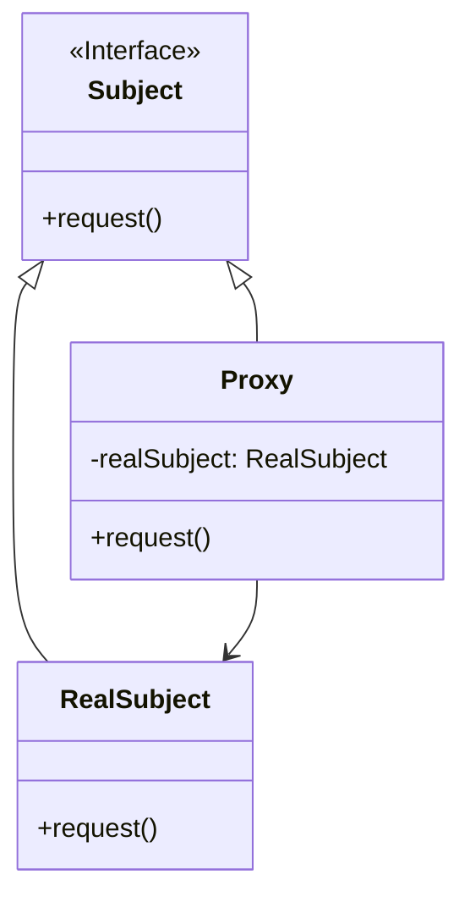

# 代理模式 (Proxy Pattern)

## 意图

为其他对象提供一种代理以控制对这个对象的访问。

代理模式在不改变原始对象接口的前提下，引入一个代理对象作为客户端与真实对象之间的中介。代理对象负责管理对真实对象的访问，可以在访问前后执行额外的逻辑，如权限验证、延迟加载、日志记录、缓存等。

## 结构

### UML类图



### 角色说明

**Subject（抽象主题）**
- 定义了 RealSubject 和 Proxy 的公共接口
- 使得在任何使用 RealSubject 的地方都可以使用 Proxy
- 通常是一个接口或抽象类

**RealSubject（真实主题）**
- 定义了 Proxy 所代表的真实实体
- 实现了 Subject 接口定义的业务逻辑
- 是客户端最终需要访问的实际对象

**Proxy（代理）**
- 保存一个引用使得代理可以访问实体（RealSubject）
- 提供一个与 Subject 相同的接口，使得代理可以替代实体
- 控制对实体的访问，并可能负责创建和删除实体
- 在访问真实对象前后可以执行额外的操作

## 适用场景

### 1. 远程代理（Remote Proxy）

为位于不同地址空间的对象提供本地代表。隐藏对象位于不同地址空间的事实，使得客户端可以像访问本地对象一样访问远程对象。

**典型应用**：
- RPC（远程过程调用）框架
- Web Service 客户端
- 分布式系统中的对象访问

### 2. 虚拟代理（Virtual Proxy）

根据需要创建开销很大的对象，延迟对象的创建直到真正需要时。常用于优化性能，避免不必要的资源消耗。

**典型应用**：
- 图片懒加载（先显示占位图，加载完成后再显示真实图片）
- 大型文档的延迟加载
- 复杂对象的按需创建

### 3. 保护代理（Protection Proxy）

控制对原始对象的访问，基于权限控制决定是否允许访问真实对象。用于实现访问控制和安全检查。

**典型应用**：
- 权限管理系统
- 敏感操作的访问控制
- 基于角色的资源访问

### 4. 智能代理（Smart Proxy）

在访问对象时执行一些附加操作，如引用计数、线程安全检查、日志记录、缓存等。

**典型应用**：
- 智能指针（C++）
- 访问计数和日志记录
- 结果缓存
- 线程同步控制

## 优缺点

### 优点

1. **职责分离**：将访问控制逻辑与业务逻辑分离，符合单一职责原则。代理对象专注于访问控制，真实对象专注于业务实现。

2. **开闭原则**：可以在不修改真实对象的情况下，通过引入代理来扩展功能，符合开闭原则。

3. **访问控制**：可以灵活地控制对真实对象的访问，实现权限验证、延迟加载、缓存等机制。

4. **远程透明性**：远程代理使得客户端无需关心对象是否位于远程服务器，简化了分布式系统的开发。

5. **性能优化**：虚拟代理可以延迟创建开销大的对象，智能代理可以实现缓存机制，提升系统性能。

### 缺点

1. **增加复杂度**：引入代理对象会增加系统的复杂度，需要维护额外的类层次结构。

2. **请求延迟**：增加一层代理会增加请求的处理时间，特别是在需要创建代理对象或进行网络通信时。

3. **代码冗余**：代理类和真实类实现相同接口，可能导致代码重复，特别是在接口方法较多时。

## 实现要点

1. **接口一致性**：代理类必须实现与真实类相同的接口，确保客户端可以透明地使用代理替代真实对象。

2. **引用管理**：代理类需要持有对真实对象的引用，可以是直接引用或通过工厂方法获取。

3. **延迟初始化**：虚拟代理中，真实对象的创建应该延迟到真正需要时才进行。

4. **访问控制**：保护代理中，需要在调用真实对象方法前进行权限验证。

5. **异常处理**：代理应该妥善处理真实对象访问失败的情况，提供优雅的错误处理机制。

## 与其他模式的关系

### 与装饰器模式的关系

**相似点**：
- 两者都实现相同的接口/抽象类
- 两者都持有一个被包装对象的引用
- 两者都可以在调用真实对象前后添加额外行为

**区别**：
- **目的不同**：代理模式主要目的是控制对对象的访问，装饰器模式主要目的是增强对象的功能
- **创建时机**：代理通常在编译时确定，装饰器通常在运行时动态组合
- **关注点**：代理关注访问控制（如权限、延迟加载），装饰器关注功能增强（如添加新行为）
- **生命周期**：代理通常管理被代理对象的完整生命周期，装饰器只包装现有对象

### 与适配器模式的关系

**相似点**：
- 两者都作为客户端和目标对象之间的中介
- 两者都可以隐藏底层实现的复杂性

**区别**：
- **接口变化**：适配器提供不同的接口来适配目标接口，代理提供相同的接口来控制访问
- **目的不同**：适配器用于接口转换，代理用于访问控制
- **使用场景**：适配器用于集成不兼容的接口，代理用于控制对现有接口的访问

### 与外观模式的关系

**相似点**：
- 两者都可以简化客户端对复杂系统的访问
- 两者都作为客户端和子系统之间的中介

**区别**：
- **粒度不同**：外观为整个子系统提供简化的接口，代理为单个对象提供访问控制
- **目的不同**：外观用于简化接口，代理用于控制访问
- **透明性**：代理对客户端透明（接口相同），外观可能改变接口

## 常见问题

### Q1: 代理模式与装饰器模式有什么区别？

虽然代理模式和装饰器模式在结构上非常相似，但它们的设计意图和使用场景有本质区别：

| 维度 | 代理模式 | 装饰器模式 |
|------|----------|------------|
| **主要目的** | 控制对对象的访问 | 动态添加新功能 |
| **接口** | 与真实对象相同 | 与组件相同 |
| **创建时机** | 通常在编译时确定 | 通常在运行时动态组合 |
| **关注点** | 访问控制、延迟加载、权限验证 | 功能增强、行为扩展 |
| **生命周期** | 管理被代理对象的创建和销毁 | 包装已存在的对象 |

**实际判断**：如果你是为了控制访问（如权限检查、远程访问、延迟加载），使用代理模式；如果你是为了给对象添加新功能（如添加滚动条、边框等），使用装饰器模式。

### Q2: 什么情况下应该使用代理模式而不是直接访问对象？

以下情况建议使用代理模式：

1. **需要延迟加载**：当创建对象开销很大，且不确定是否会使用时，使用虚拟代理延迟创建。

2. **需要访问控制**：当需要根据用户权限控制对对象的访问时，使用保护代理。

3. **需要远程访问**：当对象位于远程服务器时，使用远程代理提供本地访问接口。

4. **需要附加功能**：当需要在访问对象时自动执行日志记录、引用计数、缓存等操作时，使用智能代理。

5. **需要保护真实对象**：当真实对象需要被保护，不希望客户端直接访问时。

### Q3: 代理模式会带来性能问题吗？

代理模式确实会引入一定的性能开销：

- **方法调用开销**：增加了一层间接调用，会有微小的性能损失
- **对象创建开销**：代理对象本身需要创建和维护
- **网络开销**：远程代理涉及网络通信，延迟较大

但是，这些开销通常是可接受的，特别是考虑到代理带来的好处（如延迟加载可以节省资源、缓存可以提升性能）。在性能敏感的场景，可以通过以下方式优化：

- 使用轻量级代理
- 合理设计缓存策略
- 使用连接池减少远程代理的连接开销

## 最佳实践

### 1. 合理选择代理类型

根据具体需求选择合适的代理类型，避免过度设计：

- 需要远程访问 → 远程代理
- 需要延迟加载 → 虚拟代理
- 需要权限控制 → 保护代理
- 需要附加功能（日志、缓存）→ 智能代理

不要试图用一个代理实现所有功能，保持代理的职责单一。

### 2. 考虑使用动态代理

在支持反射的语言中（如 Java、C#、Python），考虑使用动态代理来减少代码重复：

```java
// Java 动态代理示例
InvocationHandler handler = (proxy, method, args) -> {
    // 前置处理
    log.info("Calling method: " + method.getName());
    
    // 调用真实对象
    Object result = method.invoke(realSubject, args);
    
    // 后置处理
    log.info("Method completed: " + method.getName());
    return result;
};

Subject proxy = (Subject) Proxy.newProxyInstance(
    classLoader,
    new Class[]{Subject.class},
    handler
);
```

动态代理可以大幅减少需要编写的代理类数量，特别是在接口方法较多时。

### 3. 注意代理的生命周期管理

代理对象应该合理管理真实对象的生命周期：

- **虚拟代理**：延迟创建真实对象，但创建后应该缓存，避免重复创建
- **远程代理**：管理好网络连接的生命周期，使用连接池提高效率
- **保护代理**：确保权限验证逻辑的安全性，防止绕过代理直接访问真实对象

### 4. 保持接口的稳定性

代理模式依赖于接口的稳定性。如果接口频繁变化，代理类和真实类都需要同步修改。因此：

- 设计稳定的接口，遵循接口隔离原则
- 避免在接口中添加过多方法
- 考虑使用抽象类作为 Subject，为未来扩展预留空间

### 5. 结合其他模式使用

代理模式可以与其他模式结合使用，发挥更大作用：

- **代理 + 工厂模式**：使用工厂创建代理对象，隐藏代理的创建细节
- **代理 + 单例模式**：确保代理对象的唯一性，特别是远程代理
- **代理 + 策略模式**：在代理中使用策略模式实现不同的访问控制策略
