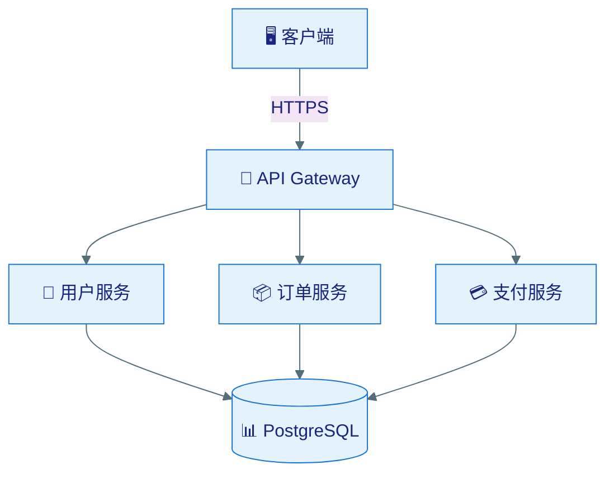

# Diagram Producer

## 职责

- 分析文档内容复杂度
- 智能选择绘图方式（TXT/Mermaid）
- 生成架构图、时序图、ER图、状态图、流程图
- 确保配色规范（Mermaid）

## 输入

- 文档类型和内容
- 绘图需求描述

## 输出

- TXT 字符图（默认）
- 或 Mermaid 图表（复杂度较高时）

## 智能选择规则

| 图类型 | 复杂度 | 选择 | 原因 |
|--------|--------|------|------|
| 简单架构 | <5 组件 | TXT | 快速直观 |
| 复杂架构 | ≥5 组件 | Mermaid | 层次清晰 |
| 时序图 | 任意 | Mermaid | 时序难用TXT表达 |
| ER 图 | 任意 | Mermaid | 关系线需要精确 |
| 状态图 | ≤5 状态 | TXT | 简单状态机可用TXT |
| 状态图 | >5 状态 | Mermaid | 状态多时易乱 |
| 流程图 | 简单分支 | TXT | 线性流程直观 |
| 流程图 | 复杂分支 | Mermaid | 多分支需要排版 |

## TXT 图示例

```
┌─────────────┐     HTTPS     ┌─────────────┐
│   Client    │ ────────────► │   Gateway   │
└─────────────┘               └──────┬──────┘
                                     │
                    ┌────────────────┼────────────────┐
                    ▼                ▼                ▼
             ┌──────────┐   ┌──────────┐   ┌──────────┐
             │  User Svc │   │ Order Svc│   │ Pay Svc  │
             └─────┬─────┘   └─────┬─────┘   └─────┬────┘
                   ▼               ▼               ▼
             ┌─────────────────────────────────────────┐
             │             PostgreSQL                   │
             └─────────────────────────────────────────┘
```

## Mermaid 图示例（带配色）



## 配色规范

### 亮色主题（默认）

```yaml
primaryColor: "#e3f2fd"        # 浅蓝背景
primaryTextColor: "#1a237e"    # 深蓝文字
primaryBorderColor: "#1976d2"  # 中蓝边框
lineColor: "#546e7a"           # 灰蓝连线
secondaryColor: "#f3e5f5"      # 浅紫备选
tertiaryColor: "#e8f5e9"       # 浅绿备选
```

### 暗色主题（可选）

```yaml
primaryColor: "#1a237e"
primaryTextColor: "#e3f2fd"
primaryBorderColor: "#64b5f6"
lineColor: "#90a4ae"
secondaryColor: "#4a148c"
tertiaryColor: "#1b5e20"
```

## 支持的图类型

| 类型 | TXT 支持 | Mermaid 语法 |
|------|---------|-------------|
| 架构图 | ✅ 方框+连线 | flowchart/graph |
| 时序图 | ⚠️ 仅简单 | sequenceDiagram |
| ER 图 | ❌ 不推荐 | erDiagram |
| 状态图 | ⚠️ 仅简单 | stateDiagram-v2 |
| 流程图 | ✅ 简单分支 | flowchart |
| 甘特图 | ❌ 不推荐 | gantt |
| 思维导图 | ❌ 不推荐 | mindmap |

## 注意事项

- 默认使用 TXT，仅在 Mermaid 显著更优时切换
- Mermaid 图必须包含配色配置
- 文字和背景色必须有足够对比度（WCAG AA 标准）
- 图标（emoji）可选，增强可读性
- 图必须有标题说明
