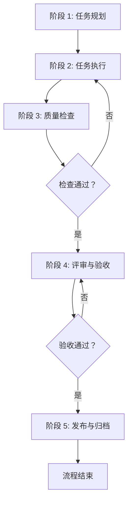
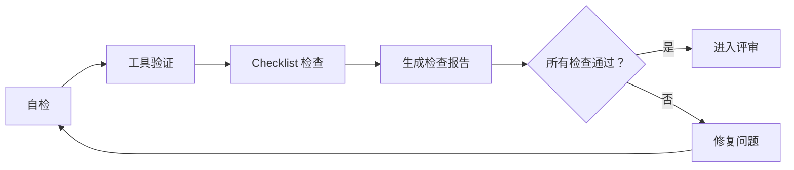

# ProjectWiki 可靠性工作流程

## 概述

本工作流程确保 project-wiki 技能的所有任务执行都具备**可靠性、可追溯性、可验证性**，通过标准化的流程保障文档质量和一致性。

**核心原则**：
- ✅ **流程标准化**：所有任务遵循统一的工作流程
- ✅ **检查清单化**：每个环节都有明确的检查项
- ✅ **验证自动化**：尽可能使用工具自动验证
- ✅ **责任明确化**：每个环节责任到人
- ✅ **文档可追溯**：所有变更都有记录

---

## 工作流程总览

```
┌─────────────────────────────────────────────────────────────────┐
│  阶段 1: 任务规划 (Planning)                                      │
│  ├── 需求分析 → 任务拆解 → 资源准备                              │
│  └── 输出：任务清单、验收标准                                    │
└─────────────────────────────────────────────────────────────────┘
                              ↓
┌─────────────────────────────────────────────────────────────────┐
│  阶段 2: 任务执行 (Execution)                                    │
│  ├── 按照任务清单执行 → 过程记录 → 问题反馈                     │
│  └── 输出：执行记录、中间产物                                    │
└─────────────────────────────────────────────────────────────────┘
                              ↓
┌─────────────────────────────────────────────────────────────────┐
│  阶段 3: 质量检查 (Quality Check)                                │
│  ├── 自检 → 工具验证 → Checklist 检查                            │
│  └── 输出：检查报告、问题清单                                    │
└─────────────────────────────────────────────────────────────────┘
                              ↓
┌─────────────────────────────────────────────────────────────────┐
│  阶段 4: 评审与验收 (Review & Acceptance)                        │
│  ├── 同行评审 → 修改完善 → 最终验收                             │
│  └── 输出：评审报告、验收确认                                    │
└─────────────────────────────────────────────────────────────────┘
                              ↓
┌─────────────────────────────────────────────────────────────────┐
│  阶段 5: 发布与归档 (Release & Archive)                          │
│  ├── 版本发布 → 文档归档 → 经验总结                             │
│  └── 输出：发布版本、归档文档、复盘报告                          │
└─────────────────────────────────────────────────────────────────┘
```

---

## 阶段 1: 任务规划 (Planning)

### 1.1 需求分析

**目标**：明确任务目标和验收标准。

**输入**：
- 用户需求/任务描述
- 现有文档/代码状态

**活动**：
1. 分析任务背景和目标
2. 识别关键干系人
3. 确定任务优先级
4. 评估工作量和风险

**输出**：
- 需求分析文档
- 干系人清单
- 风险评估报告

**Checklist**：
- [ ] 任务目标清晰、可衡量
- [ ] 验收标准明确
- [ ] 干系人已识别
- [ ] 风险已评估

### 1.2 任务拆解

**目标**：将大任务拆解为可执行的小任务。

**活动**：
1. 使用 WBS（工作分解结构）拆解任务
2. 定义每个子任务的输入输出
3. 确定任务依赖关系
4. 估算每个子任务的时间

**输出**：
- 任务分解清单（tasks.md）
- 任务依赖图
- 时间估算表

**Checklist**：
- [ ] 每个子任务可在 4 小时内完成
- [ ] 任务依赖关系清晰
- [ ] 验收标准可量化

### 1.3 资源准备

**目标**：准备任务执行所需的资源和工具。

**活动**：
1. 准备开发环境
2. 获取必要的访问权限
3. 准备模板和工具
4. 建立沟通渠道

**输出**：
- 环境配置清单
- 工具清单
- 沟通计划

**Checklist**：
- [ ] 开发环境已配置
- [ ] 工具已安装并测试
- [ ] 模板已准备
- [ ] 沟通渠道已建立

---

## 阶段 2: 任务执行 (Execution)

### 2.1 按照任务清单执行

**目标**：按照任务清单逐项执行任务。

**活动**：
1. 从任务清单中领取任务
2. 按照标准操作程序执行
3. 记录执行过程和结果
4. 遇到问题及时上报

**输出**：
- 执行记录
- 中间产物（代码/文档）
- 问题日志

**Checklist**：
- [ ] 任务按计划执行
- [ ] 执行记录完整
- [ ] 问题及时记录
- [ ] 变更已记录

### 2.2 过程记录

**目标**：记录执行过程中的关键信息。

**记录内容**：
- 执行时间和人员
- 使用的工具和版本
- 遇到的问题和解决方案
- 临时决策和变更

**记录方式**：
```markdown
## 执行记录

**任务 ID**: TASK-001
**执行时间**: 2026-03-13 14:00-16:00
**执行人员**:张三
**使用工具**: generate_doc.py v2.0

### 执行步骤
1. 步骤 1...
2. 步骤 2...

### 遇到的问题
- 问题 1: 描述
  - 解决方案：...

### 变更说明
- 变更 1: 描述
```

### 2.3 问题反馈

**目标**：及时反馈和解决问题。

**流程**：
```
发现问题 → 记录问题 → 评估影响 → 制定方案 → 解决问题 → 验证结果
```

**问题分级**：
- **P0 - 严重**：任务无法继续，需立即处理
- **P1 - 高**：影响任务质量，需优先处理
- **P2 - 中**：影响较小，可延后处理
- **P3 - 低**：建议改进，可选处理

---

## 阶段 3: 质量检查 (Quality Check)

### 3.1 自检

**目标**：执行者自行检查任务完成质量。

**自检清单**：
- [ ] 任务目标已达成
- [ ] 验收标准已满足
- [ ] 文档格式规范
- [ ] 链接有效
- [ ] 示例可运行
- [ ] 版本号正确

**输出**：自检报告

### 3.2 工具验证

**目标**：使用自动化工具验证质量。

**验证工具**：
```bash
# 1. Markdown 格式检查
markdownlint *.md

# 2. 链接检查
markdown-link-check README.md

# 3. 拼写检查
cspell *.md

# 4. 一致性检查
python scripts/check_consistency.py

# 5. 文档生成测试
python scripts/generate_doc.py --test
```

**输出**：工具验证报告

### 3.3 Checklist 检查

**目标**：使用标准化 Checklist 进行全面检查。

**检查维度**：
1. **内容完整性**（6 项）
2. **术语一致性**（4 项）
3. **格式规范性**（6 项）
4. **链接有效性**（4 项）
5. **可测试性**（4 项）
6. **可实现性**（4 项）

**检查清单**：[document-review-checklist.md](templates/checklists/document-review-checklist.md)

**输出**：检查报告

---

## 阶段 4: 评审与验收 (Review & Acceptance)

### 4.1 同行评审

**目标**：通过同行评审发现潜在问题。

**评审方式**：
- **异步评审**：PR/MR 中 Review
- **同步评审**：评审会议

**评审流程**：
```
提交评审 → 预审 → 正式评审 → 问题汇总 → 修改完善 → 复审
```

**评审人员**：
- 产品经理（内容准确性）
- 技术负责人（技术可行性）
- 开发工程师（实现细节）
- 测试工程师（可测试性）
- 文档管理员（规范性）

**输出**：评审报告

### 4.2 修改完善

**目标**：根据评审意见修改完善。

**流程**：
```
接收意见 → 分类整理 → 制定修改计划 → 逐项修改 → 验证修改
```

**修改跟踪表**：
| 问题 ID | 问题描述 | 优先级 | 修改方案 | 修改人 | 修改日期 | 验证人 | 状态 |
|---------|---------|--------|---------|--------|---------|--------|------|
| ISSUE-001 | ... | P0 | ... | 张三 | 2026-03-13 | 李四 | ✅ |

### 4.3 最终验收

**目标**：确认任务完成并达到验收标准。

**验收流程**：
```
提交验收申请 → 验收检查 → 验收确认 → 签署验收报告
```

**验收标准**：
- [ ] 所有任务已完成
- [ ] 所有检查项已通过
- [ ] 所有问题已解决
- [ ] 文档已归档
- [ ] 版本已发布

**输出**：验收报告

---

## 阶段 5: 发布与归档 (Release & Archive)

### 5.1 版本发布

**目标**：正式发布任务成果。

**发布流程**：
```
版本打包 → 发布说明 → 正式发布 → 通知干系人
```

**发布检查清单**：
- [ ] 版本号已更新
- [ ] CHANGELOG.md 已更新
- [ ] Git Tag 已创建
- [ ] 发布说明已撰写
- [ ] 干系人已通知

**发布说明模板**：
```markdown
## [版本号] - 发布日期

### 新增
- 功能 1
- 功能 2

### 优化
- 优化 1

### 修复
- 修复 1

### 变更
- 变更 1
```

### 5.2 文档归档

**目标**：将文档归档到知识库。

**归档内容**：
- 最终版本文档
- 评审报告
- 验收报告
- 执行记录
- 经验总结

**归档位置**：
```
project-wiki/
├── docs/           # 最终文档
├── records/        # 执行记录
├── reports/        # 评审/验收报告
└── archives/       # 历史归档
```

### 5.3 经验总结

**目标**：总结经验教训，持续改进。

**复盘会议**：
- **参会人员**：项目组成员
- **会议时间**：任务完成后 1 周内
- **会议内容**：
  - 哪些做得好？
  - 哪些可以改进？
  - 下次如何做得更好？

**输出**：复盘报告

---

## 角色与职责

| 角色 | 职责 | 主要任务 |
|------|------|---------|
| **项目经理（PM）** | 任务规划、进度跟踪、风险管理 | 任务拆解、资源协调、干系人沟通 |
| **执行负责人** | 任务执行、质量保证 | 按照流程执行任务、自检 |
| **质量负责人（QA）** | 质量检查、工具验证 | 组织检查、工具验证、问题跟踪 |
| **评审组长** | 组织评审、验收确认 | 组织评审会议、验收确认 |
| **文档管理员** | 文档归档、版本管理 | 文档归档、版本发布 |

---

## 工具与模板

### 工具清单

| 工具 | 用途 | 命令/链接 |
|------|------|----------|
| markdownlint | Markdown 格式检查 | `markdownlint *.md` |
| markdown-link-check | 链接检查 | `markdown-link-check README.md` |
| cspell | 拼写检查 | `cspell *.md` |
| generate_doc.py | 文档生成 | `python scripts/generate_doc.py` |
| normalize_templates.py | 模板标准化 | `python scripts/normalize_templates.py` |

### 模板清单

| 模板 | 用途 | 路径 |
|------|------|------|
| 任务清单模板 | 任务拆解 | [templates/tasks-template.md](templates/checklists/README.md) |
| 评审 Checklist | 文档评审 | [templates/checklists/document-review-checklist.md](templates/checklists/document-review-checklist.md) |
| 验收报告模板 | 最终验收 | [templates/acceptance-template.md](templates/checklists/README.md) |
| 复盘报告模板 | 经验总结 | [templates/retrospective-template.md](templates/checklists/README.md) |

---

## 工作流程图

### 完整流程图



### 质量检查流程



---

## 关键成功因素

### 1. 流程遵循

- ✅ 严格按照流程执行
- ✅ 不跳过任何环节
- ✅ 所有检查项必须完成

### 2. 文档质量

- ✅ 使用标准模板
- ✅ 遵循写作规范
- ✅ 及时更新维护

### 3. 工具支持

- ✅ 尽可能自动化
- ✅ 工具版本统一
- ✅ 定期检查更新

### 4. 团队协作

- ✅ 沟通及时透明
- ✅ 责任明确到人
- ✅ 知识共享

---

## 持续改进

### 流程优化

- **定期回顾**：每季度回顾流程有效性
- **问题收集**：收集团队反馈
- **持续改进**：根据反馈优化流程

### 工具升级

- **工具评估**：定期评估工具效果
- **新技术引入**：关注行业最佳实践
- **自动化提升**：逐步提高自动化程度

---

## 参考资料

- [文档管理流程指南](references/guides/document-management-guide.md)
- [文档一致性检查清单](references/guides/document-consistency-checklist.md)
- [文档评审 Checklist](templates/checklists/document-review-checklist.md)
- [快速开始指南](QUICKSTART.md)

---

**最后更新**: 2026-03-13  
**版本**: v1.0.0  
**维护者**: 文档管理员  
**状态**: ✅ 已批准
