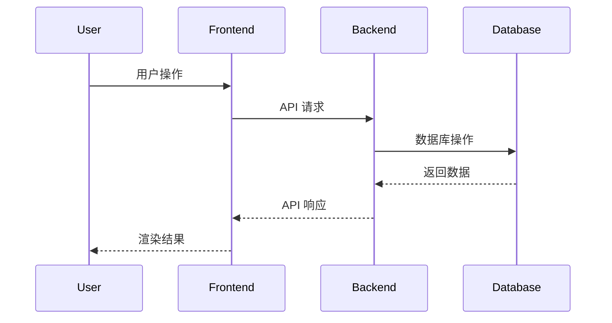
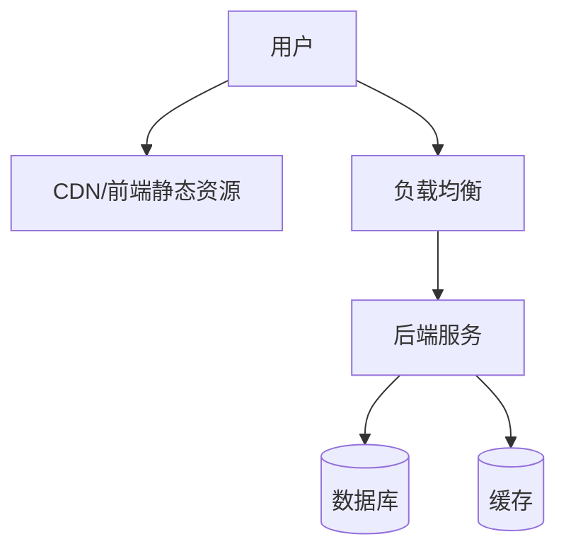

# 全栈项目文档指南

## 概述

本指南适用于前后端分离的全栈项目，提供端到端的文档建议。

### 最小文档集（必备）

1. **前端文档** + **后端文档**
2. **接口契约文档**
3. **联调指南**
4. **部署拓扑图**

---

## 核心文档

### 1. 端到端数据流图

```markdown
## 数据流


```

### 2. 接口契约文档

**核心内容**：

```markdown
## 接口约定

### 字段命名
- 前端：camelCase
- 后端：snake_case
- API: camelCase（统一）

### 错误码约定
| 错误码 | 说明 | 前端处理 |
|--------|------|---------|
| 40001 | 参数错误 | 显示表单错误 |
| 40100 | 未授权 | 跳转登录 |
| 50000 | 服务器错误 | 显示错误提示 |
```

### 3. 联调指南

**核心内容**：

```markdown
## 本地联调

### 启动顺序
1. 启动后端：`npm run server`
2. 启动前端：`npm run client`
3. 配置代理：vite.config.ts

### Mock Server
- 工具：MSW、Mockoon
- Mock 数据位置：`/mocks`
```

### 4. 部署拓扑图

```markdown
## 部署架构


```

---

## 检查清单

- [ ] 端到端数据流图清晰
- [ ] 接口契约文档完整
- [ ] 联调指南详细
- [ ] 部署拓扑图准确

---

## 参考资料

- [前端项目指南](frontend-project-guide.md)
- [后端项目指南](backend-project-guide.md)
- [项目类型总览](README.md)