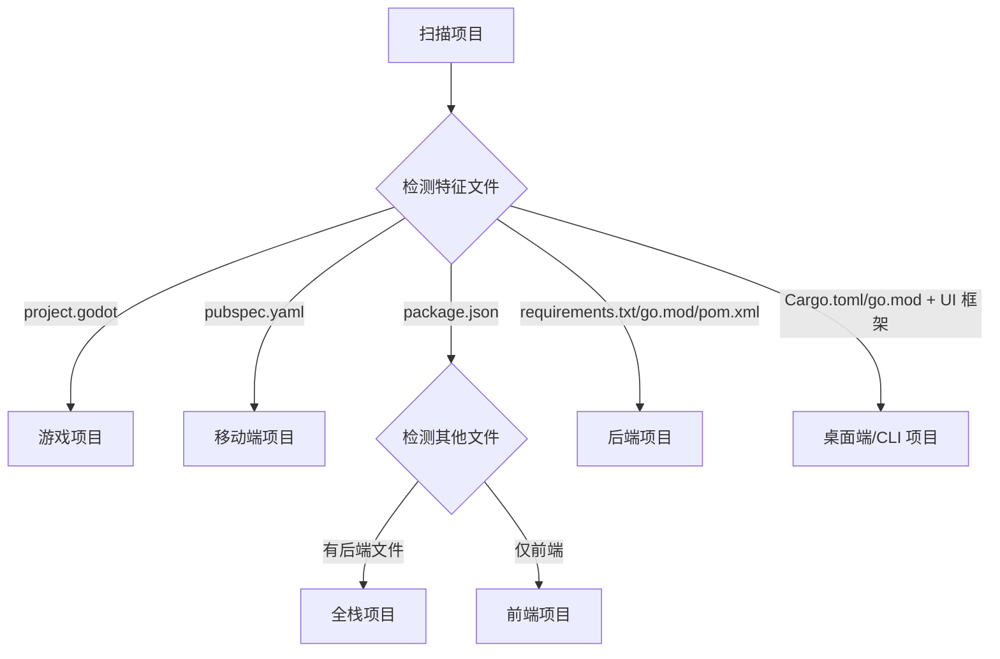

# 项目类型识别规则

## 概述

本文档定义项目类型识别的规则，基于项目结构、文件特征和技术栈依赖自动识别项目类型。

---

## 识别规则

### 基于文件特征

| 项目类型 | 特征文件 | 技术栈识别 |
|---------|---------|-----------|
| **前端** | package.json, vite.config.ts, vue.config.js | Vue: vue 依赖<br>Svelte: svelte 依赖<br>SolidJS: solid-js 依赖 |
| **后端** | requirements.txt (Python), go.mod (Go), pom.xml (Java) | FastAPI: fastapi 依赖<br>Gin: gin 依赖<br>Spring Boot: spring-boot 依赖 |
| **全栈** | package.json + 后端特征文件 | 同时包含前后端依赖 |
| **移动端** | pubspec.yaml | Flutter: flutter SDK |
| **桌面端** | Cargo.toml (Tauri), go.mod (Wails), .csproj (C#) | Tauri: tauri 依赖<br>Wails: wails 依赖<br>Electron: electron 依赖 |
| **CLI/TUI** | Cargo.toml, go.mod, setup.py | CLI 框架依赖（clap, cobra, click） |
| **游戏** | project.godot | Godot 引擎版本 |

---

### 基于目录结构

| 项目类型 | 特征目录 |
|---------|---------|
| **前端** | src/components/, src/views/, src/store/ |
| **后端** | src/controllers/, src/models/, src/routes/ |
| **全栈** | client/, server/ 或 frontend/, backend/ |
| **移动端** | lib/, android/, ios/ |
| **桌面端** | src-tauri/, frontend/ (Tauri)<br>ui/, backend/ (Wails) |
| **CLI/TUI** | cmd/, internal/, pkg/ |
| **游戏** | scenes/, scripts/, assets/ |

---

### 基于技术栈依赖

#### 前端框架识别

```yaml
Vue:
  依赖：vue, vue-router, pinia/vuex
  配置文件：vue.config.js, vite.config.ts

Svelte:
  依赖：svelte, svelte-routing
  配置文件：svelte.config.js

SolidJS:
  依赖：solid-js, solid-start
  配置文件：vite.config.ts
```

#### 后端框架识别

```yaml
FastAPI:
  依赖：fastapi, uvicorn
  文件：main.py, requirements.txt

Gin:
  依赖：github.com/gin-gonic/gin
  文件：main.go, go.mod

Spring Boot:
  依赖：org.springframework.boot
  文件：pom.xml/build.gradle
```

---

## 识别流程



---

## 识别结果

识别成功后，返回：

1. **项目类型**：前端/后端/全栈/移动端/桌面端/CLI/TUI/游戏
2. **技术栈**：具体框架和版本
3. **推荐文档集**：根据项目类型推荐最小/完整文档集

---

## 参考资料

- [项目类型总览](../guides/project-types/README.md)
